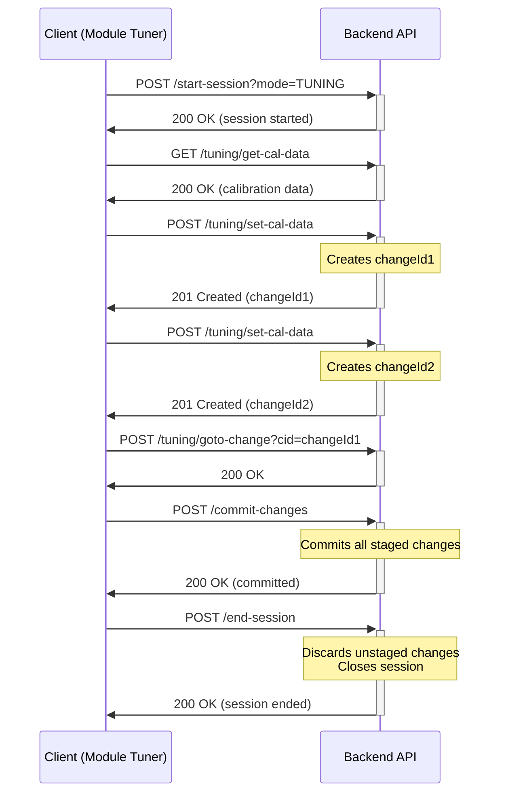
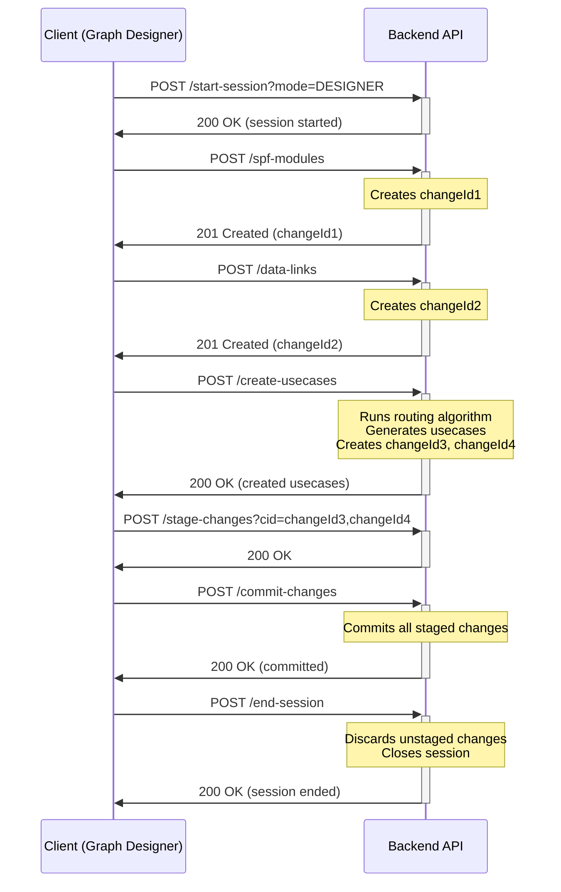
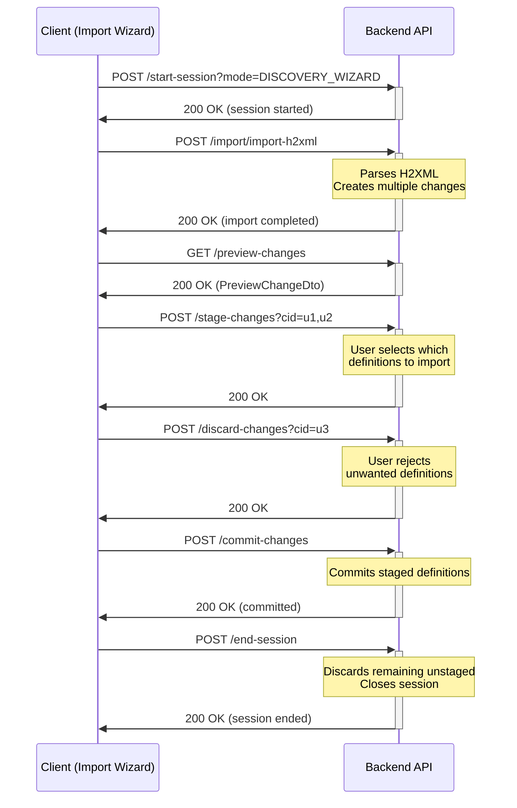
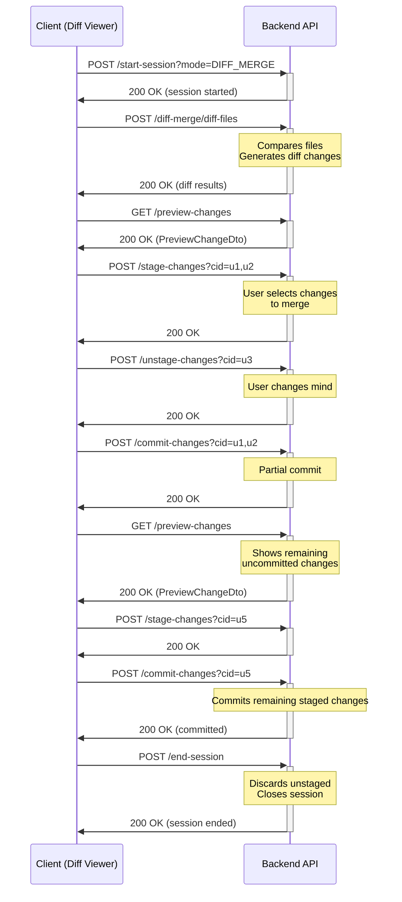

# Modification Framework: API Reference & Workflows

## Document Information
- **Version**: 1.1
- **Date**: July 2026
- **Status**: Final
- **Author**: Architecture Team

**Related Documents:**
- `modification-framework-design.md` - Core framework design
- `modification-framework-testing.md` - Testing strategy
- `docs/swagger-api.json` - Detailed API specifications, request/response schemas, and examples

---

## Table of Contents

1. [Session Modes & Supported Operations](#1-session-modes--supported-operations)
2. [API Categories](#2-api-categories)
3. [Workflow Scenarios](#3-workflow-scenarios)

---

## 1) Session Modes & Supported Operations

The modification framework supports multiple session modes, each with specific API restrictions to ensure data integrity and proper workflow enforcement.

### Session Mode Overview

| Mode | Description | Supported API Categories |
|------|-------------|-------------------------|
| **READONLY** | Default state for every project. No active session exists. A project begins here and returns here after `end-session`. Cannot be passed to `start-session`. Read APIs only; no modifications allowed. | • Read APIs only<br>• No modifications allowed |
| **TUNING** | Calibration and parameter tuning | • Read APIs<br>• Tuning/Calibration APIs<br>• Change Management APIs |
| **DESIGNER** | Full design and configuration | • Read APIs<br>• Tuning APIs<br>• Designer APIs<br>• Change Management APIs |
| **DISCOVERY_WIZARD** | Import and discovery operations | • Read APIs<br>• Import/Discovery APIs<br>• Change Management APIs |
| **DIFF_MERGE** | Comparison and merging | • Read APIs<br>• Tuning APIs<br>• Designer APIs<br>• Diff/Merge APIs<br>• Change Management APIs |

### Mode Restrictions & Validation

> **Note:** READONLY is not a mode passed to `start-session` — it is the implicit state when no active session exists.
> Every project starts in READONLY. Calling `start-session` creates an active session in the specified mode.
> Calling `end-session` destroys that session, returning the project to READONLY.

**Enforcement Mechanism**:
- Session mode is set when starting a session via `POST /arc-api/v1/projects/:projectId/start-session`
- Backend validates each API call against the current session mode
- Invalid API calls return `403 Forbidden` with error code `INVALID_OPERATION_FOR_MODE`

**Error Response Example**:
```json
{
  "success": false,
  "error": {
    "code": "INVALID_OPERATION_FOR_MODE",
    "message": "Operation 'add-module' is not supported in TUNING mode",
    "details": {
      "currentMode": "TUNING",
      "requestedOperation": "add-module",
      "supportedModes": ["DESIGNER", "DIFF_MERGE"]
    },
    "timestamp": "2026-02-23T15:30:00Z",
    "path": "/arc-api/v1/projects/123/spf-modules"
  }
}
```

---

## 2) API Categories

### A. Session Management APIs

**Base Path**: `/arc-api/v1/projects/:projectId`

| Endpoint | Method | Description | Comments |
|----------|--------|-------------|----------|
| `/start-session` | POST | Start a new session with specified mode | |
| `/end-session` | POST | End current session (discard unstaged changes only) | Errors (422 `STAGED_CHANGES_EXIST`) if staged changes exist — commit or discard them first. Discards unstaged changes and returns project to READONLY. |

**Note**: For detailed API specifications, refer to `docs/swagger-api.json`

---

### B. Change Management APIs

**Base Path**: `/arc-api/v1/projects/:projectId`

| Endpoint | Method | Description | Comments |
|----------|--------|-------------|----------|
| `/preview-changes` | GET | Preview all pending changes (read-only) | Not currently planned |
| `/create-usecases` | POST | Reconcile staged changes with database | Generates usecases using routing logic |
| `/stage-changes` | POST | Stage specific changes for commit | |
| `/unstage-changes` | POST | Unstage previously staged changes | |
| `/commit-changes` | POST | Commit specific staged changes | Available in all session modes. Pass `?enforceValidation=true` to run validation before applying. |
| `/discard-changes` | POST | Discard uncommitted changes | |

**Note**: For detailed API specifications, refer to `docs/swagger-api.json`

---

### C. Tuning/Calibration APIs

**Base Path**: `/arc-api/v1/projects/:projectId/spf-modules`

| Endpoint | Method | Description | Supported Modes | Comments |
|----------|--------|-------------|-----------------|----------|
| `/:spfModuleSystemId/cal-data/:ckvSystemId` | GET | Get calibration data for module | TUNING, DESIGNER, DIFF_MERGE | |
| `/:spfModuleSystemId/cal-data/:ckvSystemId` | PUT | Update calibration data | TUNING, DESIGNER, DIFF_MERGE | |
| `/:spfModuleSystemId/tag-data/:tagSystemId/:tkvSystemId` | GET | Get tag data for module | TUNING, DESIGNER, DIFF_MERGE | |
| `/:spfModuleSystemId/tag-data/:tagSystemId/:tkvSystemId` | PUT | Update tag data | TUNING, DESIGNER, DIFF_MERGE | |
| `/tuning/goto-change` | POST | Navigate to specific change | TUNING, DESIGNER, DIFF_MERGE | Future API |

**Note**: For detailed API specifications, refer to `docs/swagger-api.json`

---

### D. Usecase Designer APIs

**Base Path**: `/arc-api/v1/projects/:projectId`

| Endpoint | Method | Description | Supported Modes | Comments |
|----------|--------|-------------|-----------------|----------|
| `/spf-modules` | POST | Add new SPF module to graph | DESIGNER, DIFF_MERGE | |
| `/spf-modules/:id` | DELETE | Delete SPF module from graph | DESIGNER, DIFF_MERGE | |
| `/data-links` | POST | Add data link between modules (flat view) | DESIGNER, DIFF_MERGE | |
| `/data-links/with-subsystems` | POST | Add data link (with subsystem hierarchy) | DESIGNER, DIFF_MERGE | |
| `/data-links/:id` | DELETE | Delete data link | DESIGNER, DIFF_MERGE | |
| `/control-links` | POST | Add control link between modules (flat view) | DESIGNER, DIFF_MERGE | |
| `/control-links/with-subsystems` | POST | Add control link (with subsystem hierarchy) | DESIGNER, DIFF_MERGE | |
| `/control-links/:id/properties` | GET | Get control link properties | DESIGNER, DIFF_MERGE | |
| `/control-links/:id/properties` | PATCH | Update control link properties | DESIGNER, DIFF_MERGE | |
| `/control-links/:id` | DELETE | Delete control link | DESIGNER, DIFF_MERGE | |

**Note**: For detailed API specifications, refer to `docs/swagger-api.json`

---

### E. Discovery wizard APIs

**Base Path**: `/arc-api/v1/projects/:projectId/import`

| Endpoint | Method | Description | Supported Modes | Comments |
|----------|--------|-------------|-----------------|----------|
| `/import-h2xml` | POST | Import H2XML definition files | DISCOVERY_WIZARD | Future API |

**Note**: For detailed API specifications, refer to `docs/swagger-api.json`

---

### F. Diff/Merge APIs

**Base Path**: `/arc-api/v1/projects/:projectId/diff-merge`

| Endpoint | Method | Description | Supported Modes | Comments |
|----------|--------|-------------|-----------------|----------|
| `/diff-files` | POST | Compare two project files | DIFF_MERGE | Future API |

**Note**: For detailed API specifications, refer to `docs/swagger-api.json`

---

## 3) Workflow Scenarios

### Scenario 1: TUNING Mode Workflow

**Use Case**: Module tuner application adjusting calibration parameters



**Key Points**:
- Only tuning operations allowed
- All changes automatically staged
- Call `commit-changes` before `end-session` to persist staged changes
- `end-session` errors with 422 (`STAGED_CHANGES_EXIST`) if staged changes remain
- Designer operations (add-module, add-link) would return `403 Forbidden`

---

### Scenario 2: DESIGNER Mode Workflow

**Use Case**: Graph designer application creating audio processing graph



**Key Points**:
- Full design capabilities enabled
- After adding modules/links, call `create-usecases` to generate usecases
- `create-usecases` uses routing logic to automatically create usecases from staged changes
- Changes can be staged/unstaged before commit
- Call `commit-changes` before `end-session` to persist staged changes
- `end-session` errors with 422 (`STAGED_CHANGES_EXIST`) if staged changes remain
- `preview-changes` is not part of the DESIGNER workflow and is not currently planned for this mode

---

### Scenario 3: DISCOVERY_WIZARD Mode Workflow

**Use Case**: Importing new module definitions from H2XML files



**Key Points**:
- Only import operations allowed
- Imported definitions initially unstaged for user review
- User explicitly stages desired definitions
- Call `commit-changes` before `end-session` to persist staged changes
- `end-session` errors with 422 (`STAGED_CHANGES_EXIST`) if staged changes remain
- Designer operations (add-module) would return `403 Forbidden`

---

### Scenario 4: DIFF_MERGE Mode Workflow

**Use Case**: Comparing and merging changes from different project versions



**Key Points**:
- Full capabilities: tuning + designer + diff/merge
- Supports partial commits via `commit-changes`
- Call `commit-changes` before `end-session` to persist all desired staged changes
- `end-session` errors with 422 (`STAGED_CHANGES_EXIST`) if staged changes remain
- Most flexible mode for complex merge scenarios

---

## Document Revision History

| Version | Date | Author | Changes |
|---------|------|--------|---------|
| 1.0 | 2026-02-24 | Architecture Team | Initial API reference document with session modes, workflows, and endpoint documentation |
| 1.1 | 2026-07-22 | Architecture Team | Fix base path (arcapi → arc-api); add SIMULATION/CONNECTED/DISCONNECTED session modes; update Section C base path to spf-modules; replace phantom modules-instance rows in Section D with implemented SPF module and link routes (data-links, control-links including with-subsystems and properties); mark preview-changes as not currently planned |
| 1.2 | 2026-07-24 | Architecture Team | end-session no longer commits staged changes — returns 422 if staged changes exist; commit-changes available in all session modes; remove unimplemented SIMULATION/CONNECTED/DISCONNECTED modes; update all workflow diagrams |

---

**End of Document**
