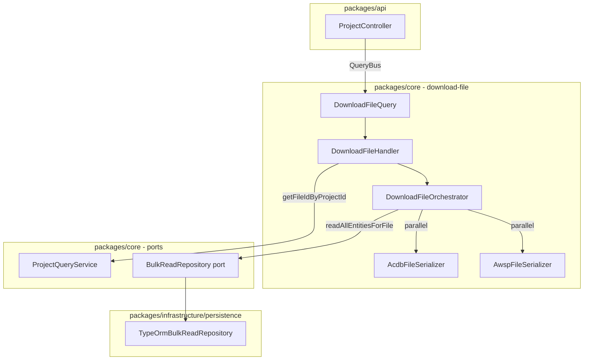
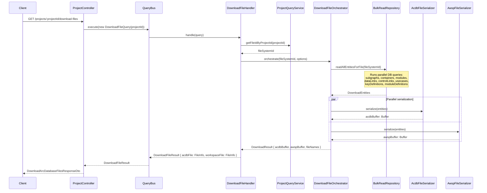
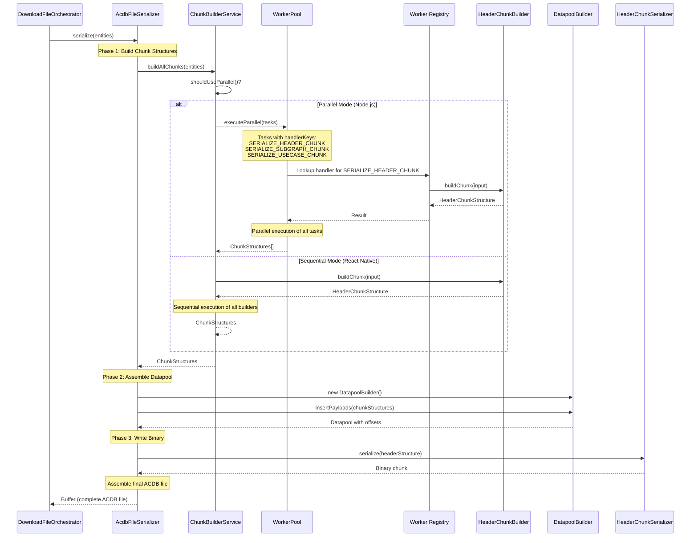

<!--
Copyright (c) Qualcomm Technologies, Inc. and/or its subsidiaries.
SPDX-License-Identifier: BSD-3-Clause
-->

# File Download Workflow Design

## Document Information
- **Version**: 1.0
- **Date**: May 2026
- **Status**: Draft

---

## Table of Contents
1. [Overview](#1-overview)
2. [High-Level Architecture](#2-high-level-architecture)
3. [Mirror Pattern Architecture](#3-mirror-pattern-architecture)
4. [Call Flow](#4-call-flow)
5. [ACDB Chunk Serialization Design](#5-acdb-chunk-serialization-design)
6. [Layers & Components](#6-layers--components)
7. [Folder Structure](#7-folder-structure)
8. [New Files & Changes](#8-new-files--changes)
9. [Data Models](#9-data-models)
10. [Parallelization Strategy](#10-parallelization-strategy)
11. [Error Handling](#11-error-handling)
12. [Performance Considerations](#12-performance-considerations)
13. [Relationship to Upload Architecture](#13-relationship-to-upload-architecture)
14. [Summary](#14-summary)

---

## 1) Overview

### 1.1 Purpose

The file download workflow is the **reverse operation** of file upload. It reads all entities for a given project from the SQLite database and reconstructs the original `.acdb` (AudioReach Calibration Database) and `.awsp` (AudioReach Workspace) files, returning their binary content to the client.

The download always reflects the **current state** of the database — including any modifications made after the original upload.

### 1.2 Key Characteristics

- **Reverse of upload**: Upload parses files → stores in DB. Download reads from DB → serializes to files.
- **Reuses existing infrastructure**: `ValidationQueryRepository`, AWSP serializer classes, ACDB chunk classes, worker pool.
- **Parallel generation**: ACDB and AWSP files are generated in parallel (independent operations).
- **Sequential fallback**: React Native compatibility — sequential mode available via configuration.
- **QueryBus**: Download is a read operation dispatched via `QueryBus` (not `CommandBus`).
- **Binary content in response**: Returns `Buffer` content directly in the JSON response body, consistent with how upload receives file content via Multer.

### 1.3 Comparison with Upload

| Aspect | Upload | Download |
|---|---|---|
| Direction | Files → DB | DB → Files |
| Bus | `CommandBus` | `QueryBus` |
| Handler | `UploadFileHandler` | `DownloadFileHandler` |
| Orchestrator | `UploadFileOrchestrator` | `DownloadFileOrchestrator` |
| File parsing | `AcdbFileOrchestrator`, `AwspFileOrchestrator` | — |
| File serialization | — | `AcdbFileSerializer`, `AwspFileSerializer` |
| DB write | `BulkImportRepository` | — |
| DB read | — | `BulkReadRepository` |
| Parallelization | Worker pool for AWSP parsing | `Promise.all` for ACDB + AWSP generation |
| React Native | Sequential/parallel option | Sequential/parallel option |

---

## 2) High-Level Architecture

### 2.1 Component Interaction

```
┌─────────────────────────────────────────────────────────────┐
│                    HTTP Request                              │
│  GET /arc-api/v1/projects/:projectId/download-files         │
└─────────────────────────┬───────────────────────────────────┘
                          │
                          ▼
┌─────────────────────────────────────────────────────────────┐
│              ProjectController (NestJS)                      │
│  • Dispatches DownloadFileQuery via QueryBus                 │
│  • Maps result to DownloadArcDatabaseFilesResponseDto        │
└─────────────────────────┬───────────────────────────────────┘
                          │
                          ▼
┌─────────────────────────────────────────────────────────────┐
│              DownloadFileHandler (CQRS Query)                │
│  • Resolves fileSystemId from projectId                      │
│  • Delegates to DownloadFileOrchestrator                     │
│  • Returns { acdbFile: FileInfo, workspaceFile: FileInfo }   │
└─────────────────────────┬───────────────────────────────────┘
                          │
                          ▼
┌─────────────────────────────────────────────────────────────┐
│           DownloadFileOrchestrator                           │
│                                                              │
│  Step 1: BulkReadRepository.readAllEntitiesForFile()         │
│    → { subgraphs, containers, modules, dataLinks,            │
│        controlLinks, usecases, keyDefinitions,               │
│        moduleDefinitions }                                   │
│                                                              │
│  Step 2: [parallel]                                          │
│    ├─ AcdbFileSerializer.serialize(entities) → Buffer        │
│    └─ AwspFileSerializer.serialize(entities) → Buffer        │
│                                                              │
│  Step 3: Return { acdbBuffer, awspBuffer, fileNames }        │
└─────────────────────────┬───────────────────────────────────┘
                          │
                          ▼
┌─────────────────────────────────────────────────────────────┐
│              Response to Client                              │
│  DownloadArcDatabaseFilesResponseDto {                       │
│    acdbFile: { name, fileType, content: Buffer }             │
│    workspaceFile: { name, fileType, content: Buffer }        │
│  }                                                           │
└─────────────────────────────────────────────────────────────┘
```

### 2.2 Component Diagram



---

## 3) Mirror Pattern Architecture

### 3.1 Overview

The download-file architecture is designed as a **deliberate mirror** of the upload-file architecture. This symmetry provides consistency, maintainability, and a familiar learning curve for developers working on either direction of file operations.

### 3.2 Upload vs Download Comparison

| Component | Upload (Parse) | Download (Serialize) |
|-----------|----------------|----------------------|
| **Service Layer** | `EntityBuilderService` | `ChunkBuilderService` |
| **Individual Builders** | `KeyDefinitionBuilder`<br/>`SpfModuleDefinitionBuilder`<br/>`SubgraphBuilder` | `HeaderChunkBuilder`<br/>`SubgraphDataChunkBuilder`<br/>`UsecaseDataChunkBuilder` |
| **Data Flow** | Binary → Chunks → Entities | Entities → Chunk Structures → Binary |
| **Worker Pattern** | Static methods for parallel building | Static methods for parallel building |
| **Handler Registry** | `BUILD_KEY_DEFINITIONS`<br/>`BUILD_SPF_MODULE_DEFINITIONS` | `SERIALIZE_HEADER_CHUNK`<br/>`SERIALIZE_SUBGRAPH_CHUNK` |
| **Parallelization** | Optional via WorkerPoolPort | Optional via WorkerPoolPort |
| **Sequential Fallback** | React Native support | React Native support |

### 3.3 Architectural Symmetry Diagram

```
┌─────────────────────────────────────────────────────────────────┐
│                         UPLOAD FLOW                              │
├─────────────────────────────────────────────────────────────────┤
│                                                                  │
│  Binary ACDB File                                                │
│         ↓                                                        │
│  AcdbFileOrchestrator (parse chunks)                             │
│         ↓                                                        │
│  EntityBuilderService                                            │
│    ├─ KeyDefinitionBuilder.buildKeyDefinitions()                │
│    ├─ SpfModuleDefinitionBuilder.buildModuleDefinitions()       │
│    └─ SubgraphBuilder.buildSubgraphs()                          │
│         ↓                                                        │
│  [Parallel/Sequential Decision]                                  │
│    ├─ Worker Registry (parallel)                                │
│    └─ Static Methods (sequential)                               │
│         ↓                                                        │
│  Domain Entities → Database                                      │
│                                                                  │
└─────────────────────────────────────────────────────────────────┘

┌─────────────────────────────────────────────────────────────────┐
│                        DOWNLOAD FLOW                             │
├─────────────────────────────────────────────────────────────────┤
│                                                                  │
│  Database → Domain Entities                                      │
│         ↓                                                        │
│  ChunkBuilderService                                             │
│    ├─ HeaderChunkBuilder.buildChunk()                           │
│    ├─ SubgraphDataChunkBuilder.buildChunk()                     │
│    └─ UsecaseDataChunkBuilder.buildChunk()                      │
│         ↓                                                        │
│  [Parallel/Sequential Decision]                                  │
│    ├─ Worker Registry (parallel)                                │
│    └─ Static Methods (sequential)                               │
│         ↓                                                        │
│  Chunk Structures                                                │
│         ↓                                                        │
│  ChunkSerializers (write binary)                                 │
│         ↓                                                        │
│  Binary ACDB File                                                │
│                                                                  │
└─────────────────────────────────────────────────────────────────┘
```

### 3.4 Why Mirror Pattern?

**Benefits:**

1. **Consistency**: Developers familiar with upload can immediately understand download
2. **Maintainability**: Changes to one side suggest corresponding changes to the other
3. **Testability**: Same testing patterns apply to both directions
4. **Code Reuse**: Shared infrastructure (WorkerPoolPort, BinaryUtils, chunk classes)
5. **Learning Curve**: Reduced cognitive load when working across both operations

**Key Principle:**

> "If upload parses X into Y, then download serializes Y into X"

This principle guides all architectural decisions in the download implementation.

---

## 4) Call Flow

### 4.1 Detailed Sequence (High-Level)



### 4.2 ACDB Serialization Call Flow (Detailed)



---

## 5) ACDB Chunk Serialization Design

### 5.1 Overview

This section details the implementation of binary ACDB chunk serialization, using the **header chunk as a proof-of-concept**. The design mirrors the upload-file architecture and supports both parallel (Node.js) and sequential (React Native) execution modes.

### 5.2 Core Components

#### 5.2.1 ChunkBuilderService

**Purpose**: Orchestrates building chunk structures from domain entities, with parallel/sequential support.

**Location**: `packages/core/src/application/file-operations/download-file/services/chunk-builder-service.ts`

**Key Responsibilities**:
- Determines parallel vs sequential execution based on platform
- Coordinates worker pool for parallel chunk building
- Falls back to sequential execution when workers unavailable
- Collects and aggregates chunk structures

**Interface**:

```typescript
export class ChunkBuilderService {
  constructor(
    private readonly workerPool?: WorkerPoolPort,
    private readonly logger?: Logger
  ) {}

  /**
   * Build all chunk structures (parallel or sequential based on platform)
   */
  async buildAllChunks(
    entities: DownloadEntities
  ): Promise<ChunkStructures> {
    if (this.shouldUseParallel()) {
      return this.buildChunksParallel(entities);
    } else {
      return this.buildChunksSequential(entities);
    }
  }

  private shouldUseParallel(): boolean {
    return (
      this.workerPool !== undefined &&
      this.workerPool.isThreadingSupported()
    );
  }
}
```

#### 5.2.2 HeaderChunkBuilder (Proof of Concept)

**Purpose**: Builds header chunk structure from domain entities.

**Location**: `packages/core/src/application/file-operations/download-file/services/chunk-builders/header-chunk-builder.ts`

**Key Features**:
- Static method for use in both sequential and parallel modes
- Error collection instead of throwing
- Returns structured output with errors

**Implementation**:

```typescript
export interface HeaderChunkBuildInput {
  /** Entities containing header metadata */
  entities: DownloadEntities;
  /** Human-readable name for error messages */
  taskName: string;
}

export interface HeaderChunkBuildOutput {
  /** Built header chunk structure */
  chunkStructure: HeaderChunkStructure;
  /** Errors encountered during building */
  errors: string[];
}

export interface HeaderChunkStructure {
  chunkType: string;
  headerVersion: number;
  version: ACDBVersionInfo;
  codecInfos: CodecInfo[];
  modifiedDate: number;
  oemInfo: string;
}

export class HeaderChunkBuilder {
  /**
   * Static method for building header chunk structure.
   * Called by worker registry for parallel processing.
   */
  static buildChunk(input: HeaderChunkBuildInput): HeaderChunkBuildOutput {
    try {
      const structure: HeaderChunkStructure = {
        chunkType: CHUNK_TYPES.HEADER,
        headerVersion: 1,
        version: input.entities.headerMetadata?.version ?? {
          major: 1,
          minor: 0,
          revision: 0,
          cplInfo: 0
        },
        codecInfos: input.entities.headerMetadata?.codecInfos ?? [],
        modifiedDate: Date.now(),
        oemInfo: input.entities.headerMetadata?.oemInfo ?? ''
      };

      return {
        chunkStructure: structure,
        errors: []
      };
    } catch (error) {
      return {
        chunkStructure: null as any,
        errors: [error instanceof Error ? error.message : String(error)]
      };
    }
  }

  /**
   * Instance method (delegates to static for consistency)
   */
  build(entities: DownloadEntities): HeaderChunkStructure {
    const result = HeaderChunkBuilder.buildChunk({
      entities,
      taskName: 'header-chunk'
    });

    if (result.errors.length > 0) {
      throw new Error(result.errors.join('; '));
    }

    return result.chunkStructure;
  }
}
```

#### 5.2.3 HeaderChunkSerializer

**Purpose**: Serializes header chunk structure to binary format.

**Location**: `packages/core/src/application/file-operations/download-file/services/chunk-serializers/header-chunk-serializer.ts`

**Implementation**:

```typescript
export class HeaderChunkSerializer {
  /**
   * Serialize header chunk structure to binary
   */
  serialize(structure: HeaderChunkStructure): Uint8Array {
    const size = this.calculateSize(structure);
    const buffer = new Uint8Array(size);
    const view = new DataView(buffer.buffer);
    let pos = 0;

    // Write header version (4 bytes)
    BinaryUtils.writeUint32(view, pos, structure.headerVersion);
    pos += BinaryUtils.SIZEOF_UINT32;

    // Write ACDB version info (4 bytes: major, minor, revision, cplInfo)
    BinaryUtils.writeUint8(view, pos, structure.version.major);
    pos += BinaryUtils.SIZEOF_UINT8;
    BinaryUtils.writeUint8(view, pos, structure.version.minor);
    pos += BinaryUtils.SIZEOF_UINT8;
    BinaryUtils.writeUint8(view, pos, structure.version.revision);
    pos += BinaryUtils.SIZEOF_UINT8;
    BinaryUtils.writeUint8(view, pos, structure.version.cplInfo);
    pos += BinaryUtils.SIZEOF_UINT8;

    // Write codec count (4 bytes)
    BinaryUtils.writeUint32(view, pos, structure.codecInfos.length);
    pos += BinaryUtils.SIZEOF_UINT32;

    // Write codec information
    for (const codec of structure.codecInfos) {
      BinaryUtils.writeUint32(view, pos, codec.codecId);
      pos += BinaryUtils.SIZEOF_UINT32;
      BinaryUtils.writeUint32(view, pos, codec.majorVersion);
      pos += BinaryUtils.SIZEOF_UINT32;
      BinaryUtils.writeUint32(view, pos, codec.minorVersion);
      pos += BinaryUtils.SIZEOF_UINT32;
    }

    // Write modified date (4 bytes)
    BinaryUtils.writeUint32(view, pos, structure.modifiedDate);
    pos += BinaryUtils.SIZEOF_UINT32;

    // Write OEM info
    const oemBytes = new TextEncoder().encode(structure.oemInfo);
    BinaryUtils.writeUint32(view, pos, oemBytes.length);
    pos += BinaryUtils.SIZEOF_UINT32;
    buffer.set(oemBytes, pos);

    return buffer;
  }

  private calculateSize(structure: HeaderChunkStructure): number {
    let size = 0;
    size += BinaryUtils.SIZEOF_UINT32; // headerVersion
    size += 4 * BinaryUtils.SIZEOF_UINT8; // version info
    size += BinaryUtils.SIZEOF_UINT32; // codec count
    size += structure.codecInfos.length * 3 * BinaryUtils.SIZEOF_UINT32; // codecs
    size += BinaryUtils.SIZEOF_UINT32; // modified date
    size += BinaryUtils.SIZEOF_UINT32; // OEM info size
    size += new TextEncoder().encode(structure.oemInfo).length; // OEM info
    return size;
  }
}
```

### 5.3 Worker Pattern Integration

#### 5.3.1 Handler Keys

**Location**: `packages/core/src/application/file-operations/shared/constants/registry-keys.ts`

```typescript
export const HANDLER_KEYS = {
  // Existing upload keys
  BUILD_KEY_DEFINITIONS: 'build-key-definitions',
  BUILD_SPF_MODULE_DEFINITIONS: 'build-spf-module-definitions',

  // NEW: Download serialization keys
  SERIALIZE_HEADER_CHUNK: 'serialize-header-chunk',
  SERIALIZE_SUBGRAPH_CHUNK: 'serialize-subgraph-chunk',
  SERIALIZE_USECASE_CHUNK: 'serialize-usecase-chunk',
};
```

#### 5.3.2 Parallel Execution

```typescript
private async buildChunksParallel(
  entities: DownloadEntities
): Promise<ChunkStructures> {
  if (!this.workerPool) {
    throw new Error('Worker pool not available for parallel processing');
  }

  this.logger?.logDebug({
    msg: 'Building chunk structures in parallel',
    action: 'parallel_chunk_building_start'
  });

  // Create tasks using handlerKey (not workerScript)
  const tasks: WorkerTask<HeaderChunkBuildInput>[] = [
    {
      handlerKey: HANDLER_KEYS.SERIALIZE_HEADER_CHUNK,
      input: {
        entities,
        taskName: 'header-chunk'
      }
    },
    {
      handlerKey: HANDLER_KEYS.SERIALIZE_SUBGRAPH_CHUNK,
      input: {
        subgraphs: entities.subgraphs,
        taskName: 'subgraph-chunk'
      }
    },
    {
      handlerKey: HANDLER_KEYS.SERIALIZE_USECASE_CHUNK,
      input: {
        usecases: entities.usecases,
        taskName: 'usecase-chunk'
      }
    }
  ];

  // Execute in parallel using WorkerPoolPort
  const results = await this.workerPool.executeParallel<
    HeaderChunkBuildInput,
    unknown,
    HeaderChunkBuildOutput
  >(tasks);

  // Process results and build chunk structures
  return this.processParallelResults(results);
}
```

#### 5.3.3 Sequential Execution

```typescript
private buildChunksSequential(
  entities: DownloadEntities
): ChunkStructures {
  this.logger?.logDebug({
    msg: 'Building chunk structures sequentially',
    action: 'sequential_chunk_building_start'
  });

  // Call static methods directly (same as parallel path)
  const headerResult = HeaderChunkBuilder.buildChunk({
    entities,
    taskName: 'header-chunk'
  });

  const subgraphResult = SubgraphDataChunkBuilder.buildChunk({
    subgraphs: entities.subgraphs,
    taskName: 'subgraph-chunk'
  });

  const usecaseResult = UsecaseDataChunkBuilder.buildChunk({
    usecases: entities.usecases,
    taskName: 'usecase-chunk'
  });

  // Check for errors
  if (headerResult.errors.length > 0) {
    throw new Error(`Header chunk build failed: ${headerResult.errors.join('; ')}`);
  }

  return {
    header: headerResult.chunkStructure,
    subgraphs: subgraphResult.chunkStructure,
    usecases: usecaseResult.chunkStructure
  };
}
```

#### 5.3.4 Worker Registry Update

**Location**: `packages/infrastructure/fs/src/workers/worker-handler-registry.ts`

```typescript
import {HeaderChunkBuilder} from '@arc/core/...';
import {SubgraphDataChunkBuilder} from '@arc/core/...';
import {UsecaseDataChunkBuilder} from '@arc/core/...';

export const WORKER_HANDLERS = {
  // Existing upload handlers
  [HANDLER_KEYS.BUILD_KEY_DEFINITIONS]: KeyDefinitionBuilder.buildKeyDefinitions,
  [HANDLER_KEYS.BUILD_SPF_MODULE_DEFINITIONS]: SpfModuleDefinitionBuilder.buildModuleDefinitions,

  // NEW: Download serialization handlers
  [HANDLER_KEYS.SERIALIZE_HEADER_CHUNK]: HeaderChunkBuilder.buildChunk,
  [HANDLER_KEYS.SERIALIZE_SUBGRAPH_CHUNK]: SubgraphDataChunkBuilder.buildChunk,
  [HANDLER_KEYS.SERIALIZE_USECASE_CHUNK]: UsecaseDataChunkBuilder.buildChunk,
};
```

### 5.4 BinaryUtils Extensions

**Location**: `packages/core/src/shared/utilities/binary-utils.ts`

Add write methods to complement existing read methods:

```typescript
export class BinaryUtils {
  // Existing read methods...
  static readUint8(view: DataView, offset: number): number { ... }
  static readUint32(view: DataView, offset: number): number { ... }

  // NEW: Write methods
  static writeUint8(view: DataView, offset: number, value: number): void {
    view.setUint8(offset, value);
  }

  static writeUint16(view: DataView, offset: number, value: number): void {
    view.setUint16(offset, value, true); // little-endian
  }

  static writeUint32(view: DataView, offset: number, value: number): void {
    view.setUint32(offset, value, true); // little-endian
  }

  static writeInt32(view: DataView, offset: number, value: number): void {
    view.setInt32(offset, value, true); // little-endian
  }
}
```

### 5.5 AcdbFileSerializer (Updated)

**Location**: `packages/core/src/application/file-operations/download-file/services/acdb-file-serializer.ts`

```typescript
export class AcdbFileSerializer {
  private chunkBuilderService: ChunkBuilderService;

  constructor(
    workerPool?: WorkerPoolPort,
    logger?: Logger
  ) {
    this.chunkBuilderService = new ChunkBuilderService(workerPool, logger);
  }

  async serialize(entities: DownloadEntities): Promise<Buffer> {
    // Phase 1: Build chunk structures (parallel or sequential)
    const chunkStructures = await this.chunkBuilderService.buildAllChunks(entities);

    // Phase 2: Assemble datapool (always sequential)
    const datapool = await this.assembleDatapool(chunkStructures);

    // Phase 3: Write final binary
    return this.writeFinalBinary(chunkStructures, datapool);
  }

  private async assembleDatapool(
    structures: ChunkStructures
  ): Promise<Uint8Array> {
    const builder = new DatapoolBuilder();

    // Insert payloads in order (maintains chunk dependencies)
    // For header chunk, there's typically no datapool payload
    // For subgraphs, insert module data payloads
    // For usecases, insert key-value data payloads

    // TODO: Implement datapool assembly logic
    return builder.build();
  }

  private writeFinalBinary(
    structures: ChunkStructures,
    datapool: Uint8Array
  ): Buffer {
    // Serialize each chunk
    const headerSerializer = new HeaderChunkSerializer();
    const headerBinary = headerSerializer.serialize(structures.header);

    // TODO: Serialize other chunks

    // Assemble final ACDB file
    const totalSize = headerBinary.length + datapool.length;
    const finalBuffer = Buffer.alloc(totalSize);

    let offset = 0;
    finalBuffer.set(headerBinary, offset);
    offset += headerBinary.length;

    // TODO: Write other chunks

    finalBuffer.set(datapool, offset);

    return finalBuffer;
  }
}
```

### 5.6 Repository Extensions

#### BulkReadRepository (Updated)

**Location**: `packages/core/src/application/ports/persistence/repositories/bulk-read/bulk-read.repository.ts`

```typescript
export interface HeaderMetadata {
  version: ACDBVersionInfo;
  codecInfos: CodecInfo[];
  modifiedDate: number;
  oemInfo: string;
}

export interface DownloadEntities {
  // Existing fields...
  subgraphs: Subgraph[];
  containers: Container[];
  modules: SpfModule[];
  dataLinks: DataLink[];
  controlLinks: ControlLink[];
  usecases: UseCase[];
  keyDefinitions: KeyDefinition[];
  moduleDefinitions: SpfModuleDefinition[];

  // NEW: Header metadata
  headerMetadata?: HeaderMetadata;
}

export interface BulkReadRepository {
  readAllEntitiesForFile(fileSystemId: number): Promise<DownloadEntities>;

  // NEW: Read header metadata
  readHeaderMetadata(fileSystemId: number): Promise<HeaderMetadata>;
}
```

#### TypeOrmBulkReadRepository (Stub Implementation)

```typescript
async readHeaderMetadata(fileSystemId: number): Promise<HeaderMetadata> {
  // TODO: Implement actual DB query
  // For now, return default values for proof of concept
  return {
    version: { major: 1, minor: 0, revision: 0, cplInfo: 0 },
    codecInfos: [],
    modifiedDate: Date.now(),
    oemInfo: 'AudioReach Creator'
  };
}
```

### 5.7 Parallelization Strategy

#### Phase 1: Parallel Chunk Building

**What runs in parallel:**
- Header chunk structure building
- Subgraph chunk structure building
- Usecase chunk structure building

**Why it's safe:**
- Each chunk builder operates on independent data
- No shared state between builders
- Pure transformation: entities → chunk structures

**Performance gain:**
- ~2-3x speedup for chunk construction phase
- Scales with number of CPU cores

#### Phase 2: Sequential Datapool Assembly

**Why sequential:**
- Datapool is a shared resource
- Chunk payloads must be inserted in specific order
- Offset references must be updated sequentially

**Process:**
1. Create empty datapool builder
2. For each chunk (in order):
   - Insert payload into datapool
   - Get offset from datapool
   - Update chunk's offset reference
3. Finalize datapool

#### Platform Detection

```typescript
// Automatic detection - no configuration needed
if (workerPool && workerPool.isThreadingSupported()) {
  // Node.js: Use parallel workers
  await buildChunksParallel(entities);
} else {
  // React Native: Use sequential main thread
  await buildChunksSequential(entities);
}
```

### 5.8 Testing Strategy

#### Unit Tests

```typescript
describe('HeaderChunkBuilder', () => {
  it('should build header chunk structure from entities', () => {
    const entities = createMockEntities();
    const result = HeaderChunkBuilder.buildChunk({
      entities,
      taskName: 'test'
    });

    expect(result.errors).toHaveLength(0);
    expect(result.chunkStructure.chunkType).toBe(CHUNK_TYPES.HEADER);
    expect(result.chunkStructure.headerVersion).toBe(1);
  });
});

describe('HeaderChunkSerializer', () => {
  it('should serialize header chunk to binary', () => {
    const structure = createMockHeaderStructure();
    const serializer = new HeaderChunkSerializer();
    const binary = serializer.serialize(structure);

    expect(binary).toBeInstanceOf(Uint8Array);
    expect(binary.length).toBeGreaterThan(0);
  });

  it('should produce binary that can be parsed back (round-trip)', () => {
    const structure = createMockHeaderStructure();
    const serializer = new HeaderChunkSerializer();
    const binary = serializer.serialize(structure);

    // Round-trip test
    const parser = new HeaderChunkParser();
    const parsed = parser.parse({
      rawChunks: new Map([['HEADER', binary]])
    });

    expect(parsed.headerVersion).toBe(structure.headerVersion);
    expect(parsed.version).toEqual(structure.version);
  });
});
```

---

## 6) Layers & Components

### 6.1 `packages/api` — Presentation Layer

#### `ProjectController` (UPDATE)

Implement the existing stub `downloadArcDbFiles()`:

```typescript
@Get('/:projectId/download-files')
async downloadArcDbFiles(
  @Param('projectId') projectId: string,
): Promise<ApiResult<DownloadArcDatabaseFilesResponseDto>> {
  const result = await this.queryBus.execute<DownloadFileResult>(
    new DownloadFileQuery(projectId),
  );

  return {
    data: {
      acdbFile: result.acdbFile,
      workspaceFile: result.workspaceFile,
    },
    success: true,
    message: 'Files downloaded successfully',
  };
}
```

**Note**: `QueryBus` needs to be injected alongside the existing `CommandBus`.

---

### 6.2 `packages/core` — Application Layer

#### `DownloadFileQuery` (NEW)

```typescript
// packages/core/src/application/file-operations/download-file/download-file.query.ts
export class DownloadFileQuery implements Query {
  constructor(public readonly projectId: string) {}
}
```

#### `DownloadFileHandler` (NEW)

```typescript
// packages/core/src/application/file-operations/download-file/download-file.handler.ts
export type DownloadFileResult = {
  acdbFile: FileInfo;
  workspaceFile: FileInfo;
};

export class DownloadFileHandler implements QueryHandler<DownloadFileQuery, DownloadFileResult> {
  constructor(private readonly queryServices: QueryServices) {}

  async handle(query: DownloadFileQuery): Promise<DownloadFileResult> {
    // 1. Resolve fileSystemId
    const fileSystemId = await this.queryServices.projectQueryService
      .getFileIdByProjectId(Number(query.projectId));

    // 2. Get file names from project metadata
    const fileNames = await this.queryServices.projectQueryService
      .getFileNamesByProjectId(Number(query.projectId));

    // 3. Orchestrate download
    const orchestrator = new DownloadFileOrchestrator(
      this.queryServices.bulkReadRepository,
    );

    return orchestrator.orchestrate(fileSystemId, fileNames);
  }
}
```

#### `DownloadFileOrchestrator` (NEW)

```typescript
// packages/core/src/application/file-operations/download-file/services/download-file-orchestrator.ts
export class DownloadFileOrchestrator {
  constructor(
    private readonly bulkReadRepository: BulkReadRepository,
    private readonly options?: { sequential?: boolean },
  ) {}

  async orchestrate(
    fileSystemId: number,
    fileNames: { acdb: string; awsp: string },
  ): Promise<DownloadFileResult> {
    // Step 1: Read all entities from DB
    const entities = await this.bulkReadRepository.readAllEntitiesForFile(fileSystemId);

    // Step 2: Serialize to files (parallel or sequential)
    const acdbSerializer = new AcdbFileSerializer();
    const awspSerializer = new AwspFileSerializer();

    let acdbBuffer: Buffer;
    let awspBuffer: Buffer;

    if (this.options?.sequential) {
      acdbBuffer = await acdbSerializer.serialize(entities);
      awspBuffer = await awspSerializer.serialize(entities);
    } else {
      [acdbBuffer, awspBuffer] = await Promise.all([
        acdbSerializer.serialize(entities),
        awspSerializer.serialize(entities),
      ]);
    }

    return {
      acdbFile: { name: fileNames.acdb, fileType: 'application/octet-stream', content: acdbBuffer },
      workspaceFile: { name: fileNames.awsp, fileType: 'application/json', content: awspBuffer },
    };
  }
}
```

#### `AcdbFileSerializer` (NEW — skeleton)

```typescript
// packages/core/src/application/file-operations/download-file/services/acdb-file-serializer.ts
export class AcdbFileSerializer {
  /**
   * Serializes domain entities to binary ACDB format.
   * Reuses ACDB chunk classes from shared/acdb-chunks/.
   * Implementation: populate chunk objects from entities, then write binary.
   */
  async serialize(entities: DownloadEntities): Promise<Buffer> {
    // TODO: Implement binary ACDB serialization
    // 1. Build SubgraphDataChunk from entities.subgraphs, entities.modules,
    //    entities.dataLinks, entities.controlLinks
    // 2. Build UsecaseDataChunk from entities.usecases
    // 3. Write chunk headers + binary data
    throw new Error('AcdbFileSerializer.serialize() not yet implemented');
  }
}
```

#### `AwspFileSerializer` (NEW — skeleton)

```typescript
// packages/core/src/application/file-operations/download-file/services/awsp-file-serializer.ts
export class AwspFileSerializer {
  /**
   * Serializes domain entities to AWSP JSON format.
   * Reuses AWSP serializer classes from shared/awsp-serializers/v1/.
   * Uses class-transformer instanceToPlain() for serialization.
   */
  async serialize(entities: DownloadEntities): Promise<Buffer> {
    // TODO: Implement AWSP JSON serialization
    // 1. Map entities.keyDefinitions → AwspKeyDefinition instances
    // 2. Map entities.moduleDefinitions → AwspSpfModuleDefinition instances
    // 3. Assemble into AWSP document structure
    // 4. instanceToPlain() → JSON → Buffer
    throw new Error('AwspFileSerializer.serialize() not yet implemented');
  }
}
```

---

### 6.3 `packages/core` — Port Interfaces

#### `BulkReadRepository` (NEW port)

```typescript
// packages/core/src/application/ports/persistence/repositories/bulk-read/bulk-read.repository.ts
export interface DownloadEntities {
  subgraphs: Subgraph[];
  containers: Container[];
  modules: SpfModule[];
  dataLinks: DataLink[];
  controlLinks: ControlLink[];
  usecases: UseCase[];
  keyDefinitions: KeyDefinition[];
  moduleDefinitions: SpfModuleDefinition[];
}

export interface BulkReadRepository {
  /**
   * Reads all entities for a file in parallel.
   * Single entry point for download orchestrator.
   */
  readAllEntitiesForFile(fileSystemId: number): Promise<DownloadEntities>;
}
```

#### `ProjectQueryService` (UPDATE)

Add `getFileNamesByProjectId()`:

```typescript
export interface ProjectQueryService {
  getFileIdByProjectId(projectId: number): Promise<number>;
  // NEW:
  getFileNamesByProjectId(projectId: number): Promise<{ acdb: string; awsp: string }>;
}
```

#### `QueryServices` (UPDATE)

Add `bulkReadRepository`:

```typescript
export interface QueryServices {
  readonly modulesQueryService: ModuleQueryService;
  readonly useCaseQueryService: UseCaseQueryService;
  readonly projectQueryService: ProjectQueryService;
  readonly validationQueryService: ValidationQueryRepository;
  // NEW:
  readonly bulkReadRepository: BulkReadRepository;
}
```

---

### 6.4 `packages/infrastructure/persistence` — Adapter Layer

#### `TypeOrmBulkReadRepository` (NEW)

```typescript
// packages/infrastructure/persistence/src/persistence-typeorm-sqllite/
//   repositories/bulk-read/typeorm-bulk-read.repository.ts
export class TypeOrmBulkReadRepository implements BulkReadRepository {
  constructor(private readonly dataSource: DataSource) {}

  async readAllEntitiesForFile(fileSystemId: number): Promise<DownloadEntities> {
    // Run all queries in parallel for performance
    const [
      subgraphs,
      containers,
      modules,
      dataLinks,
      controlLinks,
      usecases,
      keyDefinitions,
      moduleDefinitions,
    ] = await Promise.all([
      this.findSubgraphs(fileSystemId),
      this.findContainers(fileSystemId),
      this.findModules(fileSystemId),
      this.findDataLinks(fileSystemId),
      this.findControlLinks(fileSystemId),
      this.findUsecases(fileSystemId),
      this.findKeyDefinitions(fileSystemId),
      this.findModuleDefinitions(fileSystemId),
    ]);

    return {
      subgraphs,
      containers,
      modules,
      dataLinks,
      controlLinks,
      usecases,
      keyDefinitions,
      moduleDefinitions,
    };
  }

  // Individual query methods — each maps DB rows to domain entities
  private async findSubgraphs(fileSystemId: number): Promise<Subgraph[]> { /* TODO */ }
  private async findContainers(fileSystemId: number): Promise<Container[]> { /* TODO */ }
  private async findModules(fileSystemId: number): Promise<SpfModule[]> { /* TODO */ }
  private async findDataLinks(fileSystemId: number): Promise<DataLink[]> { /* TODO */ }
  private async findControlLinks(fileSystemId: number): Promise<ControlLink[]> { /* TODO */ }
  private async findUsecases(fileSystemId: number): Promise<UseCase[]> { /* TODO */ }
  private async findKeyDefinitions(fileSystemId: number): Promise<KeyDefinition[]> { /* TODO */ }
  private async findModuleDefinitions(fileSystemId: number): Promise<SpfModuleDefinition[]> { /* TODO */ }
}
```

#### `DbQueryServices` (UPDATE)

Wire `TypeOrmBulkReadRepository`:

```typescript
export class DbQueryServices implements QueryServices {
  readonly modulesQueryService: ModuleQueryService;
  readonly useCaseQueryService: UseCaseQueryService;
  readonly projectQueryService: ProjectQueryService;
  readonly validationQueryService: ValidationQueryRepository;
  readonly bulkReadRepository: BulkReadRepository; // NEW

  constructor(dataSource: DataSource) {
    this.modulesQueryService = new DbModuleQueryService();
    this.useCaseQueryService = new DbUseCaseQueryService(dataSource);
    this.projectQueryService = new DbProjectQueryService(dataSource);
    this.validationQueryService = new TypeOrmValidationQueryRepository(dataSource);
    this.bulkReadRepository = new TypeOrmBulkReadRepository(dataSource); // NEW
  }
}
```

#### `DbProjectQueryService` (UPDATE)

Add `getFileNamesByProjectId()`:

```typescript
async getFileNamesByProjectId(projectId: number): Promise<{ acdb: string; awsp: string }> {
  // Query arc_db_file.fileName (stored as JSON: { acdb: "...", awsp: "..." })
  // TODO: implement
}
```

---

### 6.5 CQRS Registration

#### `QueryHandlerRegistry` (UPDATE)

Register `DownloadFileHandler` factory.

#### `NestJS Module` (UPDATE)

Inject `QueryBus` into `ProjectController` alongside existing `CommandBus`.

---

## 7) Folder Structure

### 7.1 Complete Directory Layout

```
packages/core/src/application/file-operations/
├── shared/
│   ├── acdb-chunks/                    (Shared by upload & download)
│   │   ├── base-chunk.ts
│   │   ├── header-chunk.ts
│   │   ├── subgraph-data-chunk.ts
│   │   └── usecase-data-chunk.ts
│   ├── awsp-serializers/               (Shared by upload & download)
│   └── constants/
│       └── registry-keys.ts            (UPDATE: Add serialization keys)
│
├── upload-file/                        (Existing)
│   ├── upload-file.command.ts
│   ├── upload-file.handler.ts
│   ├── services/
│   │   ├── upload-file-orchestrator.ts
│   │   ├── entity-builder-service.ts
│   │   ├── acdb-file-orchestrator.ts   (Parses binary → chunks)
│   │   ├── awsp-file-orchestrator.ts
│   │   └── entity-builders/
│   │       ├── key-definition-builder.ts
│   │       ├── spf-module-definition-builder.ts
│   │       ├── subgraph-builder.ts
│   │       └── ...
│   └── ...
│
└── download-file/                      (NEW - Mirrors upload-file)
    ├── download-file.query.ts          (NEW)
    ├── download-file.handler.ts        (NEW)
    └── services/
        ├── download-file-orchestrator.ts (NEW)
        ├── chunk-builder-service.ts    (NEW - Mirrors EntityBuilderService)
        ├── acdb-file-serializer.ts     (NEW - Writes chunks → binary)
        ├── awsp-file-serializer.ts     (NEW)
        ├── chunk-builders/             (NEW - Mirrors entity-builders/)
        │   ├── header-chunk-builder.ts (NEW - Proof of Concept)
        │   ├── subgraph-data-chunk-builder.ts (NEW - Stub)
        │   ├── usecase-data-chunk-builder.ts  (NEW - Stub)
        │   └── datapool-chunk-builder.ts      (NEW - Stub)
        └── chunk-serializers/          (NEW)
            ├── header-chunk-serializer.ts (NEW - Proof of Concept)
            ├── subgraph-data-chunk-serializer.ts (NEW - Stub)
            └── usecase-data-chunk-serializer.ts  (NEW - Stub)

packages/core/src/shared/utilities/
└── binary-utils.ts                     (UPDATE: Add write methods)

packages/infrastructure/fs/src/workers/
├── worker-handler-registry.ts          (UPDATE: Add serialization handlers)
└── (No new worker script files needed - reuses existing infrastructure)

packages/infrastructure/persistence/src/persistence-typeorm-sqllite/
└── repositories/
    └── bulk-read/                      (NEW)
        └── typeorm-bulk-read.repository.ts (NEW)
```

### 7.2 Mirror Pattern in Folder Structure

| Upload Path | Download Path | Purpose |
|-------------|---------------|---------|
| `upload-file/services/entity-builder-service.ts` | `download-file/services/chunk-builder-service.ts` | Orchestrates building |
| `upload-file/services/entity-builders/` | `download-file/services/chunk-builders/` | Individual builders |
| `upload-file/services/acdb-file-orchestrator.ts` | `download-file/services/acdb-file-serializer.ts` | ACDB processing |
| N/A | `download-file/services/chunk-serializers/` | Binary writing |

---

## 8) New Files & Changes

### 8.1 New Files

```
packages/core/src/application/file-operations/download-file/
├── download-file.query.ts                              (NEW)
├── download-file.handler.ts                            (NEW)
└── services/
    ├── download-file-orchestrator.ts                   (NEW)
    ├── chunk-builder-service.ts                        (NEW)
    ├── acdb-file-serializer.ts                         (NEW)
    ├── awsp-file-serializer.ts                         (NEW)
    ├── chunk-builders/
    │   ├── header-chunk-builder.ts                     (NEW - Proof of Concept)
    │   ├── subgraph-data-chunk-builder.ts              (NEW - Stub)
    │   ├── usecase-data-chunk-builder.ts               (NEW - Stub)
    │   └── datapool-chunk-builder.ts                   (NEW - Stub)
    └── chunk-serializers/
        ├── header-chunk-serializer.ts                  (NEW - Proof of Concept)
        ├── subgraph-data-chunk-serializer.ts           (NEW - Stub)
        └── usecase-data-chunk-serializer.ts            (NEW - Stub)

packages/core/src/application/ports/persistence/repositories/bulk-read/
└── bulk-read.repository.ts                             (NEW)

packages/infrastructure/persistence/src/persistence-typeorm-sqllite/
└── repositories/bulk-read/
    └── typeorm-bulk-read.repository.ts                 (NEW)
```

### 8.2 Updated Files

| File | Change |
|---|---|
| `packages/api/.../project.controller.ts` | Implement `downloadArcDbFiles()`, inject `QueryBus` |
| `packages/core/.../query-services.ts` | Add `bulkReadRepository: BulkReadRepository` |
| `packages/core/.../project-query-service.ts` | Add `getFileNamesByProjectId()` |
| `packages/core/.../query-handler-registry.ts` | Register `DownloadFileHandler` |
| `packages/core/.../registry-keys.ts` | Add `SERIALIZE_HEADER_CHUNK`, `SERIALIZE_SUBGRAPH_CHUNK`, `SERIALIZE_USECASE_CHUNK` |
| `packages/core/.../binary-utils.ts` | Add `writeUint8()`, `writeUint16()`, `writeUint32()`, `writeInt32()` |
| `packages/infrastructure/.../typeorm-query-services.ts` | Wire `TypeOrmBulkReadRepository` |
| `packages/infrastructure/.../db-project-query-service.ts` | Implement `getFileNamesByProjectId()` |
| `packages/infrastructure/.../worker-handler-registry.ts` | Add serialization handler mappings |
| `packages/api/.../arc-cqrs.module.ts` | Inject `QueryBus` into `ProjectController` |

---

## 9) Data Models

### 9.1 `DownloadEntities`

```typescript
interface DownloadEntities {
  subgraphs: Subgraph[];
  containers: Container[];
  modules: SpfModule[];
  dataLinks: DataLink[];
  controlLinks: ControlLink[];
  usecases: UseCase[];
  keyDefinitions: KeyDefinition[];
  moduleDefinitions: SpfModuleDefinition[];
}
```

### 9.2 `DownloadFileResult`

```typescript
type DownloadFileResult = {
  acdbFile: FileInfo;       // { name: "foo.acdb", fileType: "application/octet-stream", content: Buffer }
  workspaceFile: FileInfo;  // { name: "foo.awsp", fileType: "application/json", content: Buffer }
};
```

### 9.3 `ChunkStructures`

```typescript
interface ChunkStructures {
  header: HeaderChunkStructure;
  subgraphs: SubgraphChunkStructure;
  usecases: UsecaseChunkStructure;
}
```

### 9.4 File Name Resolution

Original file names are stored in `arc_db_file.fileName` as JSON:
```json
{ "acdb": "acdb_cal.acdb", "awsp": "workspaceFileXml.awsp", "uploadedAt": "..." }
```

`DbProjectQueryService.getFileNamesByProjectId()` parses this JSON and returns `{ acdb, awsp }`.

---

## 10) Parallelization Strategy

### 10.1 ACDB + AWSP Generation (Orchestrator level)

```
DownloadFileOrchestrator
  ├── [parallel] AcdbFileSerializer.serialize()   ← independent
  └── [parallel] AwspFileSerializer.serialize()   ← independent
```

Both serializers receive the same `DownloadEntities` object (read-only). They are completely independent and can run in parallel via `Promise.all`.

### 10.2 Chunk Structure Building (ChunkBuilderService level)

```
ChunkBuilderService
  ├── [parallel] HeaderChunkBuilder.buildChunk()      ← independent
  ├── [parallel] SubgraphDataChunkBuilder.buildChunk() ← independent
  └── [parallel] UsecaseDataChunkBuilder.buildChunk()  ← independent
```

All chunk builders operate on independent data and can run in parallel via worker pool.

### 10.3 DB Reads (BulkReadRepository level)

```
TypeOrmBulkReadRepository.readAllEntitiesForFile()
  └── Promise.all([
        findSubgraphs(),
        findContainers(),
        findModules(),
        findDataLinks(),
        findControlLinks(),
        findUsecases(),
        findKeyDefinitions(),
        findModuleDefinitions(),
      ])
```

All 8 entity type queries run in parallel.

### 10.4 Sequential Mode (React Native)

The `DownloadFileOrchestrator` accepts an `options` parameter:

```typescript
interface DownloadOptions {
  sequential?: boolean;  // default: false (parallel)
}
```

When `sequential: true`:
```typescript
const acdbBuffer = await acdbSerializer.serialize(entities);
const awspBuffer = await awspSerializer.serialize(entities);
```

The `BulkReadRepository` always runs DB queries in parallel (safe for all environments).

---

## 11) Error Handling

| Scenario | Behavior |
|---|---|
| Project not found | `DownloadFileHandler` throws `NotFoundException` |
| File has no associated DB file | `getFileIdByProjectId()` throws, propagates as 404 |
| Serialization failure | Throws, propagates as 500 |
| Empty entities (no data) | Serializers return empty but valid file buffers |

The download is an **all-or-nothing** operation — unlike upload which uses continue-on-error semantics. If any step fails, the entire download fails with an appropriate HTTP error.

---

## 12) Performance Considerations

### 12.1 Target: < 10 seconds

| Operation | Strategy | Expected Time |
|---|---|---|
| DB reads (8 entity types) | `Promise.all` — parallel queries | ~1-2s |
| Chunk structure building | Parallel workers (3 chunks) | ~1-2s |
| Datapool assembly | Sequential (order-dependent) | ~0.5-1s |
| Binary writing | Sequential (final assembly) | ~0.5-1s |
| AWSP serialization | Parallel with ACDB | ~1-2s |
| **Total** | Parallel DB + parallel chunk building + parallel AWSP | **~3-6s** |

### 12.2 Key optimizations:
1. **Parallel DB reads**: All 8 entity type queries run simultaneously
2. **Parallel chunk building**: Header, subgraph, and usecase chunks built in parallel
3. **Parallel file generation**: ACDB and AWSP generation run simultaneously
4. **Worker pool reuse**: Same infrastructure as upload, no new overhead
5. **No ID block reservation**: Unlike upload, download doesn't need ID management
6. **No transaction**: Read-only operation, no transaction overhead

---

## 13) Relationship to Upload Architecture

The download architecture is a deliberate mirror of upload:

```
Upload:                          Download:
─────────────────────────────    ─────────────────────────────
CommandBus                       QueryBus
UploadFileCommand                DownloadFileQuery
UploadFileHandler                DownloadFileHandler
UploadFileOrchestrator           DownloadFileOrchestrator
AcdbFileOrchestrator (parse)     AcdbFileSerializer (write)
AwspFileOrchestrator (parse)     AwspFileSerializer (write)
BulkImportRepository (write)     BulkReadRepository (read)
ForeignKeyMapper                 (not needed — natural keys in DB)
EntityBuilderService             (not needed — entities already in DB)
EntitySystemIdService            (not needed — IDs already assigned)
```

### 13.1 Shared infrastructure (reused by both):
- ACDB chunk classes (`shared/acdb-chunks/`)
- AWSP serializer classes (`shared/awsp-serializers/v1/`)
- Worker pool (optional for download)
- Domain entity types
- `ProjectQueryService`

---

## 14) Summary

### 14.1 What Gets Built

1. **New `download-file/` module** in `packages/core` — mirrors `upload-file/` structure
2. **New `ChunkBuilderService`** — orchestrates chunk building with parallel/sequential support
3. **New chunk builders** — `HeaderChunkBuilder` (full), others (stubs)
4. **New chunk serializers** — `HeaderChunkSerializer` (full), others (stubs)
5. **New `BulkReadRepository` port** — single interface for reading all entities by fileSystemId
6. **New `TypeOrmBulkReadRepository` adapter** — parallel DB queries, maps rows to domain entities
7. **Updated `BinaryUtils`** — adds write methods (writeUint8, writeUint32, etc.)
8. **Updated worker registry** — adds serialization handler mappings
9. **Updated `ProjectController`** — implements the existing `downloadArcDbFiles()` stub
10. **Updated `QueryServices`** — adds `bulkReadRepository`
11. **Updated `ProjectQueryService`** — adds `getFileNamesByProjectId()`

### 14.2 Implementation Phases

| Phase | Scope |
|---|---|
| **Phase 1 (this design)** | Proof of concept — ChunkBuilderService, HeaderChunkBuilder, HeaderChunkSerializer fully specified; other chunks stubbed |
| **Phase 2** | Complete ACDB serialization — SubgraphDataChunkBuilder, UsecaseDataChunkBuilder, DatapoolBuilder |
| **Phase 3** | Complete chunk serializers — SubgraphDataChunkSerializer, UsecaseDataChunkSerializer |
| **Phase 4** | `AwspFileSerializer` — JSON AWSP writer |
| **Phase 5** | `TypeOrmBulkReadRepository` — individual query implementations |

---

## Document Revision History

| Version | Date | Author | Changes |
|---------|------|--------|---------|
| 1.0 | May 2026 | Architecture Team | Initial download-file design document |
| 1.1 | May 2026 | Architecture Team | Added ACDB chunk serialization design, mirror pattern architecture, folder structure, and updated call flow |

---

**End of Document**