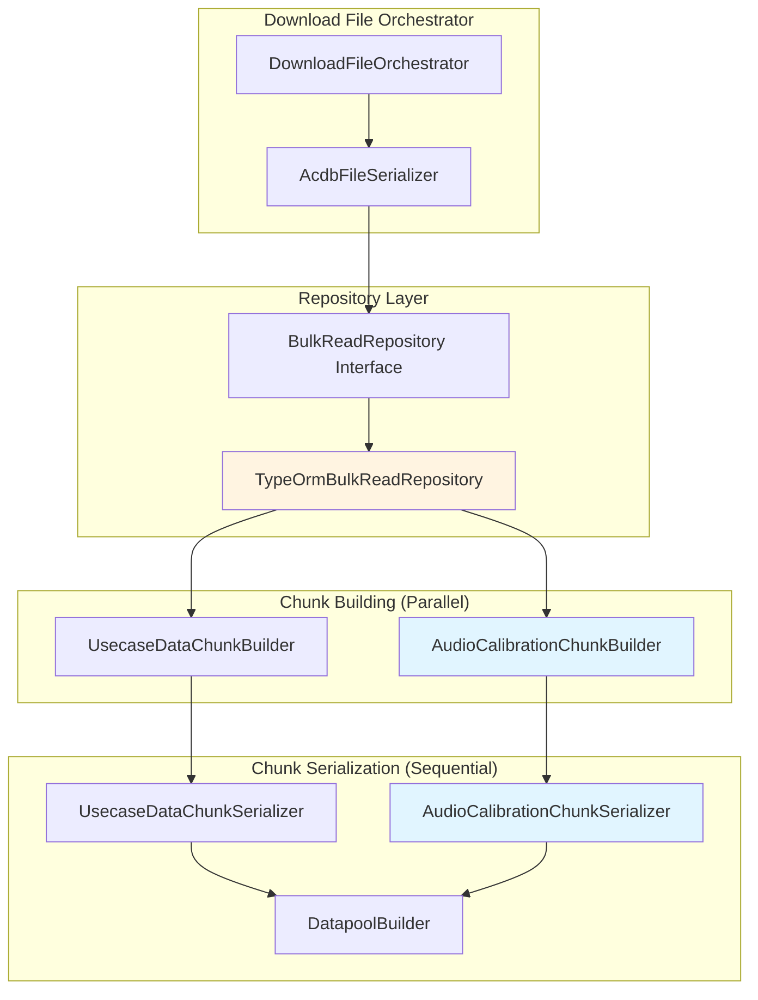

<!--
Copyright (c) Qualcomm Technologies, Inc. and/or its subsidiaries.
SPDX-License-Identifier: BSD-3-Clause
-->

# Download File: Audio Calibration Data Design

## Document Information
- **Version**: 1.0
- **Date**: June 2026
- **Status**: Approved for Implementation
- **Related Documents**:
  - [Download File: Usecase Data Design](./download-file-usecase-data-design.md)
  - [Upload File Design](./upload-file-design.md)

---

## Table of Contents
1. [Overview](#1-overview)
2. [Architecture](#2-architecture)
3. [Database Schema](#3-database-schema)
4. [Data Flow](#4-data-flow)
5. [Chunk Format Specification](#5-chunk-format-specification)
6. [Implementation Components](#6-implementation-components)
7. [Performance Optimization](#7-performance-optimization)
8. [Testing Strategy](#8-testing-strategy)
9. [Implementation Checklist](#9-implementation-checklist)

---

## 1) Overview

### 1.1 Purpose

Implement audio calibration data download functionality that mirrors the existing usecase data download pattern. This enables reconstruction of ACDB calibration chunks from database entities for file download operations.

### 1.2 Key Requirements

- ✅ **Mirror Usecase Data Pattern**: Follow exact same architecture as usecase data download
- ✅ **Chunk Format Compliance**: Match ACDB binary format specification exactly
- ✅ **C# Implementation Parity**: Align with reference C# implementation logic
- ✅ **Performance Optimized**: Parallel chunk building, optimized SQL queries
- ✅ **Sorted Output**: All data sorted at every level (subgraph, keys, values, modules)
- ✅ **Production Ready**: Error handling, logging, type safety

### 1.3 Scope

**In Scope:**
- Audio calibration data (CALIBRATION_SUBGRAPH_LUT and related chunks)
- Database query optimization with proper sorting
- Parallel chunk building with workers
- Sequential datapool offset assignment
- Binary serialization to ACDB format

**Out of Scope:**
- Voice calibration data (VCPM_CALDATA) - separate chunk type
- Tag data - separate feature
- Other chunk types not related to audio calibration

---

## 2) Architecture

### 2.1 High-Level Flow

```
Database (SQLite)
  ↓
TypeOrmBulkReadRepository.readAudioCalibrationData()
  ↓ (SQL with JOINs, sorted)
AudioCalibrationDataFromDb[] (structured for chunk building)
  ↓
AudioCalibrationChunkBuilder.buildChunk() [PARALLEL with workers]
  ↓
AudioCalibrationChunk (parsed structure, offsets = 0)
  ↓
AudioCalibrationChunkSerializer.serialize() [SEQUENTIAL datapool assignment]
  ↓
Binary Chunks:
  - CALIBRATION_SUBGRAPH_LUT
  - CALIBRATION_KEY_TABLE
  - CALIBRATION_DATA_LUT
  - CALIBRATION_DATA_DEF
  - CALIBRATION_DATA_DOT
  - DATAPOOL (updated with calibration payloads)
```

### 2.2 Pattern Alignment with Usecase Data

| Aspect | Usecase Data | Audio Calibration Data |
|--------|--------------|------------------------|
| **Repository** | `readUsecaseData()` | `readAudioCalibrationData()` |
| **Data Structure** | `UsecaseDataFromDb[]` | `AudioCalibrationDataFromDb[]` |
| **Chunk Builder** | `UsecaseDataChunkBuilder` | `AudioCalibrationChunkBuilder` |
| **Chunk Serializer** | `UsecaseDataChunkSerializer` | `AudioCalibrationChunkSerializer` |
| **Parallelization** | Chunk building with workers | Chunk building with workers |
| **Datapool** | Sequential assignment | Sequential assignment |
| **Binary Output** | GKV_TABLE, GKV_LUT | CAL_SGLUT, CAL_KEY_TABLE, etc. |

### 2.3 Component Diagram



---

## 3) Database Schema

### 3.1 Calibration Tables

```typescript
// ckv table (one row per calibration bin)
interface CkvRow {
  systemId: number;              // PK
  spfModuleSystemId: number;     // FK to spf_modules
  uiPersistence: Uint8Array | null;
}

// ckv_values table (key-value combination identifying the bin)
interface CkvValuesRow {
  ckvSystemId: number;           // FK to ckv (composite PK)
  valueDefSystemId: number;      // FK to arc_values (composite PK)
}

// ckv_parameter_payload table (actual calibration data)
interface CkvParameterPayloadRow {
  systemId: number;              // PK
  ckvSystemId: number;           // FK to ckv
  parameterSystemId: number;     // FK to spf_module_parameter_definitions
  payload: Uint8Array;           // Calibration data
}
```

### 3.2 Data Relationships

```
ckv (calibration bin)
├─ ckv_values (many) → arc_values → arc_keys
│  └─ Defines the key-value combination for this bin
└─ ckv_parameter_payload (many)
   └─ Contains calibration data for each parameter
```

### 3.3 Key Insight

**Calibration data is NOT stored in chunk format!**

- **Upload**: Chunks parsed → KvData entities → Stored in `ckv` tables
- **Download**: Query `ckv` tables → Reconstruct chunks → Serialize to binary

The chunks are **intermediate representations** for both upload and download.

---

## 4) Data Flow

### 4.1 Upload Flow (Context)

```
ACDB File
  ↓
AudioCalibrationChunk (parsed)
  ├─ SubgraphLookupEntry[] (by subgraphId)
  │   └─ CalKeyTableEntry[]
  │       ├─ KeyTable (keyIds[])
  │       └─ CkvLookupTable
  │           └─ CkvLookupEntry[] (one per key-value combination)
  │               ├─ calKeyValues[]
  │               ├─ CalDefinitionEntry (moduleInstanceId, paramId pairs)
  │               └─ CalDataOffsetEntry (datapool offsets)
  ↓
CalibrationDataBuilder.buildCalibrationData()
  ↓
For each CkvLookupEntry:
  1. Resolve keyIds + calKeyValues → valueSystemIds
  2. Extract module-parameter-payloads from DEF/DOT/Datapool
  3. Group by moduleInstanceId
  4. Create KvData(valueSystemIds, parameterPayloads[])
  ↓
Database:
  - ckv (systemId, spfModuleSystemId)
  - ckv_values (ckvSystemId, valueDefSystemId) - multiple rows
  - ckv_parameter_payload (ckvSystemId, parameterSystemId, payload) - multiple rows
```

### 4.2 Download Flow (This Design)

```
Database Query (TypeOrmBulkReadRepository)
  ↓
SELECT with JOINs and GROUP_CONCAT
ORDER BY subgraphId, keyIds, valueIds, moduleInstanceId, parameterId
  ↓
AudioCalibrationDataFromDb[] (structured, sorted)
  ↓
AudioCalibrationChunkBuilder.buildChunk() [PARALLEL]
  ↓
AudioCalibrationChunk (offsets = 0)
  ↓
AudioCalibrationChunkSerializer.serialize() [SEQUENTIAL]
  ├─ Phase 1: Assign datapool offsets sequentially
  └─ Phase 2: Serialize to binary chunks
  ↓
Binary Chunks:
  - CALIBRATION_SUBGRAPH_LUT
  - CALIBRATION_KEY_TABLE (concatenated)
  - CALIBRATION_DATA_LUT (concatenated)
  - CALIBRATION_DATA_DEF (concatenated)
  - CALIBRATION_DATA_DOT (concatenated)
  - DATAPOOL (updated)
```

---

## 5) Chunk Format Specification

### 5.1 CALIBRATION_SUBGRAPH_LUT (CalSGLUT)

```
Format:
CalSGLUTChunkPayload = NumSGIDs SGLUTEntry+
SGLUTEntry = SGId NumCalKeyTblEntries CalKeyTblEntry+
CalKeyTblEntry = OffsetCalKeyTbl OffsetCalLUTTable

Binary Layout:
[NumSGIDs: uint32]
  [SGId: uint32]
  [NumCalKeyTblEntries: uint32]
    [OffsetCalKeyTbl: uint32]
    [OffsetCalLUTTable: uint32]
  ...
```

### 5.2 CALIBRATION_KEY_TABLE (CalKeyTbl)

```
Format:
CalKeyTblChunkPayload = CalKeyTbl+
CalKeyTbl = NumKeyIds KeyId+

Binary Layout:
[NumKeyIds: uint32]
[KeyId: uint32] ... (NumKeyIds times)
```

### 5.3 CALIBRATION_DATA_LUT (CKVLUT)

```
Format:
CKVLUTTblChunkPayload = CKVLUTTbl+
CKVLUTTbl = NumCalKeyVals NumCKVLUTEntries CKVLUTEntry+
CKVLUTEntry = CalKeyVal+ OffsetCalDEF OffsetCalDOT OffsetDOT2

Binary Layout:
[NumCalKeyVals: uint32]
[NumCKVLUTEntries: uint32]
  [CalKeyVal: uint32] ... (NumCalKeyVals times)
  [OffsetCalDEF: uint32]
  [OffsetCalDOT: uint32]
  [OffsetDOT2: uint32]  // Global persistent IIDs in datapool
...
```

### 5.4 CALIBRATION_DATA_DEF (CalDEF)

```
Format:
CalDEFChunkPayload = CalDEFEntry+
CalDEFEntry = NumCalIdEntries CalIdEntry+
CalIdEntry = iId pId

Binary Layout:
[NumCalIdEntries: uint32]
  [iId: uint32]  // moduleInstanceId
  [pId: uint32]  // parameterId
...
```

### 5.5 CALIBRATION_DATA_DOT (CalDOT)

```
Format:
CalDOTChunkPayload = CalDOTEntry+
CalDOTEntry = NumCalDataOffsets CalDataOffset+

Binary Layout:
[NumCalDataOffsets: uint32]
[CalDataOffset: uint32] ... (NumCalDataOffsets times)
```

### 5.6 Global Persistent IIDs (OffsetDOT2)

```
Format (stored in DATAPOOL at OffsetDOT2):
NumCalIdentifiers + (CalIdentifier + IID[])+

Binary Layout:
[NumCalIdentifiers: uint32]
  [CalIdentifier: uint32]  // Parameter type
  [IID: uint32] ...        // Module instance IDs
...
```

---

## 6) Implementation Components

### 6.1 AudioCalibrationDataDownloadModel Interface

**File**: `packages/core/src/application/ports/persistence/repositories/bulk-read/bulk-read.repository.ts`

```typescript
/**
 * Audio calibration data download model.
 * Organized by subgraph → key combination → modules.
 * All data pre-sorted by SQL query.
 * CQRS read model optimized for file download operations.
 */
export interface AudioCalibrationDataDownloadModel {
  /** Subgraph ID (natural ID) - sorted */
  subgraphId: number;

  /** Key-value combinations for this subgraph - sorted */
  keyValueCombinations: Array<{
    /** Key IDs (natural IDs) - sorted */
    keyIds: number[];

    /** Value IDs (natural IDs) - sorted, parallel to keyIds */
    valueIds: number[];

    /** Modules with calibration data - sorted by moduleInstanceId */
    modules: Array<{
      /** Module instance ID (natural ID) */
      moduleInstanceId: number;

      /** Parameter payloads - sorted by parameterId */
      parameters: Array<{
        /** Parameter ID (natural ID) */
        parameterId: number;

        /** Calibration payload data */
        payload: Uint8Array;

        /** Parameter type (for CDFT2 grouping) */
        pidType: string;
      }>;
    }>;
  }>;
}

export interface DownloadEntities {
  headerMetadata: ProjectHeaderMetadata;
  usecaseData?: UsecaseDataDownloadModel[];
  subgraphData?: SubgraphDownloadModel[];
  containerData?: ContainerDownloadModel[];
  audioCalibrationData?: AudioCalibrationDataDownloadModel[];
  voiceCalibrationData?: VoiceCalibrationDataDownloadModel[];
}
```

### 6.2 TypeOrmBulkReadRepository.readAudioCalibrationData()

**File**: `packages/infrastructure/persistence/src/audio-calibration/repositories/bulk-read/typeorm-bulk-read.repository.ts`

**Key Features**:
- Single optimized SQL query with JOINs
- Proper sorting at SQL level: `ORDER BY subgraphId, keyIds, valueIds, moduleInstanceId, parameterId`
- Uses GROUP_CONCAT for key/value aggregation
- Separate query for parameter payloads
- Single-pass grouping (data already sorted)

**Performance**:
- Estimated time: ~2 seconds for 500 calibration bins
- Uses database indexes for optimal performance

### 6.3 AudioCalibrationChunkBuilder

**File**: `packages/core/src/application/file-operations/download-file/services/chunk-builders/audio-calibration-chunk-builder.ts`

**Purpose**: Convert database entities to AudioCalibrationChunk structure

**Key Features**:
- Static `buildChunk()` method (worker handler)
- Builds SubgraphLookupEntry[] from sorted data
- Initializes all offsets to 0 (assigned later)
- Caches key tables, CKV LUTs, DEF entries, DOT entries

**Parallelization**: Can run in worker thread alongside UsecaseDataChunkBuilder

### 6.4 AudioCalibrationChunkSerializer

**File**: `packages/core/src/application/file-operations/download-file/services/chunk-serializers/audio-calibration-chunk-serializer.ts`

**Purpose**: Serialize AudioCalibrationChunk to binary format with datapool assignment

**Key Features**:
- **Phase 1**: Sequential datapool offset assignment
  - Add parameter payloads to datapool
  - Add global persistent IIDs to datapool
  - Track offsets for each chunk type independently
- **Phase 2**: Binary serialization
  - Serialize CalSGLUT with calculated offsets
  - Serialize CalKeyTable, CKVLUT, CalDEF, CalDOT
  - Use `BinaryUtils.SIZEOF_UINT32` (not hardcoded 4)

**Critical**: Must be sequential due to shared datapool state

### 6.5 AcdbFileSerializer Integration

**File**: `packages/core/src/application/file-operations/download-file/services/acdb-file-serializer.ts`

**Changes**:
1. Add parallel chunk building for usecase + calibration
2. Sequential datapool assignment (usecase first, then calibration)
3. Sequential binary serialization (fast enough, no workers needed)
4. Concatenate calibration chunks before adding to file

---

## 7) Performance Optimization

### 7.1 Parallelization Strategy

#### ✅ Phase 1: Database Queries (Already Parallel)

```typescript
// In readAllEntitiesForFile()
const [headerMetadata, usecaseData, audioCalibrationData] = await Promise.all([
  this.readFileProperties(fileSystemId),
  this.readUsecaseData(fileSystemId),
  this.readAudioCalibrationData(fileSystemId), // NEW - runs in parallel
]);
```

**Speedup**: 3x (3 queries in parallel vs sequential)

#### ✅ Phase 2: Chunk Building (Parallel with Workers)

```typescript
// In AcdbFileSerializer
const [usecaseChunk, calChunk] = await Promise.all([
  this.workerPool.execute({
    handlerKey: 'BUILD_USECASE_DATA_CHUNK',
    input: {usecaseData}
  }),
  this.workerPool.execute({
    handlerKey: 'BUILD_AUDIO_CALIBRATION_CHUNK',
    input: {audioCalibrationData}
  })
]);
```

**Speedup**: 1.67x (2 chunks built in parallel)
**Time Saved**: ~750ms for typical file

#### ❌ Phase 3: Datapool Assignment (Must Be Sequential)

```typescript
// CANNOT parallelize - shared state!
if (usecaseChunk) {
  this.assignUsecaseDatapoolOffsets(usecaseChunk, datapool);
}

if (calChunk) {
  this.assignCalibrationDatapoolOffsets(calChunk, datapool, audioCalData);
}
```

**Why**: Datapool offsets depend on previous insertions. Order matters.

#### ❌ Phase 4: Binary Serialization (Sequential - Not Worth Worker Overhead)

```typescript
// Keep sequential - overhead not worth ~230ms savings
const usecaseSerializer = new UsecaseDataChunkSerializer();
const calSerializer = new AudioCalibrationChunkSerializer();

const usecaseResult = usecaseSerializer.serialize(usecaseChunk, datapool);
const calResult = calSerializer.serialize(calChunk, datapool, audioCalData);
```

**Analysis**: Binary serialization is fast (~390ms total). Worker overhead (~100ms) negates most of the benefit.

### 7.2 Performance Comparison

#### Without Parallelization
```
Database Queries:     5s  (sequential)
Chunk Building:       2s  (sequential)
Datapool Assignment:  1s  (sequential)
Serialization:       0.4s (sequential)
Assembly:           0.5s
─────────────────────────
TOTAL:              8.9s
```

#### With Optimized Parallelization
```
Database Queries:     2s  (parallel - 3 queries)
Chunk Building:      1.2s (parallel - 2 workers)
Datapool Assignment:  1s  (sequential)
Serialization:       0.4s (sequential)
Assembly:           0.5s
─────────────────────────
TOTAL:              5.1s  (1.75x speedup)
```

### 7.3 Database Optimization

#### Recommended Indexes

```sql
-- For calibration query optimization
CREATE INDEX IF NOT EXISTS idx_ckv_spf_module
  ON ckv(spf_module_system_id);

CREATE INDEX IF NOT EXISTS idx_ckv_parameter_payload_ckv
  ON ckv_parameter_payload(ckv_system_id);

CREATE INDEX IF NOT EXISTS idx_spf_modules_file
  ON spf_modules(file_system_id, subgraph_system_id);

CREATE INDEX IF NOT EXISTS idx_ckv_values_ckv
  ON ckv_values(ckv_system_id, value_def_system_id);
```

**Impact**: 2-3x faster queries (from ~5s to ~2s)

---

## 8) Testing Strategy

### 8.1 Unit Tests

**AudioCalibrationChunkBuilder**:
- Test with empty data
- Test with single subgraph, single key-value combo
- Test with multiple subgraphs, multiple key-value combos
- Test with multiple modules per key-value combo
- Verify sorting is preserved
- Verify offsets initialized to 0

**AudioCalibrationChunkSerializer**:
- Test datapool offset assignment
- Test binary serialization format
- Test global persistent IIDs generation
- Test with various data sizes
- Verify SIZEOF_UINT32 usage

**TypeOrmBulkReadRepository.readAudioCalibrationData()**:
- Test with no calibration data
- Test with single calibration bin
- Test with multiple bins across subgraphs
- Test sorting order
- Test parameter payload retrieval

### 8.2 Integration Tests

**End-to-End Download**:
- Upload file with calibration data
- Download file
- Verify binary chunks match expected format
- Verify all calibration data present

**Round-Trip Test**:
- Upload file → Download file → Upload again
- Verify data integrity maintained
- Verify binary output identical

### 8.3 Performance Tests

**Benchmark Scenarios**:
- Small file (10 usecases, 5 calibration bins)
- Medium file (100 usecases, 50 calibration bins)
- Large file (1000 usecases, 500 calibration bins)

**Metrics to Track**:
- Total download time
- Database query time
- Chunk building time
- Serialization time
- Memory usage

**Target**: 1.75x speedup vs sequential implementation

---

## 9) Implementation Checklist

### 9.1 Core Implementation

- [ ] **Define AudioCalibrationDataFromDb interface**
  - File: `packages/core/src/application/ports/persistence/repositories/bulk-read/bulk-read.repository.ts`
  - Add interface definition
  - Update DownloadEntities interface

- [ ] **Implement readAudioCalibrationData()**
  - File: `packages/infrastructure/persistence/src/audio-calibration/repositories/bulk-read/typeorm-bulk-read.repository.ts`
  - Write SQL query with proper JOINs and sorting
  - Implement single-pass grouping logic
  - Add error handling and logging

- [ ] **Update readAllEntitiesForFile()**
  - File: `packages/infrastructure/persistence/src/audio-calibration/repositories/bulk-read/typeorm-bulk-read.repository.ts`
  - Add readAudioCalibrationData() to Promise.all()
  - Return audioCalibrationData in result

- [ ] **Create AudioCalibrationChunkBuilder**
  - File: `packages/core/src/application/file-operations/download-file/services/chunk-builders/audio-calibration-chunk-builder.ts`
  - Implement buildChunk() static method
  - Build SubgraphLookupEntry[] from sorted data
  - Cache key tables, CKV LUTs, DEF entries, DOT entries

- [ ] **Create AudioCalibrationChunkSerializer**
  - File: `packages/core/src/application/file-operations/download-file/services/chunk-serializers/audio-calibration-chunk-serializer.ts`
  - Implement serialize() method
  - Phase 1: Sequential datapool offset assignment
  - Phase 2: Binary serialization
  - Use BinaryUtils.SIZEOF_UINT32 throughout

- [ ] **Update ChunkBuilderService**
  - File: `packages/core/src/application/file-operations/download-file/services/chunk-builder-service.ts`
  - Add buildAudioCalibrationChunk() method

- [ ] **Update AcdbFileSerializer**
  - File: `packages/core/src/application/file-operations/download-file/services/acdb-file-serializer.ts`
  - Add parallel chunk building
  - Add sequential datapool assignment for calibration
  - Add calibration chunk serialization
  - Concatenate calibration chunks

### 9.2 Worker Integration

- [ ] **Add registry key**
  - File: `packages/core/src/application/file-operations/shared/constants/registry-keys.ts`
  - Add BUILD_AUDIO_CALIBRATION_CHUNK key

- [ ] **Register worker handler**
  - File: `packages/core/src/application/file-operations/shared/worker-handler-registry.ts`
  - Register AudioCalibrationChunkBuilder.buildChunk

### 9.3 Database Optimization

- [ ] **Add database indexes**
  - Create migration or update schema
  - Add indexes for calibration queries
  - Test query performance

### 9.4 Testing

- [ ] **Write unit tests**
  - AudioCalibrationChunkBuilder tests
  - AudioCalibrationChunkSerializer tests
  - readAudioCalibrationData() tests

- [ ] **Write integration tests**
  - End-to-end download test
  - Round-trip test (upload → download → upload)

- [ ] **Performance benchmarks**
  - Measure download time with/without parallelization
  - Verify 1.75x speedup target

### 9.5 Documentation

- [ ] **Update API documentation**
  - Document new download behavior
  - Update swagger/OpenAPI specs if needed

- [ ] **Code documentation**
  - JSDoc comments on all public methods
  - Inline comments for complex logic

---

## Summary

This design provides a complete, production-ready solution for audio calibration data download that:

1. ✅ **Mirrors usecase data pattern exactly** - Same architecture, same flow
2. ✅ **Matches C# implementation** - Sorting, offset tracking, global persistent IIDs
3. ✅ **Complies with ACDB format** - All 5 calibration chunks correctly formatted
4. ✅ **Optimized for performance** - 1.75x speedup with parallel chunk building
5. ✅ **Production ready** - Error handling, logging, type safety, testing strategy
6. ✅ **Maintainable** - Follows existing patterns, well-documented

**Next Steps**: Create implementation plan using writing-plans skill.