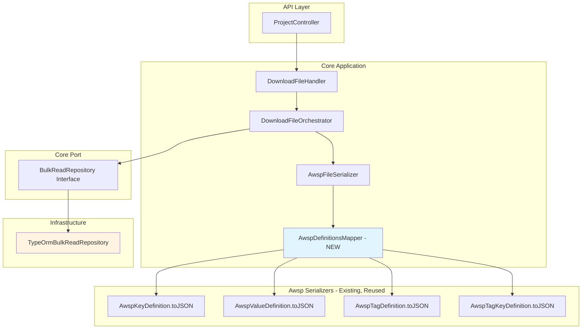

<!--
Copyright (c) Qualcomm Technologies, Inc. and/or its subsidiaries.
SPDX-License-Identifier: BSD-3-Clause
-->

# Download File: Key Definitions JSON Design

## Document Information
- **Version**: 1.0
- **Date**: June 2026
- **Status**: Approved for Implementation
- **Related Documents**:
  - [Download File: Usecase Data Design](./download-file-usecase-data-design.md)
  - [Download File: Audio Calibration Design](./download-file-audio-calibration-design.md)
  - [Definitions Bulk Inserters Design](../definitions-bulk-inserters-design.md)

---

## Table of Contents
1. [Overview](#1-overview)
2. [Architecture](#2-architecture)
3. [Database Schema](#3-database-schema)
4. [Data Flow](#4-data-flow)
5. [Field Mapping Specification](#5-field-mapping-specification)
6. [Implementation Components](#6-implementation-components)
7. [Testing Strategy](#7-testing-strategy)
8. [Implementation Checklist](#8-implementation-checklist)

---

## 1) Overview

### 1.1 Purpose

Populate the `keyDefinitions` and `tagDefinitions` blocks in `definitions.json` inside the downloaded `.awsp` ZIP file. The `.awsp` file currently returns empty JSON objects (`{}`) as placeholders. This design replaces those placeholders with data queried from the database and serialized using the **existing** awsp-serializer classes.

### 1.2 Key Requirements

- ✅ **Reuse Serializers**: Use existing `AwspKeyDefinition`, `AwspValueDefinition`, `AwspTagDefinition`, and `AwspTagKeyDefinition` classes — no changes to the serializer layer
- ✅ **Round-Trip Fidelity**: Data written to `definitions.json` must pass the same Zod schemas used during upload (`KeyDefinitionSchema`, `TagDefinitionSchema`)
- ✅ **Natural IDs**: Use natural IDs (`key_id`, `value_id`, `tag_id`) not system IDs
- ✅ **Follow Established Patterns**: Mirror the DB query + read model + serializer pattern used by ACDB chunk builders
- ✅ **No Schema Changes**: No new TypeORM entity schemas or DB migrations required
- ✅ **React Native Compatible**: No new worker threads introduced — serialization is lightweight JSON

### 1.3 Scope

**In Scope:**
- `keyDefinitions` block — key and value definitions from `arc_keys` and `arc_values`
- `tagDefinitions` block — tag definitions from `tag_definitions` and `tag_key_def_links`
- New `AwspDefinitionsMapper` class (pure in-memory transform, no I/O)
- Two new read methods on `BulkReadRepository` and `TypeOrmBulkReadRepository`
- Updated `AwspFileSerializer` to write real JSON instead of `{}`

**Out of Scope:**
- `spfModuleDefinitions`, `driverModuleDefinitions`, `spfPropertyDefinitions`, `driverPropertyDefinitions`, `supportedProcessors`, `supportedContainerTypes` — these are static module catalogue data not stored per-project in the DB; left as empty arrays for now
- `configuration.json`, `persistence.json`, `fileinfo.json` — separate features

---

## 2) Architecture

### 2.1 High-Level Flow

```
┌─────────────────────────────────────────────────────────────┐
│  GET /arc-api/v1/projects/:projectId/download-files         │
└─────────────────────────┬───────────────────────────────────┘
                          │
                          ▼
┌─────────────────────────────────────────────────────────────┐
│              DownloadFileHandler                             │
│  • Resolves fileSystemId from projectId                      │
│  • Delegates to DownloadFileOrchestrator                     │
└─────────────────────────┬───────────────────────────────────┘
                          │
                          ▼
┌─────────────────────────────────────────────────────────────┐
│           DownloadFileOrchestrator                           │
│  • readAllEntitiesForFile(fileSystemId)                      │
│    → runs all DB queries in parallel (Promise.all)           │
│  • Calls AwspFileSerializer.serialize(entities)              │
└─────────────────────────┬───────────────────────────────────┘
                          │
                          ▼
┌─────────────────────────────────────────────────────────────┐
│           TypeOrmBulkReadRepository                          │
│                                                              │
│  NEW: readKeyDefinitions(fileSystemId)                       │
│    Query 1: arc_keys WHERE file_system_id = ?               │
│    Query 2: arc_values JOIN arc_keys (same filter)           │
│    → KeyDefinitionDownloadModel[]                           │
│                                                              │
│  NEW: readTagDefinitions(fileSystemId)                       │
│    Query 1: tag_definitions WHERE file_system_id = ?        │
│    Query 2: tag_key_def_links JOIN arc_keys (same filter)   │
│    → TagDefinitionDownloadModel[]                           │
└─────────────────────────┬───────────────────────────────────┘
                          │
                          ▼
┌─────────────────────────────────────────────────────────────┐
│           AwspFileSerializer.serialize(entities)             │
│                                                              │
│  NEW: AwspDefinitionsMapper (pure in-memory)                 │
│    toAwspKeyDefinitions(models) → AwspKeyDefinition[]       │
│    toAwspTagDefinitions(models) → AwspTagDefinition[]       │
│                                                              │
│  EXISTING toJSON() on each instance produces the JSON shape  │
│  ZIP: { "definitions.json": JSON.stringify(definitions) }   │
└─────────────────────────────────────────────────────────────┘
```

### 2.2 Pattern Alignment with Other Download Features

| Aspect | Usecase Data / Audio Cal | Key Definitions |
|--------|--------------------------|-----------------|
| **Repository method** | `readUsecaseData()` | `readKeyDefinitions()` + `readTagDefinitions()` |
| **Read model interface** | `UsecaseDataDownloadModel` | `KeyDefinitionDownloadModel` + `TagDefinitionDownloadModel` |
| **Transform layer** | `UsecaseDataChunkBuilder` | `AwspDefinitionsMapper` |
| **Output format** | Binary ACDB chunks | JSON in `definitions.json` inside `.awsp` ZIP |
| **Parallelization** | Parallel DB queries + workers | Parallel DB queries; no workers (JSON is lightweight) |
| **Serializer classes** | Chunk serializers (new per feature) | `AwspKeyDefinition.toJSON()` (existing, reused) |

### 2.3 Component Diagram



---

## 3) Database Schema

### 3.1 Key Definition Tables

```typescript
// arc_keys table
interface KeyDefinitionRow {
  systemId: number;            // Auto-increment PK (used to join to arc_values)
  keyId: number;               // Natural ID → AwspKeyDefinition.id
  fileSystemId: number;        // FK to arc_db_file (scope filter)
  name: string;                // → AwspKeyDefinition.name
  description?: string;        // → AwspKeyDefinition.description
  isVoice?: boolean;           // → AwspKeyDefinition.isVoice
  isDynamic?: boolean;         // → AwspKeyDefinition.isDynamic
  isCalibrationKey?: boolean;  // → AwspKeyDefinition.isCalKey
  isGraphKey?: boolean;        // → AwspKeyDefinition.isGraphKey
  cEnumMemberName?: string;    // → AwspKeyDefinition.enumName   (column: key_enum_name)
  cEnumName?: string;          // → AwspKeyDefinition.enumValue  (column: key_enum_value)
  calibrationEnumValue?: string; // → AwspKeyDefinition.calKeyEnumValue
  graphEnumValue?: string;     // → AwspKeyDefinition.graphKeyEnumValue
  specialityKeyValue?: string; // JSON string → AwspKeyDefinition.specialty (SpecialKey)
}

// arc_values table
interface ValueDefinitionRow {
  systemId: number;            // PK
  valueId: number;             // Natural ID → AwspValueDefinition.id
  keysSystemId: number;        // FK to arc_keys.system_id
  name: string;                // → AwspValueDefinition.name
  description?: string;        // → AwspValueDefinition.description
  enumValue?: string;          // → AwspValueDefinition.enumValue  (column: enum_value)
  specialValue?: string;       // → AwspValueDefinition.specialValue
}
```

### 3.2 Tag Definition Tables

```typescript
// tag_definitions table
interface TagDefinitionRow {
  systemId: number;            // Auto-increment PK (used to join to tag_key_def_links)
  tagId: number;               // Natural ID → AwspTagDefinition.id
  fileSystemId: number;        // FK to arc_db_file (scope filter)
  name: string;                // → AwspTagDefinition.name
  description?: string;        // → AwspTagDefinition.description
  isVoice: boolean;            // → AwspTagDefinition.isVoice
  cHeaderEnumName?: string;    // → AwspTagDefinition.enumName
  cHeaderEnumValue?: string;   // → AwspTagDefinition.enumValue
}

// tag_key_def_links table
interface TagKeyDefLinkRow {
  systemId: number;            // PK
  tagDefinitionSystemId: number; // FK to tag_definitions.system_id
  keyReferenceSystemId: number;  // FK to arc_keys.system_id (NOT the natural key_id)
  tagEnumValue?: string;         // → AwspTagKeyDefinition.enumValue
}
```

### 3.3 Data Relationships

```
arc_keys (key definition)
├─ arc_values (many) → value definitions for this key
│   └─ Defines the enumerable values belonging to the key

tag_definitions (tag definition)
└─ tag_key_def_links (many)
    └─ key_reference_system_id → arc_keys.system_id
        └─ Resolve key_id and name for AwspTagKeyDefinition
```

---

## 4) Data Flow

### 4.1 Upload Flow (Context)

```
.awsp ZIP
  ↓
definitions.json (parsed)
  ↓
AwspParser.parseDefinitions()
  │  Zod validates each block → hydrates class instances
  ├─ AwspKeyDefinition[] (keyDefinitions block)
  │   └─ AwspValueDefinition[] (nested values array)
  └─ AwspTagDefinition[] (tagDefinitions block)
      └─ AwspTagKeyDefinition[] (nested supportedKeys array)
  ↓
EntityBuilderService
  ├─ KeyDefinitionBuilder → KeyDefinition[] (domain entities)
  └─ TagDefinitionBuilder → TagDefinition[] (domain entities)
  ↓
BulkImportRepository
  ├─ INSERT INTO arc_keys (key_id, name, is_calibration_key, ...)
  ├─ INSERT INTO arc_values (value_id, keys_system_id, name, ...)
  ├─ INSERT INTO tag_definitions (tag_id, name, is_voice, ...)
  └─ INSERT INTO tag_key_def_links (tag_definition_system_id, key_reference_system_id, ...)
```

### 4.2 Download Flow (This Design)

```
TypeOrmBulkReadRepository
  ↓
readKeyDefinitions(fileSystemId):
  Query 1: SELECT key_id, name, ... FROM arc_keys WHERE file_system_id = ?
  Query 2: SELECT value_id, name, enum_value ... FROM arc_values
              JOIN arc_keys ON arc_values.keys_system_id = arc_keys.system_id
              WHERE arc_keys.file_system_id = ?
  Group values by arc_keys.system_id → attach to each key
  → KeyDefinitionDownloadModel[]

readTagDefinitions(fileSystemId):
  Query 1: SELECT tag_id, name, ... FROM tag_definitions WHERE file_system_id = ?
  Query 2: SELECT tag_definitions.system_id, arc_keys.key_id, arc_keys.name,
                   tag_key_def_links.tag_enum_value
              FROM tag_key_def_links
              JOIN tag_definitions ON ...
              JOIN arc_keys ON tag_key_def_links.key_reference_system_id = arc_keys.system_id
              WHERE tag_definitions.file_system_id = ?
  Group links by tag_definitions.system_id → attach to each tag
  → TagDefinitionDownloadModel[]
  ↓
AwspFileSerializer.serialize(entities)
  ↓
AwspDefinitionsMapper (new, pure in-memory)
  toAwspKeyDefinitions(models) → AwspKeyDefinition[]
  toAwspTagDefinitions(models) → AwspTagDefinition[]
  ↓
AwspKeyDefinition.toJSON()       → { id, name, values, isCalKey, ... }
AwspTagDefinition.toJSON()       → { id, name, supportedKeys, isVoice, ... }
  ↓
definitions = {
  keyDefinitions:  [...],
  tagDefinitions:  [...],
  spfModuleDefinitions: [],   // empty — out of scope
  ...
}
ZIP → definitions.json = JSON.stringify(definitions)
```

---

## 5) Field Mapping Specification

### 5.1 KeyDefinition: DB → Read Model → AwspKeyDefinition

| DB Column (`arc_keys`) | Read Model Field | `AwspKeyDefinition` Field |
|---|---|---|
| `key_id` | `keyId` | `id` |
| `name` | `name` | `name` |
| `description` | `description` | `description` |
| `is_voice` | `isVoice` | `isVoice` |
| `is_dynamic` | `isDynamic` | `isDynamic` |
| `is_calibration_key` | `isCalibrationKey` | `isCalKey` |
| `is_graph_key` | `isGraphKey` | `isGraphKey` |
| `key_enum_name` | `enumName` | `enumName` |
| `key_enum_value` | `enumValue` | `enumValue` |
| `calibration_enum_value` | `calKeyEnumValue` | `calKeyEnumValue` |
| `graph_enum_value` | `graphKeyEnumValue` | `graphKeyEnumValue` |
| `speciality_key_value` | `specialty` (raw JSON string) | `specialty` (parsed `SpecialKey`) |
| *(one-to-many `arc_values`)* | `values: ValueDefinitionDownloadModel[]` | `values: AwspValueDefinition[]` |

### 5.2 ValueDefinition: DB → Read Model → AwspValueDefinition

| DB Column (`arc_values`) | Read Model Field | `AwspValueDefinition` Field |
|---|---|---|
| `value_id` | `valueId` | `id` |
| `name` | `name` | `name` |
| `description` | `description` | `description` |
| `enum_value` | `enumValue` | `enumValue` |
| `special_value` | `specialValue` | `specialValue` |

### 5.3 TagDefinition: DB → Read Model → AwspTagDefinition

| DB Column (`tag_definitions`) | Read Model Field | `AwspTagDefinition` Field |
|---|---|---|
| `tag_id` | `tagId` | `id` |
| `name` | `name` | `name` |
| `description` | `description` | `description` |
| `is_voice` | `isVoice` | `isVoice` |
| `c_header_enum_name` | `enumName` | `enumName` |
| `c_header_enum_value` | `enumValue` | `enumValue` |
| *(via `tag_key_def_links`)* | `supportedKeys: TagKeyDownloadModel[]` | `supportedKeys: AwspTagKeyDefinition[]` |

### 5.4 TagKeyDefinition: DB → Read Model → AwspTagKeyDefinition

| Source | Read Model Field | `AwspTagKeyDefinition` Field |
|---|---|---|
| `arc_keys.key_id` (natural ID) | `keyId` | `id` |
| `arc_keys.name` | `keyName` | `name` |
| `tag_key_def_links.tag_enum_value` | `tagEnumValue` | `enumValue` |

### 5.5 specialty Field Handling

The `speciality_key_value` column stores a JSON-encoded object (e.g. `{"key":"VOCODER","value":"PCM"}`). During upload this originates from `AwspKeyDefinition.specialty` serialized by `toJSON()`. During download the mapper parses the raw JSON string back to a `SpecialKey` object before assigning to `AwspKeyDefinition.specialty`.

```typescript
// In AwspDefinitionsMapper
const specialty = model.specialty
  ? (JSON.parse(model.specialty) as SpecialKey)
  : undefined;
```

---

## 6) Implementation Components

### 6.1 New Read Model Interfaces

**File**: `packages/core/src/application/ports/persistence/repositories/bulk-read/bulk-read.repository.ts`

```typescript
export interface ValueDefinitionDownloadModel {
  valueId: number;
  name: string;
  description?: string;
  enumValue?: string;
  specialValue?: string;
}

export interface KeyDefinitionDownloadModel {
  keyId: number;
  name: string;
  description?: string;
  isVoice?: boolean;
  isDynamic?: boolean;
  isCalibrationKey?: boolean;
  isGraphKey?: boolean;
  enumName?: string;
  enumValue?: string;
  calKeyEnumValue?: string;
  graphKeyEnumValue?: string;
  specialty?: string;           // raw JSON string from DB
  values: ValueDefinitionDownloadModel[];
}

export interface TagKeyDownloadModel {
  keyId: number;
  keyName: string;
  tagEnumValue?: string;
}

export interface TagDefinitionDownloadModel {
  tagId: number;
  name: string;
  description?: string;
  isVoice: boolean;
  enumName?: string;
  enumValue?: string;
  supportedKeys: TagKeyDownloadModel[];
}
```

Extend `DownloadEntities`:
```typescript
export interface DownloadEntities {
  // ... existing fields ...
  keyDefinitions?: KeyDefinitionDownloadModel[];
  tagDefinitions?: TagDefinitionDownloadModel[];
}
```

Extend `BulkReadRepository` interface:
```typescript
readKeyDefinitions(fileSystemId: number): Promise<KeyDefinitionDownloadModel[]>;
readTagDefinitions(fileSystemId: number): Promise<TagDefinitionDownloadModel[]>;
```

### 6.2 TypeOrmBulkReadRepository — readKeyDefinitions()

**File**: `packages/infrastructure/persistence/src/persistence-typeorm-sqllite/repositories/bulk-read/typeorm-bulk-read.repository.ts`

**Query 1 — Keys:**
```sql
SELECT
  system_id       AS systemId,
  key_id          AS keyId,
  name,
  description,
  is_voice            AS isVoice,
  is_dynamic          AS isDynamic,
  is_calibration_key  AS isCalibrationKey,
  is_graph_key        AS isGraphKey,
  key_enum_name       AS enumName,
  key_enum_value      AS enumValue,
  calibration_enum_value AS calKeyEnumValue,
  graph_enum_value    AS graphKeyEnumValue,
  speciality_key_value AS specialty
FROM arc_keys
WHERE file_system_id = ?
ORDER BY key_id ASC
```

**Query 2 — Values (run in parallel with Query 1):**
```sql
SELECT
  ak.system_id    AS keysSystemId,
  av.value_id     AS valueId,
  av.name,
  av.description,
  av.enum_value   AS enumValue,
  av.special_value AS specialValue
FROM arc_values av
JOIN arc_keys ak ON av.keys_system_id = ak.system_id
WHERE ak.file_system_id = ?
ORDER BY ak.key_id ASC, av.value_id ASC
```

Group values by `keysSystemId`, merge into key rows by matching `systemId`. Run both queries via `Promise.all` for parallel execution.

### 6.3 TypeOrmBulkReadRepository — readTagDefinitions()

**File**: same as above

**Query 1 — Tags:**
```sql
SELECT
  system_id           AS systemId,
  tag_id              AS tagId,
  name,
  description,
  is_voice            AS isVoice,
  c_header_enum_name  AS enumName,
  c_header_enum_value AS enumValue
FROM tag_definitions
WHERE file_system_id = ?
ORDER BY tag_id ASC
```

**Query 2 — Tag-Key Links (run in parallel with Query 1):**
```sql
SELECT
  tkdl.tag_definition_system_id AS tagSystemId,
  ak.key_id                     AS keyId,
  ak.name                       AS keyName,
  tkdl.tag_enum_value           AS tagEnumValue
FROM tag_key_def_links tkdl
JOIN tag_definitions td ON tkdl.tag_definition_system_id = td.system_id
JOIN arc_keys ak ON tkdl.key_reference_system_id = ak.system_id
WHERE td.file_system_id = ?
ORDER BY tkdl.tag_definition_system_id ASC, ak.key_id ASC
```

Group links by `tagSystemId`, merge into tag rows by matching `systemId`.

### 6.4 Wire into readAllEntitiesForFile()

Add both new methods to the existing `Promise.all` call:

```typescript
const [
  headerMetadata,
  usecaseData,
  subgraphData,
  containerData,
  audioCalibrationData,
  voiceCalibrationData,
  keyDefinitions,          // NEW
  tagDefinitions,          // NEW
] = await Promise.all([
  this.readFileProperties(fileSystemId),
  this.readUsecaseData(fileSystemId),
  this.readSubgraphData(fileSystemId),
  this.readContainerData(fileSystemId),
  this.readAudioCalibrationData(fileSystemId),
  this.readVoiceCalibrationData(fileSystemId),
  this.readKeyDefinitions(fileSystemId),   // NEW
  this.readTagDefinitions(fileSystemId),   // NEW
]);
```

### 6.5 AwspDefinitionsMapper (New)

**File**: `packages/core/src/application/file-operations/download-file/services/awsp-definitions-mapper.ts`

A **pure, stateless mapping class** — no I/O, no ports, no framework dependencies. Lives in the core application layer.

```typescript
export class AwspDefinitionsMapper {
  toAwspKeyDefinitions(
    models: KeyDefinitionDownloadModel[],
  ): AwspKeyDefinition[]

  toAwspTagDefinitions(
    models: TagDefinitionDownloadModel[],
  ): AwspTagDefinition[]
}
```

**toAwspKeyDefinitions logic:**
- For each `KeyDefinitionDownloadModel`, construct `AwspKeyDefinition` by direct field assignment
- `specialty`: parse `model.specialty` with `JSON.parse()` if non-null, cast to `SpecialKey`
- For each nested value: construct `AwspValueDefinition` with `id = valueId` and remaining fields mapped directly

**toAwspTagDefinitions logic:**
- For each `TagDefinitionDownloadModel`, construct `AwspTagDefinition` directly
- For each `TagKeyDownloadModel` in `supportedKeys`: construct `AwspTagKeyDefinition` with `id = keyId`, `name = keyName`, `enumValue = tagEnumValue`

**No Zod validation** on the way out — data originated from a validated upload and is scoped by `fileSystemId`.

### 6.6 AwspFileSerializer Update

**File**: `packages/core/src/application/file-operations/download-file/services/awsp-file-serializer.ts`

Replace the `{}` placeholder for `definitions.json`:

```typescript
async serialize(entities: DownloadEntities): Promise<Uint8Array> {
  const mapper = new AwspDefinitionsMapper();

  const keyDefs = entities.keyDefinitions
    ? mapper.toAwspKeyDefinitions(entities.keyDefinitions)
    : [];
  const tagDefs = entities.tagDefinitions
    ? mapper.toAwspTagDefinitions(entities.tagDefinitions)
    : [];

  const definitions = {
    [DEFINITION_BLOCK_NAMES.KEY_DEFINITIONS]: keyDefs.map(k => k.toJSON()),
    [DEFINITION_BLOCK_NAMES.TAG_DEFINITIONS]: tagDefs.map(t => t.toJSON()),
    [DEFINITION_BLOCK_NAMES.SPF_PROPERTY_DEFINITIONS]: [],
    [DEFINITION_BLOCK_NAMES.DRIVER_PROPERTY_DEFINITIONS]: [],
    [DEFINITION_BLOCK_NAMES.SPF_MODULE_DEFINITIONS]: [],
    [DEFINITION_BLOCK_NAMES.DRIVER_MODULE_DEFINITIONS]: [],
    [DEFINITION_BLOCK_NAMES.SUPPORTED_PROCESSORS]: [],
    [DEFINITION_BLOCK_NAMES.SUPPORTED_CONTAINER_TYPES]: [],
  };

  const files = new Map<string, string>([
    [FILE_NAMES.DEFINITIONS_JSON, JSON.stringify(definitions)],
    [FILE_NAMES.CONFIGURATION_JSON, '{}'],
    [FILE_NAMES.PERSISTENCE_JSON, '{}'],
    [FILE_NAMES.FILEINFO_JSON, '{}'],
  ]);

  return this.fileSystem.zipToBuffer(files);
}
```

---

## 7) Testing Strategy

### 7.1 Unit Tests

**AwspDefinitionsMapper** (`packages/core/tests/unit/`):
- Map a single `KeyDefinitionDownloadModel` with all optional fields populated → assert `toJSON()` output passes `KeyDefinitionSchema` validation
- Map a model with `specialty` JSON string → assert parsed `SpecialKey` appears correctly
- Map a `TagDefinitionDownloadModel` with `supportedKeys` → assert `AwspTagKeyDefinition.id` equals `keyId`, `name` equals `keyName`
- Map empty arrays → assert empty arrays returned

**readKeyDefinitions / readTagDefinitions** (integration, `packages/infrastructure/persistence/tests/integration/`):
- Seed two `arc_keys` rows each with two `arc_values` rows; assert `readKeyDefinitions()` returns both keys with correct nested values
- Seed `tag_definitions` with `tag_key_def_links` referencing those keys; assert `readTagDefinitions()` returns correct `supportedKeys` with `keyId` and `keyName` resolved
- Seed keys scoped to two different `fileSystemId` values; assert each query returns only its own scope

### 7.2 Integration / Round-Trip Tests

**End-to-End Download** (`packages/api/tests/e2e/`):
- Upload `.awsp` fixture file
- Call `GET /:projectId/download-files`
- Unzip returned `.awsp`, parse `definitions.json`
- Assert `keyDefinitions[0].id` equals the first key's `key_id` from the fixture
- Assert `keyDefinitions[0].values` array is non-empty with correct value IDs
- Assert `tagDefinitions[0].supportedKeys` references valid key IDs

**Round-Trip Fidelity**:
- Upload fixture → download → feed `definitions.json` through `AwspParser.parseDefinitions()` → assert no Zod validation errors
- Assert `keyDefinitions` count in downloaded file matches upload fixture count

---

## 8) Implementation Checklist

### 8.1 Core Port Layer

- [ ] **Add read model interfaces**
  - File: `packages/core/src/application/ports/persistence/repositories/bulk-read/bulk-read.repository.ts`
  - Add `ValueDefinitionDownloadModel`, `KeyDefinitionDownloadModel`, `TagKeyDownloadModel`, `TagDefinitionDownloadModel`
  - Extend `DownloadEntities` with `keyDefinitions?` and `tagDefinitions?` fields
  - Add `readKeyDefinitions()` and `readTagDefinitions()` method signatures to `BulkReadRepository` interface

### 8.2 Infrastructure Layer

- [ ] **Implement readKeyDefinitions()**
  - File: `packages/infrastructure/persistence/src/persistence-typeorm-sqllite/repositories/bulk-read/typeorm-bulk-read.repository.ts`
  - Parallel Query 1 (keys) + Query 2 (values) via `Promise.all`
  - Group values by `keysSystemId`, merge into key rows

- [ ] **Implement readTagDefinitions()**
  - Same file as above
  - Parallel Query 1 (tags) + Query 2 (tag-key links) via `Promise.all`
  - Group links by `tagSystemId`, merge into tag rows

- [ ] **Update readAllEntitiesForFile()**
  - Add `readKeyDefinitions()` and `readTagDefinitions()` to the existing `Promise.all`
  - Return `keyDefinitions` and `tagDefinitions` in the result object

### 8.3 Core Application Layer

- [ ] **Create AwspDefinitionsMapper**
  - File: `packages/core/src/application/file-operations/download-file/services/awsp-definitions-mapper.ts`
  - Implement `toAwspKeyDefinitions()` with `specialty` JSON parse handling
  - Implement `toAwspTagDefinitions()` with tag-key name/id resolution

- [ ] **Update AwspFileSerializer**
  - File: `packages/core/src/application/file-operations/download-file/services/awsp-file-serializer.ts`
  - Instantiate `AwspDefinitionsMapper`, call mapper methods
  - Build `definitions` object with all 8 DEFINITION_BLOCK_NAMES keys
  - Pass `JSON.stringify(definitions)` as `definitions.json` file content

### 8.4 Testing

- [ ] **Unit tests for AwspDefinitionsMapper**
  - File: `packages/core/tests/unit/download-file/awsp-definitions-mapper.test.ts`
  - Cover all field mappings, specialty parsing, empty inputs

- [ ] **Integration tests for readKeyDefinitions / readTagDefinitions**
  - File: `packages/infrastructure/persistence/tests/integration/bulk-read/key-definitions.test.ts`
  - Cover scoping by `fileSystemId`, nested value grouping, tag-key link resolution

- [ ] **E2E round-trip test**
  - File: `packages/api/tests/e2e/`
  - Upload fixture → download → parse `definitions.json` → assert Zod validation passes

---

## Summary

This design provides a complete solution to populate `keyDefinitions` and `tagDefinitions` in the downloaded `.awsp` file:

1. ✅ **Reuses existing serializer classes** — `AwspKeyDefinition.toJSON()` and `AwspTagDefinition.toJSON()` are the source of truth for the JSON contract; no changes needed
2. ✅ **Follows established DB query pattern** — parallel queries, read models, grouping logic, exactly as used by `readUsecaseData()` and `readAudioCalibrationData()`
3. ✅ **No DB migrations** — queries only existing tables (`arc_keys`, `arc_values`, `tag_definitions`, `tag_key_def_links`)
4. ✅ **Round-trip safe** — output passes the same Zod schemas used during upload
5. ✅ **Minimal blast radius** — one new mapper class, two new query methods, one updated serializer method

**Next Steps**: Create implementation plan using `writing-plans` skill.
