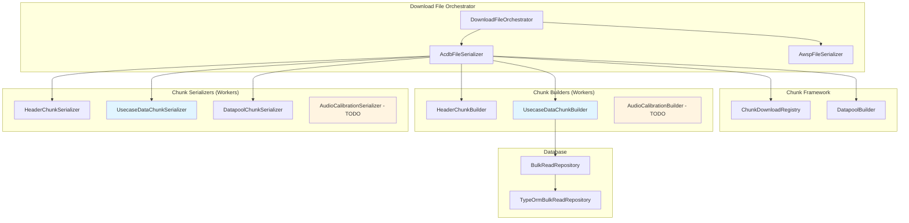

<!--
Copyright (c) Qualcomm Technologies, Inc. and/or its subsidiaries.
SPDX-License-Identifier: BSD-3-Clause
-->

# Download File: Usecase Data Raw Chunk Recreation Design

## Document Information
- **Version**: 1.0
- **Date**: May 2026
- **Status**: Approved for Implementation

---

## Table of Contents
1. [Overview](#1-overview)
2. [Architecture](#2-architecture)
3. [Three-Phase Approach](#3-three-phase-approach)
4. [Generalized Framework](#4-generalized-framework)
5. [Usecase Data Implementation](#5-usecase-data-implementation)
6. [Database Schema](#6-database-schema)
7. [Worker Pattern](#7-worker-pattern)
8. [Performance Analysis](#8-performance-analysis)
9. [Implementation Plan](#9-implementation-plan)
10. [Future Extensions](#10-future-extensions)

---

## 1) Overview

### 1.1 Purpose

Implement a generalized parallel download framework for recreating ACDB raw chunks from database entities, with **usecase data (GKV_TABLE + GKV_LUT)** as the first complete implementation.

### 1.2 Key Requirements

- ✅ **Parallel Processing**: Maximize parallelization where possible
- ✅ **Sequential Datapool**: Maintain sequential datapool offset assignment
- ✅ **Sorted Output**: LUT chunks must be sorted (numKeys → Keys → Values)
- ✅ **Natural IDs**: Use natural IDs (keyId, valueId, etc.) not system IDs
- ✅ **Mirror Pattern**: Reuse parsed chunk classes from upload
- ✅ **React Native Compatible**: Automatic fallback to sequential
- ✅ **Extensible**: Easy to add new chunk types (audio calibration, etc.)

### 1.3 C# Reference

From the provided C# code, the key pattern is:

```csharp
// 1. Sort data structures
SortedDictionary<uint, SortedDictionary<Keys, SortedList<Values, Graph>>> graphKVList;

// 2. Write GKV chunks
WriteGkvChunk(graphKVList, subgraphList, ref dataOffsetData,
              out gkvTableFile, out gkvLutFile);

// 3. Sequential datapool assignment
foreach (Graph graph in valueList.Values) {
    uint subgraphListOffset = dataOffsetData.Add(subgraphListData);
    uint subgraphPropDataOffset = dataOffsetData.Add(subgraphPropData);
}
```

---

## 2) Architecture

### 2.1 High-Level Flow

```
┌─────────────────────────────────────────────────────────────┐
│                    Download Request                          │
│  GET /arc-api/v1/projects/:projectId/download-files         │
└─────────────────────────┬───────────────────────────────────┘
                          │
                          ▼
┌─────────────────────────────────────────────────────────────┐
│              DownloadFileHandler                             │
│  • Resolves fileSystemId from projectId                      │
│  • Delegates to DownloadFileOrchestrator                     │
└─────────────────────────┬───────────────────────────────────┘
                          │
                          ▼
┌─────────────────────────────────────────────────────────────┐
│           DownloadFileOrchestrator                           │
│  • Calls AcdbFileSerializer.serialize(fileId)                │
│  • Calls AwspFileSerializer.serialize(entities)              │
│  • Returns { acdbBuffer, awspBuffer }                        │
└─────────────────────────┬───────────────────────────────────┘
                          │
                          ▼
┌─────────────────────────────────────────────────────────────┐
│              AcdbFileSerializer                              │
│                                                              │
│  PHASE 1: Parallel Query & Build Chunks                     │
│  ├─> Worker 1: Build HEADER chunk                           │
│  ├─> Worker 2: Build USECASE_DATA chunk (sorted from DB)    │
│  ├─> Worker 3: Build AUDIO_CALIBRATION chunk (TODO)         │
│  └─> Worker N: Build other chunks (TODO)                    │
│                                                              │
│  PHASE 2: Sequential Datapool Assignment                    │
│  ├─> For each chunk needing datapool:                       │
│  │    • Serialize payloads                                  │
│  │    • Assign offsets sequentially                         │
│  └─> Build final datapool chunk                             │
│                                                              │
│  PHASE 3: Parallel Serialization                            │
│  ├─> Worker 1: Serialize HEADER → binary                    │
│  ├─> Worker 2: Serialize USECASE_DATA → GKV_TABLE + GKV_LUT │
│  ├─> Worker 3: Serialize DATAPOOL → binary                  │
│  └─> Worker N: Serialize other chunks (TODO)                │
│                                                              │
│  PHASE 4: Assemble Final ACDB File                          │
│  └─> Combine all raw chunks into final binary               │
└─────────────────────────────────────────────────────────────┘
```

### 2.2 Component Diagram



---

## 3) Three-Phase Approach

### 3.1 Phase 1: Parallel Query & Build Chunks

**Goal**: Query database and build intermediate parsed chunk structures in parallel

**Parallelization**: ✅ YES - All chunks can be built in parallel

**Process**:
1. Get all chunk metadata from registry
2. Create worker tasks for each chunk type
3. Execute tasks in parallel (or sequential if no workers)
4. Each worker:
   - Queries DB with natural IDs
   - Sorts data at SQL level (ORDER BY)
   - Builds parsed chunk (reuses upload chunk classes)
   - Returns chunk with natural IDs

**Example - Usecase Data**:
```typescript
// Worker handler
static async buildChunk(input: { fileId: number }): Promise<UsecaseDataChunk> {
  // Query DB with sorting
  const usecases = await bulkReadRepo.readUsecasesWithNaturalIds(fileId, {
    orderBy: ['numKeys ASC', 'keyIds ASC', 'valueIds ASC']
  });

  // Build chunk
  const chunk = new UsecaseDataChunk();
  for (const usecase of usecases) {
    chunk.usecases.push({
      keyValuePairList: {
        keys: usecase.keys.map(k => k.keyId),
        values: usecase.values.map(v => v.valueId)
      },
      sgListOffset: 0,  // Assigned in Phase 2
      sgPropOffset: 0,  // Assigned in Phase 2
      sgList: usecase.subgraphs.map(sg => sg.subgraphId),
      sgPairList: usecase.subgraphPairs.map(pair => ({
        sourceSubgraphId: pair.sourceSubgraphId,
        destSubgraphId: pair.destSubgraphId
      }))
    });
  }
  return chunk;
}
```

### 3.2 Phase 2: Sequential Datapool Assignment

**Goal**: Assign datapool offsets to chunks that need them

**Parallelization**: ❌ NO - Must be sequential (shared state)

**Process**:
1. Create DatapoolBuilder
2. For each chunk needing datapool (in order from registry):
   - Pre-serialize payloads
   - Call `datapool.add(payload)` → get offset
   - Update chunk with offset
3. Build final datapool chunk

**Example - Usecase Data**:
```typescript
private async assignUsecaseDataOffsets(
  chunk: UsecaseDataChunk,
  datapool: DatapoolBuilder
): Promise<void> {
  for (const usecaseEntry of chunk.usecases) {
    // Serialize subgraph list
    const sgListData = this.serializeSubgraphList(usecaseEntry.sgList);
    usecaseEntry.sgListOffset = datapool.add(sgListData);

    // Serialize subgraph properties
    const sgPropData = this.serializeSubgraphProperties(usecaseEntry);
    usecaseEntry.sgPropOffset = datapool.add(sgPropData);
  }
}
```

**Why Sequential**:
- Datapool is shared state
- Offsets depend on previous insertions
- Order matters for file format

### 3.3 Phase 3: Parallel Serialization

**Goal**: Serialize all chunks to binary format

**Parallelization**: ✅ YES - All chunks can be serialized in parallel

**Process**:
1. Create worker tasks for each chunk
2. Execute serialization in parallel
3. Each worker:
   - Takes parsed chunk with offsets assigned
   - Serializes to one or more raw chunks
   - Returns map of { rawChunkType: buffer }

**Example - Usecase Data**:
```typescript
// Worker handler
static serialize(input: { chunk: UsecaseDataChunk }):
  Record<AcdbRawChunkType, Uint8Array> {
  return {
    [ACDB_RAW_CHUNK_TYPES.GKV_TABLE]:
      GkvTableSerializer.serialize(input.chunk),
    [ACDB_RAW_CHUNK_TYPES.GKV_LUT]:
      GkvLutSerializer.serialize(input.chunk)
  };
}
```

---

## 4) Generalized Framework

### 4.1 Chunk Download Registry

**Purpose**: Central metadata for all chunk types

**Key Features**:
- Declares all downloadable chunk types
- Specifies which chunks need datapool
- Maps to worker handler keys
- Easy to extend with new chunk types

**Example**:
```typescript
export class ChunkDownloadRegistry {
  private static metadata: ChunkDownloadMetadata[] = [
    {
      chunkType: PARSED_CHUNK_TYPES.USECASE_DATA,
      rawChunkTypes: [ACDB_RAW_CHUNK_TYPES.GKV_TABLE, ACDB_RAW_CHUNK_TYPES.GKV_LUT],
      needsDatapool: true,
      buildHandlerKey: HANDLER_KEYS.BUILD_USECASE_DATA_CHUNK,
      serializeHandlerKey: HANDLER_KEYS.SERIALIZE_USECASE_DATA_CHUNK,
      description: 'Usecase data with GKV table and lookup'
    },
    // TODO: Add AUDIO_CALIBRATION_DATA
    // TODO: Add VOICE_CALIBRATION_DATA
    // TODO: Add TAG_DATA
  ];
}
```

### 4.2 Datapool Builder

**Purpose**: Sequential offset assignment

**Key Features**:
- Maintains shared datapool state
- Assigns offsets sequentially
- Builds final datapool binary

**Interface**:
```typescript
export class DatapoolBuilder {
  add(payload: Uint8Array): number;  // Returns offset
  getPayloads(): Uint8Array[];
  getTotalSize(): number;
  build(): Uint8Array;
}
```

### 4.3 ACDB File Serializer

**Purpose**: Main orchestrator

**Key Methods**:
```typescript
export class AcdbFileSerializer {
  async serialize(fileId: number): Promise<Uint8Array> {
    // Phase 1: Parallel build
    const chunks = await this.buildAllChunksParallel(fileId);

    // Phase 2: Sequential datapool
    const chunksWithOffsets = await this.assignDatapoolOffsets(chunks);

    // Phase 3: Parallel serialization
    const rawChunks = await this.serializeAllChunksParallel(chunksWithOffsets);

    // Phase 4: Assemble final file
    return this.assembleFinalAcdb(rawChunks);
  }
}
```

---

## 5) Usecase Data Implementation

### 5.1 Database Schema

**Tables**:
- `use_cases` - Main usecase table
- `usecase_gkv_values` - Join table (usecase → value definitions)
- `use_case_subgraphs` - Join table (usecase → subgraphs)
- `use_case_subgraph_pairs` - Subgraph connection pairs
- `key_definitions` - Key definitions with `keyId`
- `value_definitions` - Value definitions with `valueId`
- `subgraphs` - Subgraphs with `subgraphId`

**Natural ID Columns**:
- `key_definitions.key_id` (natural ID)
- `value_definitions.value_id` (natural ID)
- `subgraphs.subgraph_id` (natural ID)

### 5.2 SQL Query with Sorting

```sql
SELECT
  uc.system_id,
  COUNT(DISTINCT gkv.value_def_system_id) as num_keys,
  GROUP_CONCAT(DISTINCT vd.key_id ORDER BY vd.key_id) as key_ids,
  GROUP_CONCAT(gkv.value_def_system_id ORDER BY gkv.value_def_system_id) as value_ids,
  -- Join subgraphs
  -- Join subgraph pairs
FROM use_cases uc
JOIN usecase_gkv_values gkv ON uc.system_id = gkv.usecase_system_id
JOIN value_definitions vd ON gkv.value_def_system_id = vd.system_id
JOIN key_definitions kd ON vd.key_system_id = kd.system_id
WHERE uc.file_system_id = ?
GROUP BY uc.system_id
ORDER BY
  num_keys ASC,
  key_ids ASC,
  value_ids ASC;
```

### 5.3 GKV_TABLE Format

```
GKVKeyTblChunkPayload = NumKeyTbls KeyTbl+
KeyTbl = NumGKeys NumGKeyEntries KeyEntry+
KeyEntry = GKeyId+ OffsetLUT
```

**Binary Layout**:
```
[NumKeyTbls: uint32]
  [NumGKeys: uint32]
  [NumGKeyEntries: uint32]
    [GKeyId: uint32] ... (NumGKeys times)
    [OffsetLUT: uint32]
  ...
```

### 5.4 GKV_LUT Format

```
GKVLUTChunkPayload = GKVLUT+
GKVLUT = NumGKeyVals NumGKVLUTEntries GKVLUTEntry+
GKVLUTEntry = GKeyVal+ OffsetSGListData OffsetSGData
```

**Binary Layout**:
```
[NumGKeyVals: uint32]
[NumGKVLUTEntries: uint32]
  [GKeyVal: uint32] ... (NumGKeyVals times)
  [OffsetSGListData: uint32]
  [OffsetSGData: uint32]
...
```

---

## 6) Database Schema

### 6.1 Usecase Tables

```typescript
// use_cases table
export interface UseCaseRow {
  systemId: number;           // Auto-increment
  aliasId: number;
  alias: string;
  fileSystemId: number;
}

// usecase_gkv_values join table
export interface UsecaseGkvValuesRow {
  usecaseSystemId: number;    // FK to use_cases
  valueDefSystemId: number;   // FK to value_definitions
}

// use_case_subgraphs join table
export interface UseCaseSubgraphRow {
  usecaseSystemId: number;    // FK to use_cases
  subgraphSystemId: number;   // FK to subgraphs
}

// use_case_subgraph_pairs
export interface UseCaseSubgraphPairRow {
  usecaseSystemId: number;
  sourceSubgraphSystemId: number;
  destSubgraphSystemId: number;
}
```

### 6.2 Definition Tables

```typescript
// key_definitions table
export interface KeyDefinitionRow {
  systemId: number;           // Auto-increment
  keyId: number;              // Natural ID (from ACDB file)
  name: string;
}

// value_definitions table
export interface ValueDefinitionRow {
  systemId: number;           // Auto-increment
  valueId: number;            // Natural ID (from ACDB file)
  keySystemId: number;        // FK to key_definitions
  name: string;
}

// subgraphs table
export interface SubgraphRow {
  systemId: number;           // Auto-increment
  subgraphId: number;         // Natural ID (from ACDB file)
  name: string;
}
```

---

## 7) Worker Pattern

### 7.1 Worker Detection

```typescript
private shouldUseParallel(): boolean {
  return (
    this.workerPool !== undefined &&
    this.workerPool.isThreadingSupported()  // Returns false in React Native
  );
}
```

### 7.2 Worker Task Structure

```typescript
interface WorkerTask<TInput = unknown, TContext = unknown> {
  handlerKey: string;  // Maps to handler in registry
  input: TInput;       // Serializable input data
  context?: TContext;  // Optional context
}

interface WorkerResult<TData = unknown> {
  success: boolean;
  data?: TData;
  error?: string;
  errorDetails?: WorkerErrorDetails;
}
```

### 7.3 Handler Registry

```typescript
export const WORKER_HANDLERS = {
  // Upload handlers
  [HANDLER_KEYS.BUILD_KEY_DEFINITIONS]: KeyDefinitionBuilder.buildKeyDefinitions,

  // Download chunk building handlers
  [HANDLER_KEYS.BUILD_HEADER_CHUNK]: HeaderChunkBuilder.buildChunk,
  [HANDLER_KEYS.BUILD_USECASE_DATA_CHUNK]: UsecaseDataChunkBuilder.buildChunk,
  // TODO: Add AUDIO_CALIBRATION handler
  // TODO: Add VOICE_CALIBRATION handler

  // Download serialization handlers
  [HANDLER_KEYS.SERIALIZE_HEADER_CHUNK]: HeaderChunkSerializer.serialize,
  [HANDLER_KEYS.SERIALIZE_USECASE_DATA_CHUNK]: UsecaseDataChunkSerializer.serialize,
  [HANDLER_KEYS.SERIALIZE_DATAPOOL_CHUNK]: DatapoolChunkSerializer.serialize,
  // TODO: Add AUDIO_CALIBRATION serializer
  // TODO: Add VOICE_CALIBRATION serializer
};
```

---

## 8) Performance Analysis

### 8.1 With ~1000 Usecases

**Phase 1 (Parallel)**: Build 2 chunk types (HEADER + USECASE_DATA)
- **Sequential**: ~5-10 seconds (DB query + chunk building)
- **Parallel (2 workers)**: ~3-5 seconds
- **Speedup**: 1.5-2x

**Phase 2 (Sequential)**: Assign datapool offsets
- **Time**: ~0.5-1 second (must be sequential)
- **No parallelization possible**

**Phase 3 (Parallel)**: Serialize 3 chunks (HEADER + GKV_TABLE + GKV_LUT + DATAPOOL)
- **Sequential**: ~2-3 seconds
- **Parallel (4 workers)**: ~1-1.5 seconds
- **Speedup**: 2x

**Total Time**:
- **Sequential**: ~7.5-14 seconds
- **Parallel**: ~4.5-7.5 seconds
- **Overall Speedup**: 1.5-2x

### 8.2 With All Chunk Types (Future)

**Phase 1 (Parallel)**: Build 8-10 chunk types
- **Sequential**: ~15-20 seconds
- **Parallel (8-10 workers)**: ~2-3 seconds
- **Speedup**: 5-7x

**Phase 2 (Sequential)**: Assign datapool offsets for 4-5 chunk types
- **Time**: ~1-2 seconds
- **No parallelization possible**

**Phase 3 (Parallel)**: Serialize 8-10 chunk types
- **Sequential**: ~5-8 seconds
- **Parallel (8-10 workers)**: ~1-2 seconds
- **Speedup**: 3-4x

**Total Time**:
- **Sequential**: ~21-30 seconds
- **Parallel**: ~4-7 seconds
- **Overall Speedup**: 4-6x

---

## 9) Implementation Plan

### 9.1 Phase 1: Core Framework

**Files to Create**:
1. `chunk-download-registry.ts` - Metadata registry
2. `datapool-builder.ts` - Sequential offset assignment
3. Update `acdb-file-serializer.ts` - Main orchestrator

**Files to Update**:
1. `registry-keys.ts` - Add new handler keys
2. `download-file-orchestrator.ts` - Use new serializer

### 9.2 Phase 2: Usecase Data Implementation

**Files to Create**:
1. `chunk-builders/usecase-data-chunk-builder.ts` - Worker handler
2. `chunk-serializers/usecase-data-chunk-serializer.ts` - Worker handler
3. `chunk-serializers/gkv-table-serializer.ts` - Binary serialization
4. `chunk-serializers/gkv-lut-serializer.ts` - Binary serialization
5. `chunk-serializers/datapool-chunk-serializer.ts` - Binary serialization

**Files to Update**:
1. `bulk-read.repository.ts` - Add interface for `readUsecasesWithNaturalIds`
2. `packages/infrastructure/persistence/src/usecase-data/repositories/bulk-read/typeorm-bulk-read.repository.ts` - Implement SQL query

### 9.3 Phase 3: Integration

**Files to Update**:
1. `worker-handler-registry.ts` - Register new handlers
2. `registry-keys.ts` - Export new keys

### 9.4 Phase 4: Testing

**Test Files to Create**:
1. Unit tests for each builder
2. Unit tests for each serializer
3. Integration test for full download flow
4. Round-trip test (upload → download → upload)

---

## 10) Future Extensions

### 10.1 Audio Calibration Data

**TODO Markers**:
- `chunk-download-registry.ts`: Add AUDIO_CALIBRATION_DATA metadata
- `registry-keys.ts`: Add BUILD_AUDIO_CALIBRATION_CHUNK key
- `registry-keys.ts`: Add SERIALIZE_AUDIO_CALIBRATION_CHUNK key
- Create `audio-calibration-chunk-builder.ts`
- Create `audio-calibration-chunk-serializer.ts`
- `bulk-read.repository.ts`: Add `readAudioCalibrationData` method
- `worker-handler-registry.ts`: Register handlers

### 10.2 Voice Calibration Data

**TODO Markers**:
- `chunk-download-registry.ts`: Add VOICE_CALIBRATION_DATA metadata
- `registry-keys.ts`: Add BUILD_VOICE_CALIBRATION_CHUNK key
- `registry-keys.ts`: Add SERIALIZE_VOICE_CALIBRATION_CHUNK key
- Create `voice-calibration-chunk-builder.ts`
- Create `voice-calibration-chunk-serializer.ts`
- `bulk-read.repository.ts`: Add `readVoiceCalibrationData` method
- `worker-handler-registry.ts`: Register handlers

### 10.3 Tag Data

**TODO Markers**:
- `chunk-download-registry.ts`: Add TAG_DATA metadata
- `registry-keys.ts`: Add BUILD_TAG_DATA_CHUNK key
- `registry-keys.ts`: Add SERIALIZE_TAG_DATA_CHUNK key
- Create `tag-data-chunk-builder.ts`
- Create `tag-data-chunk-serializer.ts`
- `bulk-read.repository.ts`: Add `readTagData` method
- `worker-handler-registry.ts`: Register handlers

### 10.4 Other Chunk Types

Follow the same pattern for:
- Subgraph Data
- Subgraph Pair Data
- Tagged Module Map
- Any future chunk types

---

## Summary

This design provides:

✅ **Generalized Framework**: Easy to add new chunk types
✅ **Maximum Parallelization**: All independent work is parallelized
✅ **Sequential Safety**: Datapool assignment remains sequential
✅ **Mirror Pattern**: Reuses parsed chunk classes from upload
✅ **DB-Level Sorting**: Efficient sorting via SQL ORDER BY
✅ **React Native Compatible**: Automatic fallback to sequential
✅ **Extensible**: Clear TODO markers for future work
✅ **Performance**: 4-6x speedup with full implementation

The usecase data implementation serves as a **proof-of-concept** and **template** for all future chunk types.