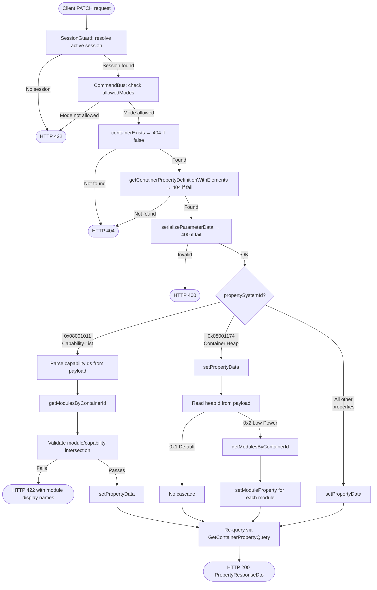

<!--
  Copyright (c) Qualcomm Technologies, Inc. and/or its subsidiaries.
  SPDX-License-Identifier: BSD-3-Clause
-->

# Set Container Property Data — Low-Level Design

## Table of Contents

- [Requirements](#requirements)
- [Section 1: Architecture & Call Flow](#section-1-architecture--call-flow)
  - [1.1 High-Level Workflow Diagram](#11-high-level-workflow-diagram)
  - [1.2 File and Folder Organization](#12-file-and-folder-organization)
  - [1.3 Layer Responsibilities](#13-layer-responsibilities)
- [Section 2: Presentation Layer](#section-2-presentation-layer)
- [Section 3: Core Layer](#section-3-core-layer)
  - [3.1 UpdateContainerPropertyCommand](#31-updatecontainerpropertycommand)
  - [3.2 UpdateContainerPropertyHandler](#32-updatecontainerpropertyhandler)
  - [3.3 ContainerPropertyDefQueryService Port Extension](#33-containerpropertydefqueryservice-port-extension)
  - [3.4 ModuleRepository Port Extensions](#34-modulerepository-port-extensions)
- [Section 4: Infrastructure Layer](#section-4-infrastructure-layer)
  - [4.1 ModuleNodeOverlayFetcher Extensions](#41-modulenodeoverlayfetcher-extensions)
  - [4.2 ModuleRepository — New Methods](#42-modulerepository--new-methods)
  - [4.3 PendingChangeWriter Specs](#43-pendingchangewriter-specs)
- [Section 5: Testing Strategy](#section-5-testing-strategy)

---

## Requirements

Requirements source: [../set-container-property-requirements.md](../set-container-property-requirements.md)

| ID | Requirement |
|---|---|
| FR-CP-01 | `PATCH /containers/:id/properties/:propSystemId` — accepts `elements: ParameterElementSummaryDto[]` |
| FR-CP-02 | Container not found → 404 |
| FR-CP-03 | Property definition not found → 404 |
| FR-CP-04 | Capability list (`0x08001011`) — validate module/capability intersection → 422 with failing module display names |
| FR-CP-05 | Container Heap (`0x08001174`) — Default: no cascade; Low Power: force all modules to Low Power |
| FR-CP-06 | Write must be staged; visible immediately via overlay read |
| FR-CP-07 | Handler returns void; controller re-queries via new `GetContainerPropertyQuery` (singular); returns single `PropertyResponseDto` → 200 |
| FR-CCR-01 | Active session required → 422 if none |
| FR-CCR-02 | All writes staged until commit |
| FR-CCR-03 | Session overlay applied to reads immediately after write |

---

## Section 1: Architecture & Call Flow

The write path follows hexagonal + CQRS using a **Command + CommandBus + UnitOfWork**. The existing `UpdateContainerPropertyCommand` and `UpdateContainerPropertyHandler` stubs are implemented — no new command/handler files created.

The re-query after write uses a **new** `GetContainerPropertyQuery` (singular). The existing `getContainerProperty` controller stub is also implemented as part of this work.

### 1.1 High-Level Workflow Diagram



### 1.2 File and Folder Organization

Files annotated **(existing)** already exist; **(modified)** means an existing file is changed; **(new)** means a new file.

#### Presentation Layer
```
packages/api/src/presentation/rest/modules/container/
└── container.controller.ts                                             (modified — implement updateContainerProperty + getContainerProperty stubs)
```

#### Core Layer
```
packages/core/src/application/
├── ports/persistence/repositories/
│   └── module/
│       └── module.repository.ts                                       (modified — add getModulesByContainerId, setModuleProperty)
├── ports/persistence/query-services/
│   └── container-property-definition/
│       └── container-property-def-query-service.ts                    (modified — add getContainerPropertyDefinitionWithElements)
├── orchestration/cqrs/registries/
│   └── query-handler-registry.ts                                      (modified — register GetContainerPropertyHandler)
└── usecase-designer/container/
    ├── update-property/
    │   ├── update-container-property.command.ts                       (modified — data: unknown[] → elements: ParameterElementSummaryDto[])
    │   └── update-container-property.handler.ts                       (modified — implement logic)
    └── get-property/
        ├── get-container-property.query.ts                            (new)
        └── get-container-property.handler.ts                         (new)
```

#### Infrastructure Layer
```
packages/infrastructure/persistence/src/persistence-typeorm-sqllite/
├── fetchers/
│   └── module-node-overlay-fetcher.ts                                 (modified — add fetchByContainerId, fetchModuleProperties)
└── repositories/
    └── module/
        └── module.repository.ts                                       (modified — implement getModulesByContainerId, setModuleProperty)
```

### 1.3 Layer Responsibilities

```
Presentation (API)
  updateContainerProperty:
    → @UseGuards(SessionGuard) — no session → HTTP 422
    → builds UpdateContainerPropertyCommand(containerSystemId, propSystemId, dto.elements)
    → CommandBus.execute(command, session)
    → re-queries via GetContainerPropertyQuery → returns single PropertyResponseDto

  getContainerProperty (stub — also implemented here):
    → builds GetContainerPropertyQuery(projectId, containerSystemId, propertySystemId)
    → QueryBus.execute(query) → returns single PropertyResponseDto

Core (Application)
  UpdateContainerPropertyHandler:
    fileSystemId = uow.getWriteContext().session.fileSystemId

    Read phase:
      1. containerExists(containerSystemId, fileSystemId) → 404 if false
      2. getContainerPropertyDefinitionWithElements(propertySystemId, fileSystemId) → 404 if fail
      3. serializeParameterData(propDef.elementsStructure, command.elements) → 400 if fail

    Special cases (before write):
      4. If 0x08001011:
           parse capabilityIds from payload (count + N × uint32)
           getModulesByContainerId(containerSystemId, fileSystemId)
           validateModuleCapabilityIntersection → 422 if any module fails

    Write phase (transactional):
      5. ContainerRepository.setPropertyData (existing method)

    Post-write cascade:
      6. If 0x08001174:
           read heapId from payload (first uint32)
           if heapId = 0x2 (Low Power):
             getModulesByContainerId(containerSystemId, fileSystemId)
             setModuleProperty(module.moduleSystemId, 0x08001A9A, heapPayload) for each module

Infrastructure (Persistence)
  ModuleNodeOverlayFetcher.fetchByContainerId (new):
    → query spf_modules WHERE container_system_id = ? AND file_system_id = ?
    → uses existing index ix_spf_modules_container_file_system
    → gets all SpfModule edit actions via getByTable(sessionId, SpfModule)
    → filters actions: UPDATE/DELETE where aggregateId in base systemId set;
      CREATE where newValue.containerSystemId = containerSystemId
    → applies OverlayMergeImpl + appends staged CREATEs
    → returns OverlaidSpfModule[]

  ModuleNodeOverlayFetcher.fetchModuleProperties (new):
    → query spf_module_properties_data WHERE module_system_id = ?
    → applies overlay via getByAggregateId(sessionId, moduleSystemId)
      filtered to targetTable = SpfModulePropertiesData
    → returns { systemId, propertySystemId }[]

  ModuleRepository.getModulesByContainerId:
    → delegates to fetchByContainerId
    → batched IN query: module_definition_container_types → container_types (containerTypeIds)
    → batched IN query: spf_module_definitions (displayName)
    → both keyed by definitionSystemId, run in parallel via Promise.all
    → maps to ModuleForContainer[]

  ModuleRepository.setModuleProperty:
    → fetchModuleProperties(moduleSystemId, session.sessionId) to resolve prop.systemId
    → writeDelta with targetSystemId = prop.systemId, aggregateId = moduleSystemId
```

---

## Section 2: Presentation Layer

**File:** `packages/api/src/presentation/rest/modules/container/container.controller.ts` (modified)

```typescript
@Patch('/:containerSystemId/properties/:propSystemId')
@UseGuards(SessionGuard)
async updateContainerProperty(
  @Param('projectId') projectId: string,
  @Param('containerSystemId', ParseIntPipe) containerSystemId: number,
  @Param('propSystemId', ParseIntPipe) propSystemId: number,
  @Body() dto: UpdatePropertyRequestDto,
  @ArcSession() session: ActiveSession,
): Promise<ApiResult<PropertyResponseDto>> {
  await this.commandBus.execute(
    new UpdateContainerPropertyCommand(containerSystemId, propSystemId, dto.elements),
    session,
  );
  const query = new GetContainerPropertyQuery(
    Number.parseInt(projectId, 10),
    containerSystemId,
    propSystemId,
    'api-client',
  );
  const result = await this.queryBus.execute<Result<PropertyDto>>(query);
  return toApiResult(result);
}

@Get('/:containerSystemId/properties/:propertySystemId')
async getContainerProperty(
  @Param('projectId') projectId: string,
  @Param('containerSystemId') containerSystemId: string,
  @Param('propertySystemId') propertySystemId: string,
): Promise<ApiResult<PropertyResponseDto>> {
  const query = new GetContainerPropertyQuery(
    Number.parseInt(projectId, 10),
    Number.parseInt(containerSystemId, 10),
    Number.parseInt(propertySystemId, 10),
    'api-client',
  );
  const result = await this.queryBus.execute<Result<PropertyDto>>(query);
  return toApiResult(result);
}
```

---

## Section 3: Core Layer

### 3.1 UpdateContainerPropertyCommand

**File:** `packages/core/src/application/usecase-designer/container/update-property/update-container-property.command.ts` (modified)

```typescript
export class UpdateContainerPropertyCommand extends BaseCommand {
  static override readonly requiresSession = true;
  static override readonly allowedModes: readonly SessionMode[] = [
    SESSION_MODE.Designer,
    SESSION_MODE.DiffMerge,
  ];

  constructor(
    public readonly containerSystemId: number,
    public readonly propertySystemId: number,
    public readonly elements: ParameterElementSummaryDto[],
  ) {
    super();
  }
}
```

### 3.2 UpdateContainerPropertyHandler

**File:** `packages/core/src/application/usecase-designer/container/update-property/update-container-property.handler.ts` (modified)

```typescript
// Property ID constants
const CONTAINER_HEAP_PROP_ID       = 0x08001174;
const CONTAINER_CAPABILITY_PROP_ID = 0x08001011;
const MODULE_HEAP_PROP_ID          = 0x08001A9A;
const HEAP_ID_LOW_POWER            = 0x2;

export class UpdateContainerPropertyHandler
  implements CommandHandler<UpdateContainerPropertyCommand, Promise<void>> {

  constructor(private readonly uow: UnitOfWork) {}

  async handle(command: UpdateContainerPropertyCommand): Promise<void> {
    const {session} = this.uow.getWriteContext();
    const fileSystemId = session.fileSystemId;

    // Step 1: validate container exists
    const exists = await this.uow.getContainerRepository()
      .containerExists(command.containerSystemId, fileSystemId);
    if (!exists) {
      throw new ResourceNotFoundException(
        `Container ${command.containerSystemId} not found`,
      );
    }

    // Step 2: validate property definition exists + fetch elementsStructure
    const propDefResult = await this.uow.getQueryServices()
      .containerPropertyDefQueryService
      .getContainerPropertyDefinitionWithElements(command.propertySystemId, fileSystemId);
    if (propDefResult.kind === RESULT_KIND.Fail) {
      throw new ResourceNotFoundException(
        `Property definition ${command.propertySystemId} not found`,
      );
    }
    const propDef = propDefResult.data;

    // Step 3: serialize elements → Uint8Array
    const serialized = serializeParameterData(propDef.elementsStructure, command.elements);
    if (!serialized.ok) {
      throw new BadRequestException(serialized.error);
    }
    const payload = serialized.value;

    // Step 4: capability list — validate module/capability intersection before writing
    if (command.propertySystemId === CONTAINER_CAPABILITY_PROP_ID) {
      const capabilityIds = parseUInt32Array(payload);
      const modules = await this.uow.getModuleRepository()
        .getModulesByContainerId(command.containerSystemId, fileSystemId);
      validateModuleCapabilityIntersection(modules, capabilityIds);
      // throws DomainRuleViolationException listing failing module displayNames → HTTP 422
    }

    // Step 5: write container property
    await this.uow.getContainerRepository()
      .setPropertyData(command.containerSystemId, command.propertySystemId, payload);

    // Step 6: heap cascade — only fires for Low Power; Default leaves modules as-is
    if (command.propertySystemId === CONTAINER_HEAP_PROP_ID) {
      const heapId = readUInt32LE(payload, 0);
      if (heapId === HEAP_ID_LOW_POWER) {
        const modules = await this.uow.getModuleRepository()
          .getModulesByContainerId(command.containerSystemId, fileSystemId);
        const heapPayload = writeUInt32LE(heapId);
        for (const mod of modules) {
          await this.uow.getModuleRepository().setModuleProperty(
            mod.moduleSystemId,
            MODULE_HEAP_PROP_ID,
            heapPayload,
          );
        }
      }
    }
  }
}
```

**Internal helper functions:**

| Function | Purpose |
|---|---|
| `serializeParameterData(elementsStructure, elements)` | Converts `ParameterElementSummaryDto[]` → `Uint8Array`; validates type, range, alignment. Returns `{ ok, value/error }` |
| `parseUInt32Array(payload)` | Reads `count` from first 4 bytes then reads `count` × uint32 — used for capability IDs |
| `validateModuleCapabilityIntersection(modules, capIds)` | For each module checks `containerTypeIds ∩ capIds` is non-empty; throws `DomainRuleViolationException` listing failing `displayName`s |
| `readUInt32LE(payload, offset)` | Reads little-endian uint32 from `Uint8Array` at offset |
| `writeUInt32LE(value)` | Returns 4-byte little-endian `Uint8Array` |

### 3.3 ContainerPropertyDefQueryService Port Extension

**File:** `packages/core/src/application/ports/persistence/query-services/container-property-definition/container-property-def-query-service.ts` (modified)

```typescript
export interface ContainerPropertyDefQueryService {
  // ... existing methods ...

  // Returns a single container property definition including elementsStructure.
  // Result.fail if not found.
  getContainerPropertyDefinitionWithElements(
    propertySystemId: number,
    fileSystemId: number,
  ): Promise<Result<ContainerPropertyDefinitionWithElementsReadModel>>;
}
```

`ContainerPropertyDefinitionWithElementsReadModel` is already defined at:
`packages/core/src/application/ports/persistence/query-services/container-property-definition/container-property-definition-with-elements-read-model.ts`

It is a type alias for `PropertyDefinitionWithElements` which extends `PropertyDefinitionReadModel` with `elementsStructure: string`. No new type needed.

The infra implementation (`DbContainerPropertyDefQueryService`) delegates to the existing `ContainerPropertyDefinitionFetcher`, filtering by `systemId` and returning the single match.

### 3.4 ModuleRepository Port Extensions

**File:** `packages/core/src/application/ports/persistence/repositories/module/module.repository.ts` (modified)

```typescript
export interface ModuleForContainer {
  moduleSystemId: number;      // PK of SpfModule — used as aggregateId for setModuleProperty
  containerTypeIds: number[];  // supported container type IDs — used for capability intersection check
  displayName: string;         // from SpfModuleDefinition — used in capability mismatch error message
}

export interface ModuleRepository {
  // ... existing methods ...

  // Returns all non-deleted modules belonging to a container.
  // Overlay-aware: excludes pending DELETE, includes pending CREATE.
  getModulesByContainerId(
    containerSystemId: number,
    fileSystemId: number,
  ): Promise<ModuleForContainer[]>;

  // Writes a module property pending change to edit_actions.
  // aggregateId = moduleSystemId (SpfModule is the aggregate root).
  setModuleProperty(
    moduleSystemId: number,
    propertySystemId: number,
    payload: Uint8Array,
  ): Promise<void>;
}
```

---

## Section 4: Infrastructure Layer

### 4.1 ModuleNodeOverlayFetcher Extensions

**File:** `packages/infrastructure/persistence/src/persistence-typeorm-sqllite/fetchers/module-node-overlay-fetcher.ts` (modified)

Two new methods added. `fetchOne` and `OverlaidSpfModule` are **not changed** — existing callers unaffected.

#### `fetchByContainerId`

Fetches all non-deleted modules for a container — overlay-aware. Used by `getModulesByContainerId`.

```typescript
async fetchByContainerId(
  containerSystemId: number,
  fileSystemId: number,
  sessionId: number | null,
): Promise<OverlaidSpfModule[]> {
  // Layer 1: base rows — uses existing index ix_spf_modules_container_file_system
  const baseRows = await this.manager
    .getRepository(ENTITY_NAMES.SpfModule)
    .createQueryBuilder('sm')
    .where(
      'sm.containerSystemId = :containerSystemId AND sm.fileSystemId = :fileSystemId',
      {containerSystemId, fileSystemId},
    )
    .getMany() as unknown as SpfModuleBase[];

  if (!sessionId) return baseRows.map(r => this.toOverlaid(r));

  // Layer 2: get all SpfModule edit actions in the session in one query
  const allActions = await this.editActionsSvc.getByTable(sessionId, ENTITY_NAMES.SpfModule);

  const baseIds = new Set(baseRows.map(r => r.systemId));

  // UPDATE/DELETE: actions whose aggregateId is a known base module
  const updateDeleteActions = allActions.filter(a => baseIds.has(a.aggregateId));

  // CREATE: actions for modules staged into this container
  const createActions = allActions.filter(
    a => a.operation === CHANGE_OPERATION.Create &&
      (a.newValue as Partial<SpfModuleBase>).containerSystemId === containerSystemId,
  );

  const overlaid = this.overlay.applyToCollection(
    baseRows as unknown as Array<{systemId: number}>,
    updateDeleteActions,
  ).map(r => r.effective as unknown as SpfModuleBase);

  const created = createActions.map(a => {
    const payload = a.newValue as Partial<SpfModuleBase>;
    return {
      systemId: a.targetSystemId,
      instanceId: payload.instanceId ?? 0,
      alias: payload.alias ?? null,
      definitionSystemId: payload.definitionSystemId ?? 0,
      containerSystemId: payload.containerSystemId ?? containerSystemId,
      subgraphSystemId: payload.subgraphSystemId ?? 0,
      fileSystemId: payload.fileSystemId ?? fileSystemId,
      parentId: null,
    } as OverlaidSpfModule;
  });

  return [...overlaid.map(r => this.toOverlaid(r)), ...created];
}
```

#### `fetchModuleProperties`

Fetches overlay-aware `spf_module_properties_data` rows for a single module. Used by `setModuleProperty` to resolve `prop.systemId` for `writeDelta`.

```typescript
async fetchModuleProperties(
  moduleSystemId: number,
  sessionId: number | null,
): Promise<{systemId: number; propertySystemId: number}[]> {
  const baseRows = await this.manager
    .getRepository(ENTITY_NAMES.SpfModulePropertiesData)
    .createQueryBuilder('p')
    .select(['p.systemId', 'p.propertySystemId'])
    .where('p.moduleSystemId = :moduleSystemId', {moduleSystemId})
    .getMany() as unknown as {systemId: number; propertySystemId: number}[];

  if (!sessionId) return baseRows;

  const actions = await this.editActionsSvc.getByAggregateId(sessionId, moduleSystemId);
  const propActions = actions.filter(
    a => a.targetTable === ENTITY_NAMES.SpfModulePropertiesData,
  );

  const overlaid = this.overlay.applyToCollection(
    baseRows as unknown as Array<{systemId: number}>,
    propActions,
  ).map(r => r.effective as unknown as {systemId: number; propertySystemId: number});

  const baseIds = new Set(baseRows.map(r => r.systemId));
  const created = propActions
    .filter(a => a.operation === CHANGE_OPERATION.Create && !baseIds.has(a.targetSystemId))
    .map(a => {
      const payload = a.newValue as Partial<{propertySystemId: number}>;
      return {
        systemId: a.targetSystemId,
        propertySystemId: payload.propertySystemId ?? 0,
      };
    });

  return [...overlaid, ...created];
}
```

### 4.2 ModuleRepository — New Methods

**File:** `packages/infrastructure/persistence/src/persistence-typeorm-sqllite/repositories/module/module.repository.ts` (modified)

```typescript
async getModulesByContainerId(
  containerSystemId: number,
  fileSystemId: number,
): Promise<ModuleForContainer[]> {
  const {session} = this.uow.getWriteContext();
  const rows = await this.moduleNodeFetcher.fetchByContainerId(
    containerSystemId,
    fileSystemId,
    session.sessionId,
  );

  if (rows.length === 0) return [];

  const definitionSystemIds = [...new Set(rows.map(r => r.definitionSystemId))];

  // Parallel batched queries for containerTypeIds and displayName
  const [links, defs] = await Promise.all([
    this.manager
      .getRepository(ENTITY_NAMES.ModuleDefinitionContainerTypeLink)
      .createQueryBuilder('link')
      .innerJoinAndSelect('link.containerType', 'ct')
      .where('link.moduleDefinitionSystemId IN (:...definitionSystemIds)', {definitionSystemIds})
      .getMany(),
    this.manager
      .getRepository(ENTITY_NAMES.SpfModuleDefinition)
      .createQueryBuilder('def')
      .select(['def.systemId', 'def.displayName'])
      .where('def.systemId IN (:...definitionSystemIds)', {definitionSystemIds})
      .getMany(),
  ]);

  const containerTypeIdsMap = new Map<number, number[]>();
  for (const link of links) {
    const existing = containerTypeIdsMap.get(link.moduleDefinitionSystemId) ?? [];
    existing.push(link.containerType.value);
    containerTypeIdsMap.set(link.moduleDefinitionSystemId, existing);
  }

  const displayNameMap = new Map<number, string>(
    defs.map(d => [d.systemId, d.displayName ?? '']),
  );

  return rows.map(r => ({
    moduleSystemId:   r.systemId,
    containerTypeIds: containerTypeIdsMap.get(r.definitionSystemId) ?? [],
    displayName:      displayNameMap.get(r.definitionSystemId) ?? '',
  }));
}

async setModuleProperty(
  moduleSystemId: number,
  propertySystemId: number,
  payload: Uint8Array,
): Promise<void> {
  const {session, groupId} = this.uow.getWriteContext();

  // Resolve SpfModulePropertiesData row's systemId — must use overlay-aware fetch
  // because the property row may be a staged CREATE not yet in base DB
  const props = await this.moduleNodeFetcher.fetchModuleProperties(
    moduleSystemId,
    session.sessionId,
  );
  const prop = props.find(p => p.propertySystemId === propertySystemId);
  if (!prop) {
    throw new Error(
      `Module property ${propertySystemId} not found on module ${moduleSystemId}. ` +
      `Ensure the property is initialised at module creation.`,
    );
  }

  await this.writer.writeDelta(
    {
      targetTable:    ENTITY_NAMES.SpfModulePropertiesData,
      targetSystemId: prop.systemId,
      aggregateId:    moduleSystemId,
      delta:          {payload},
    },
    session.sessionId,
    groupId,
    this.manager,
  );
}
```

### 4.3 PendingChangeWriter Specs

**`setModuleProperty` (heap cascade):**

| Field | Value |
|---|---|
| `targetTable` | `SpfModulePropertiesData` |
| `targetSystemId` | `prop.systemId` — PK of the `SpfModulePropertiesData` row (resolved via `fetchModuleProperties`) |
| `aggregateId` | `moduleSystemId` |
| `fieldGroup` | `null` (accumulator) |
| `source` | `MANUAL` (always `STAGED`) |
| `delta` | `{ payload: <Uint8Array> }` |

**Supersession:** if a prior pending change exists for `(sessionId, targetSystemId, fieldGroup=null)`, `PendingChangeWriter` sets `validUntil = now` on the old row and inserts a new merged row — invariant I1 (latest write wins) is satisfied automatically.

**`groupId`:** all writes in one API call — container property write + all module cascade writes — share the same `groupId` stamped by `CommandBus`. This makes the entire operation atomic for undo/redo.

---

## Section 5: Testing Strategy

### Unit Tests

**`UpdateContainerPropertyHandler`** — `update-container-property.handler.spec.ts`

| Scenario | Expected outcome |
|---|---|
| Container not found | throws `ResourceNotFoundException` → 404 |
| Property definition not found | throws `ResourceNotFoundException` → 404 |
| Serialization fails | throws `BadRequestException` → 400 |
| `0x08001011` — module capability intersection fails | throws `DomainRuleViolationException` with display names → 422 |
| `0x08001011` — all modules pass | `setPropertyData` called; no cascade |
| `0x08001174` — heap = Default (`0x1`) | `setPropertyData` called; `setModuleProperty` NOT called |
| `0x08001174` — heap = Low Power (`0x2`) | `setPropertyData` called; `setModuleProperty` called for each module |
| Any other property | `setPropertyData` called; no cascade |

### Integration Tests

**`TypeOrmModuleRepository`** — `typeorm-module-container-property.spec.ts` (new)

| Scenario | Expected outcome |
|---|---|
| `getModulesByContainerId` — modules in DB | returns `ModuleForContainer[]` with correct `containerTypeIds` and `displayName` |
| `getModulesByContainerId` — module pending DELETE | excludes that module |
| `getModulesByContainerId` — module pending CREATE | includes that module |
| `getModulesByContainerId` — no modules | returns `[]` |
| `setModuleProperty` — base row exists | `writeDelta` called with `prop.systemId` as `targetSystemId` |
| `setModuleProperty` — property row is staged CREATE | resolves `prop.systemId` from edit_actions |
| `setModuleProperty` — prior pending change exists | old row superseded; new merged row inserted |

### End-to-End Tests

**`set-container-property.e2e-spec.ts`** (new)

| Scenario | HTTP status |
|---|---|
| No active session | 422 |
| Container not found | 404 |
| Property definition not found | 404 |
| Invalid elements (serialization fails) | 400 |
| `0x08001011` — module capability mismatch | 422 |
| `0x08001011` — capability list valid | 200 |
| `0x08001174` — heap = Default | 200; no module cascade writes |
| `0x08001174` — heap = Low Power | 200; module cascade writes in edit_actions |
| Any other property | 200 |
