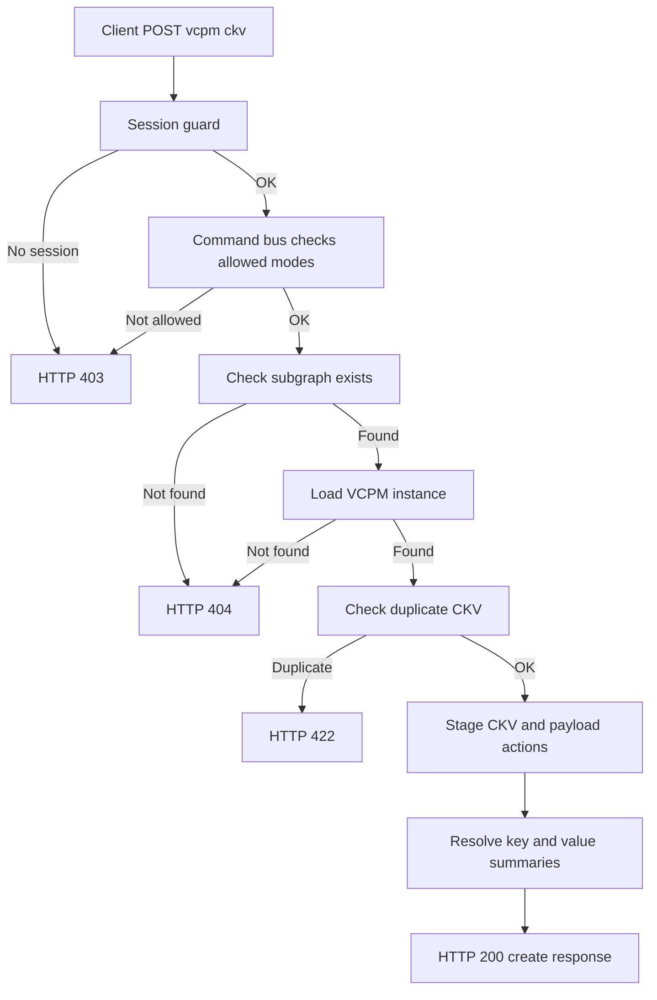
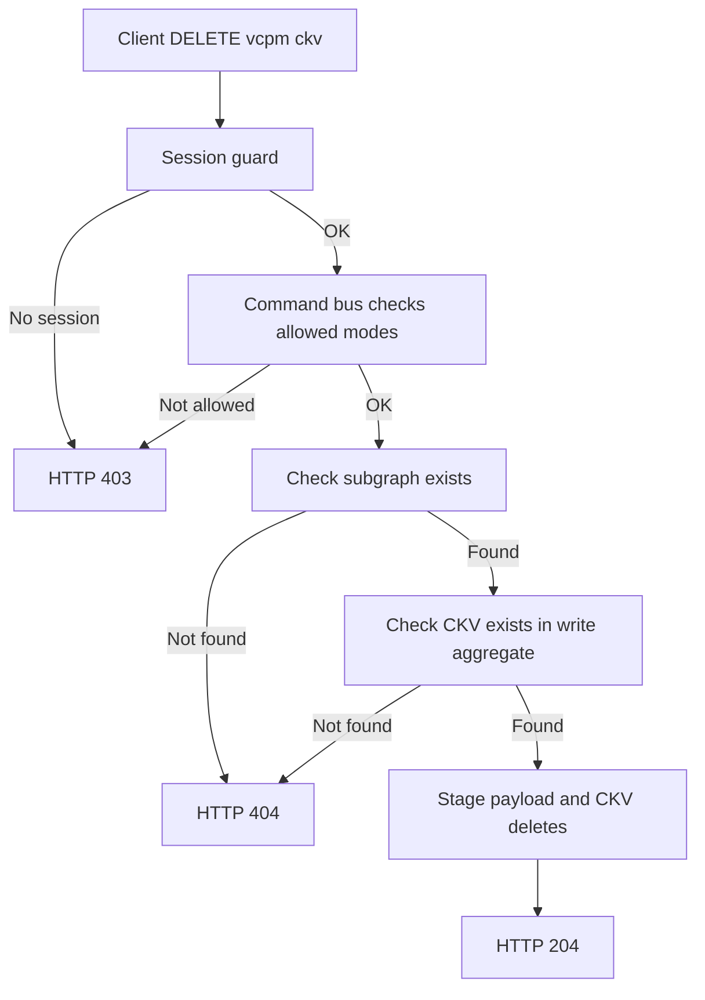
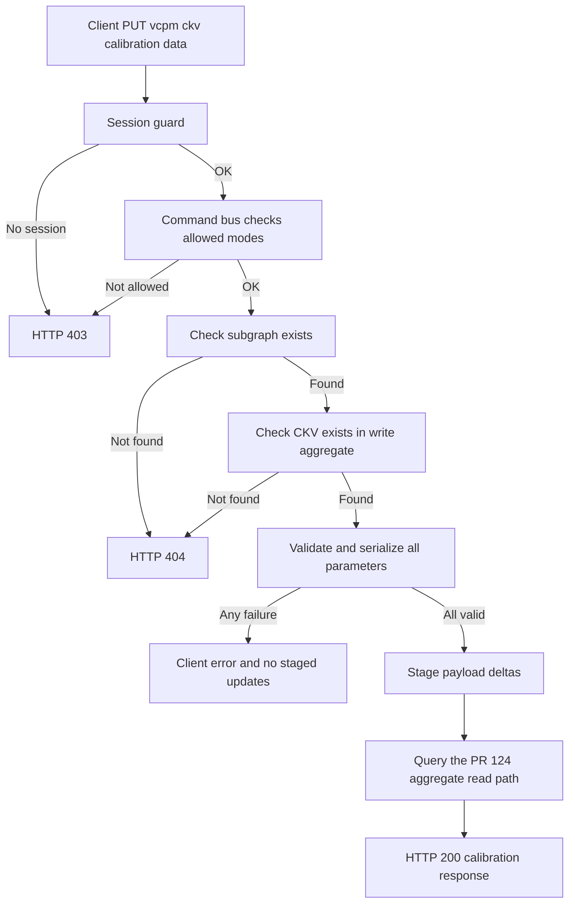

<!--
  Copyright (c) Qualcomm Technologies, Inc. and/or its subsidiaries.
  SPDX-License-Identifier: BSD-3-Clause
-->

# Set Subgraph VCPM CKV  -  Low-Level Design

**Feature folder:** `docs/property-data/`
**Status:** Draft aligned with the approved write and PR #124 read decisions
**Date:** 2026-09-29
**Related design:** Scenario cascade and zero-CKV initialization are out of scope.

---

## Requirements

Requirements source: [../set-subgraph-vcpm-ckv-requirements.md](../set-subgraph-vcpm-ckv-requirements.md)

Approved design decision: the earlier partial-success behavior in the draft
requirements is superseded for PUT calibration updates. Validation,
serialization, and staging are all-or-nothing.

PUT identifier contract: each request parameter `systemId` identifies the
`VcpmModuleParameterDefinition.systemId`. The related
`VcpmParameterPayload.systemId` is an internal row identifier used only when
targeting the payload row in `edit_actions`.

This supersedes the draft requirements wording that exposed
`VcpmParameterPayload.systemId` in the PUT request. The payload-row ID remains
an infrastructure concern; the command resolves it from the selected CKV and
parameter-definition ID.

| ID | Requirement |
|---|---|
| FR#5 | `POST /arc-api/v1/projects/:projectId/subgraphs/:subgraphSystemId/vcpm-ckv`  -  create a new CKV entry with default payloads for all parameters |
| FR#6 | `DELETE /arc-api/v1/projects/:projectId/subgraphs/:subgraphSystemId/vcpm-ckv/:ckvSystemId`  -  delete a CKV and all its parameter payloads |
| FR#7 | `PUT /arc-api/v1/projects/:projectId/subgraphs/:subgraphSystemId/vcpm-ckv/:ckvSystemId/cal-data`  -  update calibration payloads atomically for one or more parameters |
| FR-CCR-01 | Active session required  -  403 |
| FR-CCR-02 | DESIGNER / DIFF_MERGE modes only  -  403 |
| FR-CCR-03/04 | All writes staged; visible via overlay read immediately |
| FR-CCR-05 | Every write command generates one `groupId`, and all staged rows from that call carry it. POST exposes it in `CreateVcpmCkvDto`; PUT carries it in `PutVcpmCalDataResult` before the GET-shaped response is assembled; DELETE follows the existing `204 No Content` convention. |

---

## Section 1: Architecture & Call Flow

All three endpoints follow hexagonal + CQRS. The write routes are already
wired; this LLD defines the target handler, repository, and PR #124 read-path
changes.

### 1.1 High-Level Workflow Diagrams

#### POST /vcpm-ckv



#### DELETE /vcpm-ckv/:ckvSystemId



#### PUT /vcpm-ckv/:ckvSystemId/cal-data



### 1.2 File and Folder Organization

Files annotated **(existing)** already exist; **(modified)** means changed; **(new)** means new file.

#### Presentation Layer
```
packages/api/src/presentation/rest/modules/subgraph/
`-- subgraph.controller.ts                                               (modified; PUT response handling aligned)
```

Persistence adapter wiring:
```
packages/api/src/infrastructure-wrapper/persistence/unit-of-work/
`-- typeorm-unit-of-work.ts                                               (modified; expose command-side repositories and fetchers)
```

#### Core Layer
```
packages/core/src/application/
|-- ports/persistence/unit-of-work.ts                                    (modified; expose command-side repositories)
|-- ports/persistence/repositories/
|   |-- subgraph/subgraph.repository.ts                                  (modified; write aggregate port)
|   |-- vcpm/vcpm-definition.repository.ts                               (new; command-side metadata port)
|   `-- key-value/key-value-definition.repository.ts                     (new; command-side response projection port)
|-- orchestration/cqrs/registries/
|   |-- command-handler-registry.ts                                      (modified)
|   `-- query-handler-registry.ts                                        (modified; PR #124 GET handlers registered)
`-- usecase-designer/subgraph/
    |-- create-vcpm-ckv/create-vcpm-ckv.handler.ts                       (modified)
    |-- delete-vcpm-ckv/delete-vcpm-ckv.handler.ts                       (modified; explicit transaction)
    |-- get-vcpm-ckv/get-vcpm-ckv.handler.ts                             (modified; PR #124 aggregate query path)
    |-- get-vcpm-cal-data/get-vcpm-cal-data.handler.ts                   (modified; PR #124 aggregate query path)
    `-- update-vcpm-cal-data/
        |-- update-vcpm-cal-data.command.ts                              (modified)
        |-- update-vcpm-cal-data.handler.ts                              (modified; all-or-nothing)
        `-- put-vcpm-cal-data-result.ts                                  (present)
```

#### Infrastructure Layer
```
packages/infrastructure/persistence/src/persistence-typeorm-sqllite/
|-- fetchers/
|   |-- vcpm-write-aggregate-fetcher.ts                                  (new; command-side effective write state)
|   |-- vcpm-query-context.ts                                            (PR #124 read context)
|   |-- vcpm-instance-fetcher.ts                                         (PR #124 read-side)
|   |-- vcpm-ckv-fetcher.ts                                              (PR #124 read-side)
|   |-- vcpm-parameter-payload-fetcher.ts                                (PR #124 read-side)
|   `-- definitions/vcpm-module-definitions/
|       `-- vcpm-module-parameter-definition-fetcher.ts                   (PR #124 read-side)
|-- queries/subgraph/
|   `-- db-subgraph-query-service.ts                                     (modified; expose VCPM aggregate read model)
`-- repositories/
    |-- subgraph/subgraph.repository.ts                                  (modified; uses write aggregate fetcher)
    |-- vcpm/vcpm-definition.repository.ts                               (new; command-side adapter)
    `-- key-value/key-value-definition.repository.ts                     (new; command-side adapter)
```

The PR #124 read-side additions also include
`ports/persistence/query-services/subgraph/subgraph-query-service.ts` with
`getVcpmAggregateBySubgraph`, the
`ports/persistence/query-services/vcpm/vcpm-read-model.ts` contract,
`fetchers/subgraph-vcpm-data-fetcher.ts`, and the fetcher wiring in
`queries/typeorm-query-services.ts`.

No schema changes - no migration needed. The generic project commit materializer
is a platform dependency and is not implemented by this feature; it must consume
the staged VCPM CKV payload described in section 4.2.1.

### 1.3 Layer Responsibilities

```
Presentation (API)
  POST /vcpm-ckv:
     -  new CreateVcpmCkvCommand(subgraphSystemId, dto.ckv)
     -  CommandBus.execute  -  CreateVcpmCkvDto
     -  toApiResult(Result.ok(result))  -  200

  DELETE /vcpm-ckv/:ckvSystemId:
     -  new DeleteVcpmCkvCommand(subgraphSystemId, ckvSystemId)
     -  CommandBus.execute  -  void  -  204

  PUT /vcpm-ckv/:ckvSystemId/cal-data:
     -  new UpdateVcpmCalDataCommand(subgraphSystemId, ckvSystemId, dto.parameters)
     -  CommandBus.execute  -  PutVcpmCalDataResult
     -  re-query via GetVcpmCalDataQuery through the PR #124 aggregate path
     -  assemble ApiResult<CkvCalDataDto>  -  200

Core (Application)
  CreateVcpmCkvHandler:
    1. subgraphExists  -  404
    2. Load the VCPM definition through VcpmDefinitionRepository  -  404 if none
    3. Load VcpmInstance for the subgraph  -  404 if none
    4. Parse and canonicalize valueSystemIds; reject duplicate input IDs
    5. Duplicate guard: aggregate.ckvs duplicate comparison  -  422
    6. Resolve response pairs through KeyValueDefinitionRepository
    7. Allocate CKV and payload IDs, serialize default payloads, then stage createVcpmCkv(...)
    8. Return CreateVcpmCkvDto { groupId, ckvSystemId, ckv: [{keyId, valueId}] }

  DeleteVcpmCkvHandler:
    1. subgraphExists  -  404
    2. aggregate.ckvs  -  404
    3. startTransaction()
    4. deleteVcpmCkv(subgraphSystemId, ckvSystemId)  -  stages payload + CKV deletion;
       values are removed with the physical parent during commit/apply
    5. commit(); rollback on failure
    6. Return void  -  204 (no body, matching existing DELETE conventions)

  UpdateVcpmCalDataHandler:
    1. subgraphExists  -  404
    2. getVcpmWriteAggregate(subgraphSystemId, ckvSystemId); empty ckvs  -  404
    3. aggregate.payloads  -  existing payload rows (overlay-aware)
    4. Load parameter definitions through VcpmDefinitionRepository
    5. Validate and serialize every submitted parameter before starting the write transaction
         - no existing payload  -  request failure
         - isReadOnly  -  request failure
         - serialization failure  -  request failure
    6. startTransaction(); updateVcpmCalData writes one batch of deltas
    7. commit(); rollback on failure
    8. Return PutVcpmCalDataResult { groupId, succeededParamSystemIds }

Infrastructure (Persistence)
  createVcpmCkv:
     -  writeCreate VcpmCkv row with valueDefSystemIds in the action payload
     -  writeCreate VcpmParameterPayload rows (one per param, default payload)
     -  generic commit/apply materializes the parent, then VcpmCkvValues rows

  deleteVcpmCkv:
     -  fetch existing VcpmParameterPayload rows for ckvSystemId
     -  writeDelete each VcpmParameterPayload (aggregateId = subgraphSystemId)
     -  writeDelete VcpmCkv row (aggregateId = subgraphSystemId)
     -  commit/apply deletes the physical parent; VcpmCkvValues then cascade

  updateVcpmCalData:
     -  writeDeltaBatch on VcpmParameterPayload rows (aggregateId = subgraphSystemId,
      delta = { payload: serializedBytes })
```

---

### 1.4 Current implementation alignment

This document describes the target implementation. The following current-source
differences are intentional and must be resolved during implementation:

- `CreateVcpmCkvHandler`, `DeleteVcpmCkvHandler`, and
  `UpdateVcpmCalDataHandler` are implemented.
- Create and update currently receive `QueryServices`; the target design
  replaces those dependencies with command-side repositories exposed by
  `UnitOfWork`.
- The current write repository delegates effective CKV and payload reads to the
  command-side VCPM write aggregate fetcher; PR #124 remains the GET-side path.
- The current VCPM-specific calibration query service is not part of the target
  architecture. GET handlers use the existing PR #124 subgraph aggregate query
  service and read model.
- `GetVcpmCkvHandler` and `GetVcpmCalDataHandler` are currently placeholders;
  their target implementation follows the PR #124 aggregate query path.
- `DeleteVcpmCkvHandler` currently lacks an explicit transaction; the target
  handler must stage all DELETE actions atomically.
- `VcpmCkvValues` is currently inserted directly by `createVcpmCkv`; this is
  out of sync with the target design. The staged parent CREATE carries
  `valueDefSystemIds`, and the external commit materializer inserts child rows
  after the parent exists.

---

## Section 2: Presentation Layer

**File:** `packages/api/src/presentation/rest/modules/subgraph/subgraph.controller.ts` (modified)

### 2.1 POST /vcpm-ckv

The existing `createVcpmCkv` route is already wired correctly. No controller
change is required; the handler returns `CreateVcpmCkvDto`, including `groupId`.

### 2.2 DELETE /vcpm-ckv/:ckvSystemId

The existing `deleteVcpmCkv` route is already wired correctly. It returns
`204 No Content`, matching the existing project DELETE convention. The staged
actions still contain the handler-generated `groupId`.

### 2.3 PUT /vcpm-ckv/:ckvSystemId/cal-data

The existing route accepts `UpdateSpfModuleCalDataRequestDto`, which contains a
list of parameters. Each request parameter `systemId` is the
`VcpmModuleParameterDefinition.systemId`; the associated payload-row system ID
is resolved from the selected CKV. The controller maps the DTO's string IDs to
the numeric command contract. The handler validates and serializes
the complete request before staging any delta; therefore a failed parameter
causes the whole request to fail and no `207` response is produced.

```typescript
@Put('/:subgraphSystemId/vcpm-ckv/:ckvSystemId/cal-data')
@UseGuards(SessionGuard)
async updateVcpmCalData(
  @Param('projectId') projectId: string,
  @Param('subgraphSystemId', ParseIntPipe) subgraphSystemId: number,
  @Param('ckvSystemId', ParseIntPipe) ckvSystemId: number,
  @Body() dto: UpdateSpfModuleCalDataRequestDto,
  @ArcSession() session: ActiveSession,
): Promise<ApiResult<CkvCalDataResponseDto>> {
  const parameters = dto.parameters.map(parameter => ({
    systemId: Number(parameter.systemId),
    elements: parameter.elements as unknown as ParameterElementSummaryDto[],
  }));
  const putResult = await this.commandBus.execute<Result<PutVcpmCalDataResult>>(
    new UpdateVcpmCalDataCommand(
      subgraphSystemId,
      ckvSystemId,
      parameters,
    ),
    session,
  );
  if (putResult.kind === RESULT_KIND.Fail) {
    return toApiResult(
      putResult as unknown as Result<CkvCalDataResponseDto>,
    );
  }

  const query = new GetVcpmCalDataQuery(
    projectId,
    String(subgraphSystemId),
    String(ckvSystemId),
    'api-client',
    putResult.data.succeededParamSystemIds.join(','),
  );
  return toApiResult(
    await this.queryBus.execute<Result<CkvCalDataDto>>(query),
  );
}
```

---

## Section 3: Core Layer

### 3.1 UpdateVcpmCalDataCommand (modified)

**File:** `packages/core/src/application/usecase-designer/subgraph/update-vcpm-cal-data/update-vcpm-cal-data.command.ts` (modified)

`data: unknown[]`  -  `parameters: Array<{ systemId: number; elements: ParameterElementSummaryDto[] }>`:

```typescript
export class UpdateVcpmCalDataCommand extends BaseCommand {
  static override readonly requiresSession = true;
  static override readonly allowedModes: readonly SessionMode[] = [
    SESSION_MODE.Designer,
    SESSION_MODE.DiffMerge,
  ];

  constructor(
    public readonly subgraphSystemId: number,
    public readonly ckvSystemId: number,
    // VcpmModuleParameterDefinition.systemId values from the request.
    // Payload-row system IDs are resolved internally by the handler.
    public readonly parameters: Array<{systemId: number; elements: ParameterElementSummaryDto[]}>,
  ) {
    super();
  }
}
```

### 3.2 CreateVcpmCkvHandler

**File:** `packages/core/src/application/usecase-designer/subgraph/create-vcpm-ckv/create-vcpm-ckv.handler.ts` (modified)

```typescript
export class CreateVcpmCkvHandler implements CommandHandler<
  CreateVcpmCkvCommand,
  CreateVcpmCkvDto
> {
  constructor(
    private readonly uow: UnitOfWork,
    private readonly idGeneration: IdGenerationPort,
    private readonly queryServices: QueryServices,
  ) {}

  async handle(command: CreateVcpmCkvCommand): Promise<CreateVcpmCkvDto> {
    const {session, groupId} = this.uow.getWriteContext();
    const fileSystemId = session.fileSystemId;
    const repository = this.uow.getSubgraphRepository();

    if (
      !(await repository.subgraphExists(command.subgraphSystemId, fileSystemId))
    ) {
      throw new ResourceNotFoundException(
        `Subgraph ${command.subgraphSystemId} not found`,
      );
    }

    const definition = await this.uow
      .getVcpmDefinitionRepository()
      .getDefinitionWithParameters(fileSystemId);
    if (!definition) {
      throw new ResourceNotFoundException(
        `No VCPM module definition found for file ${fileSystemId}`,
      );
    }

    const writeAggregate = await repository.getVcpmWriteAggregate(
      command.subgraphSystemId,
    );
    const instanceSystemId = writeAggregate.instanceSystemId;
    if (instanceSystemId === null) {
      throw new ResourceNotFoundException(
        `VcpmInstance not found for subgraph ${command.subgraphSystemId}`,
      );
    }

    const valueSystemIds = command.ckv.flatMap(pair =>
      pair.valueSystemIds.map(valueSystemId =>
        parseId(valueSystemId, 'valueSystemId'),
      ),
    );
    if (new Set(valueSystemIds).size !== valueSystemIds.length) {
      throw new DomainRuleViolationException([
        IssueFactory.parseError(
          'VCPM_CKV_DUPLICATE_VALUE',
          'A value definition may occur only once in a CKV.',
        ),
      ]);
    }
    valueSystemIds.sort((left, right) => left - right);

    const duplicate = writeAggregate.ckvs.some(ckv => {
      const existingValues = [...ckv.valueDefSystemIds].sort(
        (left, right) => left - right,
      );
      return (
        ckv.vcpmInstanceSystemId === instanceSystemId &&
        existingValues.length === valueSystemIds.length &&
        existingValues.every(
          (value, index) => value === valueSystemIds[index],
        )
      );
    });
    if (duplicate) {
      throw new DomainRuleViolationException([
        IssueFactory.parseError(
          'VCPM_CKV_DUPLICATE',
          `A VCPM CKV with the requested values already exists for instance ${instanceSystemId}`,
        ),
      ]);
    }

    const keyValuePairs = await this.uow
      .getKeyValueDefinitionRepository()
      .getSummariesForValues(fileSystemId, valueSystemIds);
    if (keyValuePairs.length !== valueSystemIds.length) {
      throw new ResourceNotFoundException(
        'One or more VCPM CKV value definitions were not found',
      );
    }

    const serializedPayloads = definition.parameters.map(param => {
      const serialized = serializeDefaultParameterData(param);
      if (!serialized.ok) {
        throw new Error(
          `Failed to serialize default payload for VcpmParameterDefinition ${param.systemId}: ${serialized.error}`,
        );
      }
      return {param, payload: serialized.value};
    });

    await this.uow.startTransaction();
    let ckvSystemId: number;
    try {
      ckvSystemId = await this.idGeneration.getNextId(fileSystemId);
      const payloads = [];
      for (const {param, payload} of serializedPayloads) {
        payloads.push({
          systemId: await this.idGeneration.getNextId(fileSystemId),
          vcpmParameterSystemId: param.systemId,
          payload,
        });
      }

      await repository.createVcpmCkv(
        command.subgraphSystemId,
        ckvSystemId,
        instanceSystemId,
        valueSystemIds,
        payloads,
      );
      await this.uow.commit();
    } catch (error) {
      if (this.uow.isInTransaction()) await this.uow.rollback();
      throw error;
    }

    const ckv = keyValuePairs.map(pair => ({
      keyId: pair.keyId,
      valueId: pair.valueId,
    }));

    return {groupId, ckvSystemId: String(ckvSystemId), ckv};
  }
}
```

Registry entry:
```typescript
this.commandHandlerFactories.set(CreateVcpmCkvCommand, {
  create: deps =>
    new CreateVcpmCkvHandler(
      deps.uow,
      deps.idGeneration,
      deps.queryServices,
    ),
});
```

### 3.3 DeleteVcpmCkvHandler

**File:** `packages/core/src/application/usecase-designer/subgraph/delete-vcpm-ckv/delete-vcpm-ckv.handler.ts` (modified)

```typescript
export class DeleteVcpmCkvHandler implements CommandHandler<DeleteVcpmCkvCommand, void> {
  constructor(private readonly uow: UnitOfWork) {}

  async handle(command: DeleteVcpmCkvCommand): Promise<void> {
    const {session} = this.uow.getWriteContext();
    const repository = this.uow.getSubgraphRepository();

    if (
      !(await repository.subgraphExists(
        command.subgraphSystemId,
        session.fileSystemId,
      ))
    ) {
      throw new ResourceNotFoundException(
        `Subgraph ${command.subgraphSystemId} not found`,
      );
    }

    const writeAggregate = await repository.getVcpmWriteAggregate(
      command.subgraphSystemId,
      command.ckvSystemId,
    );
    if (writeAggregate.ckvs.length === 0) {
      throw new ResourceNotFoundException(
        `VcpmCkv ${command.ckvSystemId} not found`,
      );
    }

    await this.uow.startTransaction();
    try {
      await repository.deleteVcpmCkv(
        command.subgraphSystemId,
        command.ckvSystemId,
      );
      await this.uow.commit();
    } catch (error) {
      if (this.uow.isInTransaction()) await this.uow.rollback();
      throw error;
    }
  }
}
```

### 3.4 UpdateVcpmCalDataHandler

**File:** `packages/core/src/application/usecase-designer/subgraph/update-vcpm-cal-data/update-vcpm-cal-data.handler.ts` (modified)

Mirrors `PutCkvCalDataHandler` for SPF modules. The command handler uses the
command-side VCPM definition repository, validates and serializes every
submitted parameter before writing, and fails the complete request if any
parameter is invalid. No `Result.partial` or HTTP `207` is produced.

```typescript
export class UpdateVcpmCalDataHandler implements CommandHandler<
  UpdateVcpmCalDataCommand,
  Result<PutVcpmCalDataResult>
> {
  constructor(private readonly uow: UnitOfWork) {}

  async handle(command: UpdateVcpmCalDataCommand): Promise<Result<PutVcpmCalDataResult>> {
    const {session, groupId} = this.uow.getWriteContext();
    const fileSystemId = session.fileSystemId;
    const repository = this.uow.getSubgraphRepository();

    // Step 1: subgraph existence
    const exists = await repository.subgraphExists(
      command.subgraphSystemId,
      fileSystemId,
    );
    if (!exists) throw new ResourceNotFoundException(`Subgraph ${command.subgraphSystemId} not found`);

    // Step 2: CKV existence
    const writeAggregate = await repository.getVcpmWriteAggregate(
      command.subgraphSystemId,
      command.ckvSystemId,
    );
    if (writeAggregate.ckvs.length === 0) throw new ResourceNotFoundException(`VcpmCkv ${command.ckvSystemId} not found`);

    // Step 3: fetch existing payload rows (overlay-aware  -  includes same-session CREATEs)
    const existingPayloads = writeAggregate.payloads;

    // Step 4: load parameter definitions for this CKV's VCPM definition
    const definition = await this.uow
      .getVcpmDefinitionRepository()
      .getDefinitionWithParameters(fileSystemId);
    if (!definition) {
      throw new ResourceNotFoundException(
        `No VCPM module definition found for file ${fileSystemId}`,
      );
    }
    const defBySystemId = new Map(
      definition.parameters.map(parameter => [parameter.systemId, parameter]),
    );

    // Step 5: per-parameter validation + serialization
    // The command carries VcpmModuleParameterDefinition.systemId. The
    // payload row systemId is resolved internally and is never the API ID.
    const payloadByParameterSystemId = new Map(
      existingPayloads.map(payload => [payload.vcpmParameterSystemId, payload]),
    );
    const writeBatch: Array<{payloadSystemId: number; payload: Uint8Array}> = [];

    for (const param of command.parameters) {
      const existing = payloadByParameterSystemId.get(param.systemId);
      if (!existing) {
        throw new ResourceNotFoundException(
          `Parameter payload not found for parameter systemId=${param.systemId}`,
        );
      }
      const def = defBySystemId.get(param.systemId);
      if (!def) {
        throw new Error(
          `VcpmParameterDefinition missing for systemId=${param.systemId}  -  DB integrity violation`,
        );
      }
      if (def.isReadOnly) {
        throw new InvalidOperationException(
          `Parameter ${param.systemId} is read-only`,
        );
      }
      const serialized = serializeParameterData(
        def,
        mapDtoToParameterCalibration(
          param.elements as unknown as ParameterElementDto[],
        ),
      );
      if (!serialized.ok) {
        throw new InvalidOperationException(
          `Parameter ${param.systemId} serialization failed: ${serialized.error}`,
        );
      }
      writeBatch.push({
        payloadSystemId: existing.systemId,
        payload: serialized.value,
      });
    }

    // Step 6: write the complete validated batch
    await this.uow.startTransaction();
    try {
      await repository.updateVcpmCalData(
        command.subgraphSystemId,
        command.ckvSystemId,
        writeBatch,
      );
      await this.uow.commit();
    } catch (error) {
      if (this.uow.isInTransaction()) await this.uow.rollback();
      throw error;
    }

    const data: PutVcpmCalDataResult = {
      groupId,
      succeededParamSystemIds: command.parameters.map(parameter => parameter.systemId),
    };
    return Result.ok(data);
  }
}
```

**Result type** (`put-vcpm-cal-data-result.ts`  -  new):
```typescript
export interface PutVcpmCalDataResult {
  groupId: string;
  succeededParamSystemIds: number[];
}
```

Registry entries:
```typescript
this.commandHandlerFactories.set(DeleteVcpmCkvCommand, {
  create: deps => new DeleteVcpmCkvHandler(deps.uow),
});
this.commandHandlerFactories.set(UpdateVcpmCalDataCommand, {
  create: deps => new UpdateVcpmCalDataHandler(deps.uow),
});
```

### 3.5 VCPM GET handlers

The GET handlers use the existing PR #124 aggregate read path. They do not
depend on a standalone `VcpmCalibrationQueryService`:

```text
GetVcpmCkvHandler / GetVcpmCalDataHandler
   -  QueryServices.subgraphQueryService
   -  DbSubgraphQueryService.getVcpmAggregateBySubgraph(...)
   -  VcpmQueryContext
   -  VcpmInstanceFetcher
   -  VcpmCkvFetcher
   -  VcpmParameterPayloadFetcher
   -  VcpmModuleParameterDefinitionFetcher
```

The aggregate read model contains the data required by both endpoints:

```typescript
{
  ckvs,
  parameterCkvLinks,
  payloads,
  parameterDefinitions,
}
```

Both handlers first resolve the project file and validate effective subgraph
existence through the existing subgraph query service, then call
`getVcpmAggregateBySubgraph`. The cal-data handler supplies `ckvSystemId` and
optional `paramSystemIds`; the summary handler requests the full aggregate.

`GetVcpmCkvHandler` maps the aggregate to `VcpmCkvDto.configuredParams`.
`GetVcpmCalDataHandler` validates the requested CKV, applies the optional
parameter-system-ID filter, deserializes effective payloads, and maps the
result to `CkvCalDataDto`.

Handler excerpts:

```typescript
async handle(query: GetVcpmCkvQuery): Promise<Result<VcpmCkvDto>> {
  const fileSystemId =
    await this.queryServices.projectQueryService.getFileIdByProjectId(
      query.projectId,
    );
  const aggregateResult =
    await this.queryServices.subgraphQueryService.getVcpmAggregateBySubgraph(
      query.subgraphSystemId,
      fileSystemId,
    );
  if (aggregateResult.kind === RESULT_KIND.Fail) {
    throw new Error('Failed to load VCPM aggregate');
  }

  return Result.ok(
    mapVcpmAggregateToConfiguredParams(aggregateResult.data),
  );
}

async handle(query: GetVcpmCalDataQuery): Promise<Result<CkvCalDataDto>> {
  const fileSystemId =
    await this.queryServices.projectQueryService.getFileIdByProjectId(
      query.projectId,
    );
  const aggregateResult =
    await this.queryServices.subgraphQueryService.getVcpmAggregateBySubgraph(
      query.subgraphSystemId,
      fileSystemId,
      {
        ckvSystemId: query.ckvSystemId,
        paramSystemIds: query.paramSystemIds,
      },
    );
  if (aggregateResult.kind === RESULT_KIND.Fail) {
    throw new Error('Failed to load VCPM aggregate');
  }

  return Result.ok(mapVcpmAggregateToCalData(aggregateResult.data));
}
```

The mapping functions above perform the same definition lookup, ownership
validation, payload deserialization, and DTO assembly implemented by PR #124;
they are application-layer mapping functions, not new persistence services.

The current source handlers are placeholders; this section describes their
target implementation through the PR #124 query service and fetchers.

### 3.6 SubgraphRepository write-side aggregate port

**File:** `packages/core/src/application/ports/persistence/repositories/subgraph/subgraph.repository.ts` (modified)

The command side exposes one effective-state read for all VCPM write
operations. It is intentionally a raw-ID model: the GET-side PR #124
aggregate remains responsible for response enrichment and calibration
deserialization.

```typescript
export interface VcpmPayloadRow {
  systemId: number;                 // VcpmParameterPayload PK; write target
  vcpmParameterSystemId: number;    // VcpmModuleParameterDefinition.systemId
}

export interface VcpmPayloadUpdate {
  payloadSystemId: number;           // VcpmParameterPayload PK
  payload: Uint8Array;
}

export interface VcpmPayloadCreate {
  systemId: number;                 // VcpmParameterPayload PK allocated by handler
  vcpmParameterSystemId: number;    // VcpmModuleParameterDefinition.systemId
  payload: Uint8Array;              // serialized default data
}

export interface VcpmWriteCkv {
  systemId: number;
  vcpmInstanceSystemId: number;
  valueDefSystemIds: number[];
}

export interface VcpmWriteAggregate {
  instanceSystemId: number | null;
  ckvs: VcpmWriteCkv[];
  payloads: VcpmPayloadRow[];
}

export interface SubgraphRepository {
  getVcpmWriteAggregate(
    subgraphSystemId: number,
    ckvSystemId?: number,
  ): Promise<VcpmWriteAggregate>;

  createVcpmCkv(
    subgraphSystemId: number,
    ckvSystemId: number,
    instanceSystemId: number,
    valueSystemIds: number[],
    payloads: VcpmPayloadCreate[],
  ): Promise<void>;

  deleteVcpmCkv(
    subgraphSystemId: number,
    ckvSystemId: number,
  ): Promise<void>;

  updateVcpmCalData(
    subgraphSystemId: number,
    ckvSystemId: number,
    updates: VcpmPayloadUpdate[],
  ): Promise<void>;
}
```

The optional CKV ID narrows `ckvs` and populates `payloads`. A missing
instance returns `instanceSystemId: null`; a missing or deleted CKV returns
an empty `ckvs` array. No separate repository existence, duplicate, or
payload-read methods are required.
### 3.7 Command-side repository ports and UnitOfWork wiring

Command handlers must not depend on `QueryServices`. The following narrow
ports are exposed through `UnitOfWork` and implemented by the persistence
adapter:

```typescript
export interface VcpmDefinitionWithParameters {
  systemId: number;
  parameters: ParameterDefinitionBase[];
}

export interface VcpmDefinitionRepository {
  getDefinitionWithParameters(
    fileSystemId: number,
  ): Promise<VcpmDefinitionWithParameters | null>;
}

export interface KeyValueDefinitionRepository {
  getSummariesForValues(
    fileSystemId: number,
    valueSystemIds: readonly number[],
  ): Promise<Array<{keyId: number; valueId: number}>>;
}

export interface UnitOfWork {
  // ... existing methods ...
  getVcpmDefinitionRepository(): VcpmDefinitionRepository;
  getKeyValueDefinitionRepository(): KeyValueDefinitionRepository;
}
```

`TypeOrmUnitOfWork` constructs both adapters with its request-bound
`EntityManager`. The VCPM definition adapter supplies parameter metadata for
default payload creation and PUT validation. The key/value adapter supplies
the natural key/value IDs required by the POST response.

---

## Section 4: Infrastructure Layer

**Files:**
- `packages/infrastructure/persistence/src/persistence-typeorm-sqllite/fetchers/vcpm-write-aggregate-fetcher.ts` (new)
- `packages/infrastructure/persistence/src/persistence-typeorm-sqllite/repositories/subgraph/subgraph.repository.ts` (modified)

The command-side repository uses a dedicated write aggregate fetcher. It
shares the edit-session overlay mechanism with PR #124, but it does not call
the GET query service and does not return enriched key/value or calibration
read models.

### 4.1 getVcpmWriteAggregate

The fetcher loads committed VCPM instances, CKVs, and selected payload rows,
then applies current-session actions. Instance and CKV rows are scoped by both
the requested subgraph and the active file. Staged CKV CREATE actions carry
`valueDefSystemIds`; committed CKVs derive the same field from
`vcpm_ckv_values`.

Repository adapter:

```typescript
async getVcpmWriteAggregate(
  subgraphSystemId: number,
  ckvSystemId?: number,
): Promise<VcpmWriteAggregate> {
  const {session} = this.uow.getWriteContext();
  return this.vcpmWriteAggregateFetcher.fetch(
    subgraphSystemId,
    session.fileSystemId,
    session.sessionId,
    ckvSystemId,
  );
}
```

Fetcher implementation excerpt:

```typescript
async fetch(
  subgraphSystemId: number,
  fileSystemId: number,
  sessionId: number | null,
  ckvSystemId?: number,
): Promise<VcpmWriteAggregate> {
  const instanceBase = await this.loadInstances(subgraphSystemId, fileSystemId);
  const instanceActions = sessionId === null
    ? []
    : await this.editActions.getByTable(sessionId, ENTITY_NAMES.VcpmInstance);
  const instances = this.overlay
    .applyToCollection(
      instanceBase,
      instanceActions,
      row => Number(row.subgraphSystemId) === subgraphSystemId,
    )
    .map(result => result.effective);

  const instanceIds = new Set(instances.map(row => row.systemId));
  const ckvBase = await this.loadCkvs(instanceIds, ckvSystemId);
  const ckvActions = sessionId === null
    ? []
    : await this.editActions.getByTable(sessionId, ENTITY_NAMES.VcpmCkv);
  const ckvs = this.overlay
    .applyToCollection(
      ckvBase,
      ckvActions,
      row =>
        instanceIds.has(Number(row.vcpmInstanceSystemId)) &&
        (ckvSystemId === undefined || Number(row.systemId) === ckvSystemId),
    )
    .map(result => normalizeCkv(result.effective));

  return {
    instanceSystemId: instances[0]?.systemId ?? null,
    ckvs,
    payloads:
      ckvSystemId === undefined || ckvs.length === 0
        ? []
        : await this.loadEffectivePayloads(
            ckvSystemId,
            subgraphSystemId,
            sessionId,
          ),
  };
}

function normalizeCkv(row: CkvRow): VcpmWriteCkv {
  return {
    systemId: row.systemId,
    vcpmInstanceSystemId: Number(row.vcpmInstanceSystemId),
    valueDefSystemIds: Array.isArray(row.valueDefSystemIds)
      ? row.valueDefSystemIds.map(Number)
      : (row.values ?? []).map(value => Number(value.valueDefSystemId)),
  };
}
```

The actual fetcher uses TypeORM queries for `loadInstances`,
`loadCkvs`, and effective payload loading; the excerpt shows the contract
and overlay boundaries. Deletes are excluded by `OverlayMergeImpl`, while
same-session CREATE/UPDATE actions are visible to subsequent command handlers.
### 4.2 createVcpmCkv

The repository stages the complete CKV definition in the parent CREATE action.
It must not insert `VcpmCkvValues` directly: `edit_actions` contains the staged
parent, while the physical `vcpm_ckv` row does not exist until commit/apply.
The action payload uses `valueDefSystemIds: number[]`. The PR #124 read-side
fetcher normalizes those IDs into its effective `values` read shape.

```typescript
async createVcpmCkv(
  subgraphSystemId: number,
  ckvSystemId: number,
  instanceSystemId: number,
  valueSystemIds: number[],
  payloads: VcpmPayloadCreate[],
): Promise<void> {
  const {session, groupId} = this.uow.getWriteContext();

  await this.writer.writeCreate(
    {
      targetTable: ENTITY_NAMES.VcpmCkv,
      targetSystemId: ckvSystemId,
      aggregateId: subgraphSystemId,
      payload: {
        vcpmInstanceSystemId: instanceSystemId,
        valueDefSystemIds: valueSystemIds,
      },
    },
    session.sessionId,
    groupId,
    this.manager,
  );

  for (const payload of payloads) {
    await this.writer.writeCreate(
      {
        targetTable: ENTITY_NAMES.VcpmParameterPayload,
        targetSystemId: payload.systemId,
        aggregateId: subgraphSystemId,
        payload: {
          vcpmCkvSystemId: ckvSystemId,
          vcpmParameterSystemId: payload.vcpmParameterSystemId,
          payload: payload.payload,
        },
      },
      session.sessionId,
      groupId,
      this.manager,
    );
  }

}
```

### 4.2.1 Commit/apply materialization

The session commit/apply path must materialize the composite child rows after
the parent row has been inserted. This must be one atomic transaction:

```text
BEGIN
  apply VcpmCkv CREATE  -  insert vcpm_ckv parent
  insert vcpm_ckv_values rows from CREATE.payload.valueDefSystemIds
  apply VcpmParameterPayload CREATE actions
COMMIT
```

The generic commit materializer is outside this feature's implementation scope;
this section defines the contract it must honor. If any materialization step
fails, its transaction must roll back. A staged CREATE followed by a staged
DELETE before commit produces no physical CKV or value rows. The composite-PK
table is therefore not independently overlaid; its staged state is carried by
the parent CKV action and its committed state is read from `vcpm_ckv_values`.

### 4.3 deleteVcpmCkv

The handler already verifies the CKV with
`getVcpmWriteAggregate(subgraphSystemId, ckvSystemId)`. The repository
fetches the same effective payload rows before staging their deletes, so a
POST followed by DELETE in one session also removes staged payload CREATEs.

```typescript
async deleteVcpmCkv(
  subgraphSystemId: number,
  ckvSystemId: number,
): Promise<void> {
  const {session, groupId} = this.uow.getWriteContext();
  const aggregate = await this.getVcpmWriteAggregate(
    subgraphSystemId,
    ckvSystemId,
  );

  for (const payload of aggregate.payloads) {
    await this.writer.writeDelete(
      {
        targetTable: ENTITY_NAMES.VcpmParameterPayload,
        targetSystemId: payload.systemId,
        aggregateId: subgraphSystemId,
      },
      session.sessionId,
      groupId,
      this.manager,
    );
  }

  await this.writer.writeDelete(
    {
      targetTable: ENTITY_NAMES.VcpmCkv,
      targetSystemId: ckvSystemId,
      aggregateId: subgraphSystemId,
    },
    session.sessionId,
    groupId,
    this.manager,
  );
}
```

The physical `vcpm_ckv_values` rows are removed by the parent delete
cascade during commit/apply.

### 4.4 updateVcpmCalData

```typescript
async updateVcpmCalData(
  subgraphSystemId: number,
  ckvSystemId: number,
  updates: VcpmPayloadUpdate[],
): Promise<void> {
  const {session, groupId} = this.uow.getWriteContext();
  await this.writer.writeDeltaBatch(
    updates.map(update => ({
      targetTable: ENTITY_NAMES.VcpmParameterPayload,
      targetSystemId: update.payloadSystemId,
      aggregateId: subgraphSystemId,
      delta: {payload: update.payload},
    })),
    session.sessionId,
    groupId,
    this.manager,
  );
}
```

### 4.8 PendingChangeWriter Specs

**`createVcpmCkv`  -  VcpmCkv row:**

| Field | Value |
|---|---|
| `targetTable` | `VcpmCkv` |
| `targetSystemId` | new `ckvSystemId` |
| `aggregateId` | `subgraphSystemId` |
| `payload` | `{ vcpmInstanceSystemId, valueDefSystemIds: number[] }` |

**`createVcpmCkv`  -  VcpmParameterPayload rows:**

| Field | Value |
|---|---|
| `targetTable` | `VcpmParameterPayload` |
| `targetSystemId` | new `payloadSystemId` |
| `aggregateId` | `subgraphSystemId` |
| `payload` | `{ vcpmCkvSystemId, vcpmParameterSystemId, payload: <Uint8Array> }` |

**`updateVcpmCalData`:**

| Field | Value |
|---|---|
| `targetTable` | `VcpmParameterPayload` |
| `targetSystemId` | `payloadSystemId` (PK) |
| `aggregateId` | `subgraphSystemId` |
| `delta` | `{ payload: <Uint8Array> }` |

### 4.9 PR #124 read-side VCPM architecture

The GET implementation reuses the aggregate read architecture from PR #124.
There is no standalone `VcpmCkvOverlayFetcher` or
`DbVcpmCalibrationQueryService` in the target design. The fetchers are composed
by `DbSubgraphQueryService` through a `VcpmQueryContext`:

```text
DbSubgraphQueryService
   -  VcpmQueryContext
   -  VcpmInstanceFetcher
   -  VcpmCkvFetcher
   -  VcpmParameterPayloadFetcher
   -  VcpmModuleParameterDefinitionFetcher
```

The VCPM CKV fetcher reads committed `vcpm_ckv` and `vcpm_ckv_values` rows,
then applies current-session `edit_actions` scoped by both file system and
subgraph aggregate. For a staged CKV CREATE, the fetcher must extend the PR
#124 effective-row mapping to read `newValue.valueDefSystemIds` and expose the
normalized `values: [{valueDefSystemId}]` read shape. This normalization is
read-side only; the action payload remains `valueDefSystemIds`.
The payload fetcher applies CREATE, UPDATE, and DELETE actions in the same
context, so POST followed by PUT is visible before project commit.
Its `paramSystemIds` filter is applied to
`VcpmParameterPayload.vcpmParameterSystemId`, which now matches the PUT
command and response contract.

The aggregate service returns:

```typescript
{
  ckvs,
  parameterCkvLinks,
  payloads,
  parameterDefinitions,
}
```

The GET handlers assemble `VcpmCkvDto` and `CkvCalDataDto` from this aggregate.
The fetchers use PR #124's `VcpmQueryContext` and
`OverlayMergeImpl.CollectionOverlayOptions` contract. The current branch's
overlay helper must be reconciled with that PR #124 contract as part of the
fetcher alignment; this feature does not introduce a second overlay API.

### 4.10 Command-side repository adapters

`TypeOrmUnitOfWork` constructs these adapters with the request-bound
`EntityManager` and exposes them through the command-side repository ports in
section 3.7. They are dependencies of CREATE and PUT handlers; they are not
query services.

#### 4.10.1 TypeOrmVcpmDefinitionRepository

File: packages/infrastructure/persistence/src/persistence-typeorm-sqllite/repositories/vcpm/vcpm-definition.repository.ts

~~~typescript
export class TypeOrmVcpmDefinitionRepository
  implements VcpmDefinitionRepository
{
  constructor(private readonly manager: EntityManager) {}

  async getDefinitionWithParameters(
    fileSystemId: number,
  ): Promise<VcpmDefinitionWithParameters | null> {
    const row = (await this.manager
      .getRepository(ENTITY_NAMES.VcpmModuleDefinition)
      .createQueryBuilder('definition')
      .leftJoinAndSelect('definition.parameters', 'parameters')
      .where('definition.fileSystemId = :fileSystemId', {fileSystemId})
      .getOne()) as VcpmModuleDefinitionRow | null;

    if (row === null) return null;

    return {
      systemId: row.systemId,
      parameters: (row.parameters ?? []).map(parameter => ({
        systemId: parameter.systemId,
        isReadOnly: parameter.isReadOnly,
        elementsStructure: parameter.elementsStructure ?? '',
      })),
    };
  }
}
~~~

#### 4.10.2 TypeOrmKeyValueDefinitionRepository

File: packages/infrastructure/persistence/src/persistence-typeorm-sqllite/repositories/key-value/key-value-definition.repository.ts

~~~typescript
export class TypeOrmKeyValueDefinitionRepository
  implements KeyValueDefinitionRepository
{
  private readonly keyFetcher: KeyValueDefinitionFetcher;

  constructor(
    manager: EntityManager,
    private readonly uow: UnitOfWork,
  ) {
    const editActionsSvc = new EditActionsQueryService(manager);
    const valueFetcher = new ValueDefinitionFetcher(manager, editActionsSvc);
    this.keyFetcher = new KeyValueDefinitionFetcher(
      manager,
      editActionsSvc,
      valueFetcher,
    );
  }

  async getSummariesForValues(
    fileSystemId: number,
    valueSystemIds: readonly number[],
  ): Promise<Array<{keyId: number; valueId: number}>> {
    if (valueSystemIds.length === 0) return [];

    const sessionId = this.uow.getWriteContext().session.sessionId;
    const requestedIds = [...new Set(valueSystemIds)];
    const keys = await this.keyFetcher.fetchMany(
      'all',
      fileSystemId,
      sessionId,
      undefined,
      {systemId: requestedIds},
    );
    const summariesByValueId = new Map<
      number,
      {keyId: number; valueId: number}
    >();

    for (const key of keys) {
      for (const value of key.values) {
        summariesByValueId.set(value.systemId, {
          keyId: key.naturalId,
          valueId: value.naturalId,
        });
      }
    }

    return valueSystemIds.flatMap(valueSystemId => {
      const summary = summariesByValueId.get(valueSystemId);
      return summary === undefined ? [] : [summary];
    });
  }
}
~~~

---

## Section 5: Testing Strategy

### Unit Tests

#### CreateVcpmCkvHandler

**File:** `packages/core/tests/unit/application/usecase-designer/subgraph/create-vcpm-ckv/create-vcpm-ckv.handler.spec.ts` (new)

| Scenario | Expected outcome |
|---|---|
| Subgraph not found | throws `ResourceNotFoundException`  -  404 |
| No VCPM definitions found | throws `ResourceNotFoundException`  -  404 |
| VcpmInstance not found | throws `ResourceNotFoundException`  -  404 |
| Duplicate CKV | throws `DomainRuleViolationException`  -  422 |
| Success | `createVcpmCkv` called; returns `CreateVcpmCkvDto` with correct `ckvSystemId` and `ckv` |

#### DeleteVcpmCkvHandler

**File:** `packages/core/tests/unit/application/usecase-designer/subgraph/delete-vcpm-ckv/delete-vcpm-ckv.handler.spec.ts` (new)

| Scenario | Expected outcome |
|---|---|
| Subgraph not found | throws `ResourceNotFoundException`  -  404 |
| VcpmCkv not found | throws `ResourceNotFoundException`  -  404 |
| Transactional success | `startTransaction`, `deleteVcpmCkv`, and `commit` called |
| Staging failure | `rollback()` called; no partial DELETE actions remain |

#### UpdateVcpmCalDataHandler

**File:** `packages/core/tests/unit/application/usecase-designer/subgraph/update-vcpm-cal-data/update-vcpm-cal-data.handler.spec.ts` (new)

| Scenario | Expected outcome |
|---|---|
| Subgraph not found | throws `ResourceNotFoundException`  -  404 |
| VcpmCkv not found | throws `ResourceNotFoundException`  -  404 |
| Command-side repository missing | definition lookup fails before any write |
| No existing payload row | throws `ResourceNotFoundException`; no delta staged |
| Parameter is read-only | throws `InvalidOperationException`; no delta staged |
| Serialization fails | throws `InvalidOperationException`; no delta staged |
| All succeed | writes one complete batch and returns `Result.ok` |
| Write throws | `rollback()` called; error re-thrown |

### Integration Tests

**File:** `packages/infrastructure/persistence/tests/integration/repositories/subgraph/subgraph-vcpm-ckv.repository.spec.ts`

| Scenario | Expected outcome |
|---|---|
| `getVcpmWriteAggregate`  -  committed instance and CKV | returns raw instance/CKV IDs and valueDefSystemIds |
| `getVcpmWriteAggregate`  -  selected committed payloads | returns payload PKs and parameter-definition IDs |
| `getVcpmWriteAggregate`  -  staged CKV CREATE | includes valueDefSystemIds before physical child rows exist |
| `getVcpmWriteAggregate`  -  staged CKV DELETE | excludes the CKV from effective ckvs |
| `getVcpmWriteAggregate`  -  staged payload CREATE/UPDATE/DELETE | reflects the effective payload collection |
| `createVcpmCkv` | stages parent and payload actions; does not directly insert vcpm_ckv_values |
| `deleteVcpmCkv` | stages payload and parent DELETE actions |
| `updateVcpmCalData` | writes/supersedes payload delta actions |
| file/subgraph isolation | unrelated subgraphs and files are excluded |

#### PR #124 VCPM aggregate read path

The GET-side implementation remains covered separately:

| Scenario | Expected outcome |
|---|---|
| committed CKV | returns the CKV scoped to the requested file and subgraph |
| staged CREATE | normalizes valueDefSystemIds into the GET read shape |
| staged CREATE followed by DELETE | returns no effective CKV |
| staged payload CREATE/UPDATE/DELETE | returns the effective payload collection |
| `DbSubgraphQueryService.getVcpmAggregateBySubgraph` | returns CKVs, links, payloads, and parameter definitions |
| `GetVcpmCalDataHandler` | applies optional parameter-definition-ID filtering and deserializes data |

### End-to-End Tests

**File:** `packages/api/tests/e2e/subgraph/vcpm-ckv.e2e-spec.ts` (new)

| Scenario | HTTP status |
|---|---|
| POST  -  no active session | 403 |
| POST  -  subgraph not found | 404 |
| POST  -  duplicate CKV | 422 |
| POST  -  success | 200 with `ckvSystemId` + `ckv` |
| DELETE  -  subgraph not found | 404 |
| DELETE  -  CKV not found | 404 |
| DELETE  -  success | 204 |
| PUT  -  subgraph not found | 404 |
| PUT  -  CKV not found | 404 |
| PUT  -  all parameters succeed | 200 `CkvCalDataResponseDto` |
| PUT  -  one parameter invalid | 4xx; no payload delta staged |
| PUT  -  one parameter read-only | 4xx; no payload delta staged |
| PUT  -  write failure | 5xx; all payload deltas rolled back |

---

## Resolved Design Decisions

| # | Decision |
|---|---|
| D-1 | There is exactly one VCPM module definition per file and one `VcpmInstance` per subgraph. POST creates one `VcpmCkv` under that instance and returns a single `ckvSystemId`. |
| D-2 | `VcpmCkvValues` has a composite PK and is not an independent edit-action target. Staged values are carried as `valueDefSystemIds` in the parent CREATE action. The external commit materializer inserts the parent first and then child rows. |
| D-3 | CKV existence, duplicate detection, and payload lookup use the command-side VCPM write aggregate fetcher with file-system and subgraph context. The repository does not maintain separate read methods for those concerns. |
| D-4 | PUT validation and serialization are all-or-nothing. Any invalid parameter prevents every payload delta from being staged. |
| D-5 | DELETE returns `204 No Content`, matching existing project DELETE behavior. The handler-generated `groupId` remains on all staged edit actions, but is not returned in the empty HTTP response. |
| D-6 | Zero-CKV deletion is not specially guarded by this feature; zero-CKV management remains outside the endpoint's scope. |
| D-7 | PUT request and response parameter IDs are `VcpmModuleParameterDefinition.systemId` values. The related `VcpmParameterPayload.systemId` is resolved internally and used as the `edit_actions.targetSystemId`. |
