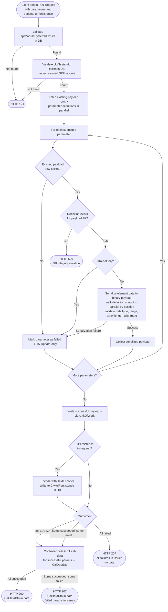

# SPF Module Update CKV Calibration Data — Low-Level Design

## Table of Contents

- [Requirements](#requirements)
- [Section 1: Architecture & Call Flow](#section-1-architecture--call-flow)
  - [1.1 High-Level Workflow Diagram](#11-high-level-workflow-diagram)
  - [1.2 File and Folder Organization](#12-file-and-folder-organization)
  - [1.3 Layer Responsibilities](#13-layer-responsibilities)
- [Section 2: Presentation Layer](#section-2-presentation-layer)
  - [2.1 Controller — updateCalibrationData](#21-controller--updatecalibrationdata)
  - [2.2 DTO Changes — UpdateSpfModuleCalDataRequest](#22-dto-changes--updatespfmodulecaldatarequest)
  - [2.3 Response Assembly](#23-response-assembly)
- [Section 3: Core Layer](#section-3-core-layer)
  - [3.1 PutCkvCalDataCommand](#31-putckvcaldatacommand)
  - [3.2 PutCkvCalDataHandler](#32-putckvcaldatahandler)
  - [3.3 ModuleRepository Extensions and ModuleDefinitionRepository Extension](#33-modulerepository-extensions-and-moduledefinitionrepository-extension)
  - [3.4 Binary Parameter Serializer](#34-binary-parameter-serializer)
    - [3.4.1 BinaryDataWriter](#341-binarydatawriter)
    - [3.4.2 serializeParameterData()](#342-serializeparameterdata)
- [Section 4: Infrastructure Layer](#section-4-infrastructure-layer)
  - [4.1 TypeOrmModuleRepository — CKV Cal Data Methods](#41-typeormmodulerepository--ckv-cal-data-methods)
  - [4.2 UnitOfWork Wiring](#42-unitofwork-wiring)
- [Section 5: Testing Strategy](#section-5-testing-strategy)
  - [Unit Tests](#unit-tests)
  - [Integration Tests](#integration-tests)
  - [End-to-End Tests](#end-to-end-tests)
- [Section 6: Impact on Existing GET Workflow](#section-6-impact-on-existing-get-workflow)

---

## Requirements

Requirements source: [spf-module-update-ckv-calibration-requirements.md](spf-module-update-ckv-calibration-requirements.md)

**Endpoint:** `PUT /arc-api/v1/projects/{projectId}/spf-modules/{spfModuleSystemId}/cal-data/{ckvSystemId}`

The client submits modified parameter data for a given SPF module CKV; the server validates, serializes to binary, and persists to the database.

| ID | Requirement |
|---|---|
| FR1 | The endpoint is `PUT /:spfModuleSystemId/cal-data/:ckvSystemId` and accepts a JSON request body. |
| FR2 | The request body is a wrapper object (`UpdateSpfModuleCalDataRequestDto`) with two fields: `parameters: ParameterResponseDto[]` (same shape as `CkvCalDataDto.parameters` from GET) and `uiPersistence?: string` (optional — see FR3). The existing `UpdateSpfModuleCalDataRequest` DTO is updated to reflect this shape (renaming the current `data` field to `parameters` and adding `uiPersistence`). |
| FR3 | The request body includes an optional `uiPersistence` field (plain UTF-8 text). If present, it is encoded with `TextEncoder` and written to `Ckv.uiPersistence` in the database. If absent, `Ckv.uiPersistence` is left unchanged. |
| FR4 | The client sends only the parameters they want to update (identified by `systemId`). Other parameters under the same CKV are unaffected. |
| FR5 | Any parameter where `isReadOnly: true` must be rejected. This is a per-parameter failure; other parameters in the same request may still succeed. |
| FR6 | Each valid parameter's element data is converted back to a binary payload (serialization). Serialization failure is a per-parameter failure. The following rules apply: <br>- Each element value is converted based on its `dataType` (e.g., `Int16`, `UInt32`, `Float`, `Double`). <br>- Each element value is validated to be within range, considering both the `dataType` bounds and the element's `min`/`max` constraints. An out-of-range value is a serialization failure. <br>&nbsp;&nbsp;* For `Int64`/`UInt64` values, `bigint` must be used instead of `number` since TypeScript's `number` type does not cover the full 64-bit integer range. <br>&nbsp;&nbsp;* For `Float` values, range validation must use float32 precision since C `float` is 32-bit while TypeScript `number` is 64-bit. <br>- For a dynamic array whose length depends on another element (with or without a formula), the actual array length must be validated against the dependency element's value. <br>- A struct's serialized payload must be 4-byte aligned. <br>- A whole parameter's serialized payload must be 8-byte aligned. If the payload length is not a multiple of 8, it is padded with zero bytes. |
| FR7 | Successfully serialized binary payloads are written to `CkvParameterPayload` rows in the database. |
| FR8 | The response is `ApiResult<CalDataDto>`. `data` is populated with the successfully written parameters only — omitted when all parameters fail. Per-parameter failures are reported as `ApiIssueItem` entries in `issues`. |
| FR9 | If all submitted parameters are written successfully, HTTP 200 is returned. |
| FR10 | If some parameters succeed and some fail, HTTP 207 is returned. Failed parameters are reported as `ApiIssueItem` entries in `issues`. |
| FR11 | If all submitted parameters fail, HTTP 207 is returned with all failures reported in `issues`. |
| FR12 | The controller handles only DTO transformation and HTTP routing. All validation, serialization, and persistence logic lives in the Core and Infrastructure layers. |
| FR13 | If no `SpfModule` row matching `spfModuleSystemId` is found in the database for the given project, the request fails with HTTP 404. |
| FR14 | If no `Ckv` row exists for `ckvSystemId` under the resolved SPF module — whether in the committed database or as a pending CREATE in the current session — the request fails with HTTP 404. If a CKV was deleted in the current session (pending DELETE), it is also treated as non-existing and the request fails with HTTP 404. |
| FR15 | Updating existing calibration data and adding new calibration data are separate workflows with separate endpoints. This endpoint (`PUT cal-data`) only updates existing `CkvParameterPayload` rows. Existence is evaluated against the session's effective state: a payload row added in the current session (pending CREATE) is treated as existing; a payload row deleted in the current session (pending DELETE) is treated as non-existing. If a submitted parameter has no existing row in the effective state, it is treated as a per-parameter failure. |

---

## Section 1: Architecture & Call Flow

The write path is the symmetric counterpart to `getCalibrationData`, following the same hexagonal + CQRS structure. The key difference: because this endpoint **writes** to the database, it uses a **Command + CommandBus + UnitOfWork** instead of a Query + QueryBus + QueryServices.

### 1.1 High-Level Workflow Diagram



### 1.2 File and Folder Organization

Files annotated as **(existing)** already exist; **(modified)** means an existing file is changed; **(new)** means a new file is created by this feature.

#### Presentation Layer Files
```
packages/api/src/presentation/rest/modules/spf-module/
├── spf-module.controller.ts                              (modified) # updateCalibrationData method implemented
└── dto/
    └── request/
        └── update-spf-module-cal-data-request.dto.ts    (modified) # rename data → parameters, add uiPersistence
```

#### Core Layer Files
```
packages/core/src/application/
├── ports/persistence/
│   └── repositories/
│       └── module/
│           ├── module.repository.ts                      (modified) # add getSpfModuleForValidation(), ckvExists(), getExistingCkvPayloads(), setCkvCalData()
│           └── module-definition.repository.ts           (modified) # add getParameterDefinitions()
├── orchestration/cqrs/registries/
│   └── command-handler-registry.ts                       (modified) # register PutCkvCalDataHandler
└── usecase-designer/spf-module/
    ├── put-cal-data/
    │   ├── put-ckv-cal-data.command.ts                (new)      # PutCkvCalDataCommand
    │   ├── put-ckv-cal-data.handler.ts                (new)      # PutCkvCalDataHandler
    │   └── put-ckv-cal-data-result.ts                 (new)      # PutCkvCalDataResult — handler result data type
    └── shared/
        ├── serialize-elements.ts                         (new)      # serializeParameterData() entry point
        └── utils/
            └── binary-data-writer.ts                     (new)      # BinaryDataWriter — symmetric pair to BinaryDataReader
```

#### Infrastructure Layer Files
```
packages/infrastructure/persistence/src/persistence-typeorm-sqllite/
├── repositories/
│   └── module/
│       ├── module.repository.ts                          (modified) # add getSpfModuleForValidation(), ckvExists(), getExistingCkvPayloads(), setCkvCalData()
│       └── module-definition.repository.ts               (modified) # add getParameterDefinitions()
├── fetchers/
│   ├── ckv-overlay-fetcher.ts                            (new)      # CkvOverlayFetcher — Layers 1+2 for CKV and CkvParameterPayload reads (shared by GET and PUT)
│   └── definitions/module-parameter-definition-fetcher.ts        (new)      # ModuleParameterDefinitionFetcher — Layers 1+2 for param def reads
└── queries/
    ├── module-calibration/
    │   └── db-ckv-calibration-query-service.ts           (modified) # getCkvForQuery, getCkvPayloads delegate Layers 1+2 to CkvOverlayFetcher
    └── spf-module-definition/
        └── db-spf-module-definition-query-service.ts     (modified) # queryParameterDefinitions delegates Layers 1+2 to fetcher
```

---

### 1.3 Layer Responsibilities

```
Presentation (API)
  Controller receives PUT request
  → @UseGuards(SessionGuard): resolves active session for project; no session → HTTP 403 (guard never reaches CommandBus)
  → passes raw path param strings to PutCkvCalDataCommand constructor
  → Command constructor parses IDs (same parseId() pattern as GetCkvCalibrationDataQuery)
  → CommandBus.execute(command, session):
       1. Reads command.constructor.requiresSession — no session passed → throws SessionRequiredError (→ HTTP 403)
       2. Reads command.constructor.allowedModes — session mode not in [Designer, DiffMerge] → throws SessionModeNotAllowedError (→ HTTP 403)
       3. Stamps groupId = UUID on WriteContext — shared by every edit_actions row written in this call
       4. Calls uow.setWriteContext({ session, groupId }) so handler reads fileSystemId/sessionId/mode/groupId via uow.getWriteContext()
       5. Routes to PutCkvCalDataHandler (handler runs only after steps 1–2 pass)

Core (Application)
  PutCkvCalDataHandler:
    constructor(uow: UnitOfWork, logger?: Logger)

    fileSystemId = uow.getWriteContext().session.fileSystemId  (same pattern as PatchSpfModuleHandler)

    Read phase (no transaction):
      1. validate SpfModule exists → HTTP 404 if not  (uow.getModuleRepository().getSpfModuleForValidation)
            returns SpfModuleBase: { systemId, definitionSystemId, subgraphSystemId, containerSystemId }
      2. validate CKV exists → HTTP 404 if not        (uow.getModuleRepository().ckvExists)
      3. fetch existing payload rows                   (uow.getModuleRepository().getExistingCkvPayloads)
            returns { systemId, parameterSystemId } per row
      4. fetch parameter definitions filtered to the parameterSystemIds from step 3
                                                       (uow.getModuleDefinitionRepository().getParameterDefinitions)

    Process phase (pure logic — no DB):
      5. for each submitted parameter:
           a. no existing payload row
              → per-parameter failure (FR15: update-only, no new rows)
           b. no matching definition for payload row's FK
              (CkvParameterPayload.parameterSystemId → SpfModuleParameterDefinition.systemId)
              → DB integrity violation, throw HTTP 500
           c. isReadOnly = true (from definition obtained in 5.b)
              → per-parameter failure
           d. serialize elements → Uint8Array
              - walk definition's elementsStructure and input elements in parallel, by position
              - definition provides: dataType, min, max, alignment, array schema (authoritative)
              - input provides: value for each element
              - element order is fixed by definition — cannot be reordered
              - mismatch in count or structure → serialization failure
           e. serialization failure → per-parameter failure

    Write phase (UnitOfWork — transactional):
      6. write successful payloads + optional uiPersistence via uow.getModuleRepository().setCkvCalData()

    Return value (Core → Controller):
      Result<PutCkvCalDataResult>  — Ok if all succeeded, Partial if any failed
      PutCkvCalDataResult = { groupId: string, succeededParamSystemIds: number[] }
      Per-parameter failures are embedded as Issue[] in the Result envelope (not a separate field on the result type)

    **Architectural constraint:** Write handlers must not call queries. The two-step
    SET+GET orchestration (write cal data, then read it back) is the controller's
    responsibility. This keeps command handlers free of query-side dependencies and
    makes the two operations independently observable and testable.

Presentation (API) — after command completes:
  Response phase:
      8. guard: if putResult.kind === Fail → throw (PutCkvCalDataHandler never returns Fail)
      9. if putResult.data.succeededParamSystemIds.length > 0 → dispatch GetCkvCalibrationDataQuery
         via QueryBus with succeededParamSystemIds as filter → CkvCalibrationReadModel → CalDataDto
     10. assemble ApiResult<CalDataDto>:
         data    = CalDataDto from GET query (omitted if all failed)
         issues  = putResult.issues (Issue[] already built by handler — no mapping needed)
     11. HTTP 200 (all success) or HTTP 207 (partial or total failure)

Infrastructure (Persistence)
  **ModuleRepository impl** (TypeOrmModuleRepository):
  → ckvExists: delegates Layers 1+2 to CkvOverlayFetcher.fetchCkv() — returns true or false
  → getExistingCkvPayloads: delegates Layers 1+2 to CkvOverlayFetcher.fetchCkvPayloads() — overlay-aware for FR15
  → setCkvCalData: calls writeDelta for each CkvParameterPayload row via PendingChangeWriter
      spec: { targetTable: CkvParameterPayload, targetSystemId: payloadSystemId, aggregateId: spfModuleSystemId, delta: { payload: base64 } }
      no direct SQL UPDATE — pending change committed when session is committed
  → (uiPersistence write folded into setCkvCalData): calls writeDelta on Ckv row via PendingChangeWriter
      spec: { targetTable: Ckv, targetSystemId: ckvSystemId, aggregateId: spfModuleSystemId, delta: { uiPersistence: "<plain string>" } }

  **SpfModule aggregate:** `SpfModule` is the aggregate root. `Ckv` and `CkvParameterPayload` are
  its children — same aggregate as `DataPort` and `ControlPort`. `aggregateId = spfModuleSystemId`
  on all pending change rows for this aggregate. This is required for the GET overlay to find PUT
  changes: the GET side calls `getByAggregateId(sessionId, spfModuleSystemId)`. Binary payloads are
  base64-encoded in `newValue` since `edit_actions.newValue` is a JSON column.
```

---

## Section 2: Presentation Layer

### 2.1 Controller — updateCalibrationData

**File:** `packages/api/src/presentation/rest/modules/spf-module/spf-module.controller.ts` (modified)

The controller method is a thin HTTP adapter — DTO transformation and routing only (FR12).

```typescript
// PUT /arc-api/v1/projects/:projectId/spf-modules/:spfModuleSystemId/cal-data/:ckvSystemId
@Put('/:spfModuleSystemId/cal-data/:ckvSystemId')
@UseGuards(SessionGuard)
@ApiParam({ name: 'spfModuleSystemId', required: true, type: String, description: 'System id of an SPF module', example: '12345' })
@ApiParam({ name: 'ckvSystemId', required: true, type: String, description: 'CKV (Calibration Key-Value) system ID for calibration data', example: '101' })
@ApiDocumentationWithExample({
  summary: 'Update calibration data for an SPF module',
  description: 'Updates calibration data for a specific SPF module. Supports updating multiple PIDs in a single request.',
  requestDto: UpdateSpfModuleCalDataRequest,
  responses: [
    { status: HttpStatus.OK,                    description: 'Calibration data updated successfully', dto: CalDataDto },
    { status: HttpStatus.BAD_REQUEST,           description: 'Invalid input data' },
    { status: HttpStatus.FORBIDDEN,             description: 'No active session or session mode not allowed' },
    { status: HttpStatus.NOT_FOUND,             description: 'Project, SPF module, or CKV system ID not found' },
    { status: HttpStatus.UNPROCESSABLE_ENTITY,  description: 'Failed to update calibration data' },
    { status: HttpStatus.MULTI_STATUS,          description: 'Partial success — some parameters failed' },
  ],
})
async updateCalibrationData(
  @Param('projectId') projectId: string,
  @Param('spfModuleSystemId') spfModuleSystemId: string,
  @Param('ckvSystemId') ckvSystemId: string,
  @Body() body: UpdateSpfModuleCalDataRequest,
  @ArcSession() session: ActiveSession,
): Promise<ApiResult<CalDataDto>> {
  const command = new PutCkvCalDataCommand(
    spfModuleSystemId, ckvSystemId,
    body.parameters, body.uiPersistence,
  );

  const putResult = await this.commandBus.execute<Result<PutCkvCalDataResult>>(command, session);
  // Handler never returns Fail — guard for TypeScript narrowing
  if (putResult.kind === RESULT_KIND.Fail) throw new Error('PutCkvCalDataHandler returned unexpected Fail result');

  let data: CkvCalDataDto | undefined;
  if (putResult.data.succeededParamSystemIds.length > 0) {
    const clientId = 'client-id'; // TODO: extract real clientId from JWT once auth wiring is done
    const query = new GetCkvCalibrationDataQuery(
      projectId, spfModuleSystemId, ckvSystemId,
      clientId,
      putResult.data.succeededParamSystemIds.join(','),
    );
    const readResult = await this.queryBus.execute<Result<CkvCalDataDto>>(query);
    data = readResult.kind !== RESULT_KIND.Fail ? readResult.data : undefined;
  }

  const issues = putResult.issues ?? [];
  const resultEnvelope = issues.length > 0 ? Result.partial(data, issues) : Result.ok(data);
  return toApiResult(resultEnvelope);
  // PartialSuccessInterceptor handles HTTP 200 vs 207 automatically
}
```

### 2.2 DTO Changes — UpdateSpfModuleCalDataRequest

**File:** `packages/api/src/presentation/rest/modules/spf-module/dto/request/update-spf-module-cal-data-request.dto.ts` (modified)

The existing `UpdateSpfModuleCalDataRequest` DTO is updated:
- Rename field `data` → `parameters` (same shape: `ParameterResponseDto[]`)
- Add optional field `uiPersistence?: string` (plain UTF-8 text, FR3)

```typescript
export class UpdateSpfModuleCalDataRequestDto {
  @ApiProperty({type: [ParameterResponseDto]})
  parameters!: ParameterResponseDto[];

  @ApiProperty({required: false})
  uiPersistence?: string;
}
```

### 2.3 Response Assembly

**File:** `packages/api/src/presentation/rest/modules/spf-module/spf-module.controller.ts` (modified — same method as 2.1)

`PartialSuccessInterceptor` already handles HTTP 200 vs 207 — it upgrades to 207 when `issues` contains at least one `Error` or `Fatal` severity entry. No changes needed to the interceptor. The controller assembles `ApiResult<CalDataDto>` with:

| Field | Value |
|---|---|
| `data` | `CalDataDto` from `GetCkvCalibrationDataQuery` for successful params — omitted if all parameters failed (FR8) |
| `issues` | `ApiIssueItem[]` — one entry per failed parameter (FR8, FR10, FR11) |

HTTP status:
- All succeeded → HTTP 200, `data` present, `issues` empty (FR9)
- Some succeeded → HTTP 207, `data` present, `issues` non-empty (FR10)
- All failed → HTTP 207, `data` omitted, `issues` non-empty (FR11)

---

## Section 3: Core Layer

### 3.1 PutCkvCalDataCommand

**File:** `packages/core/src/application/usecase-designer/spf-module/put-cal-data/put-ckv-cal-data.command.ts` (new)

Same `parseId()` pattern as `GetCkvCalibrationDataQuery` — IDs parsed in constructor, not controller (FR12).

Core must not import API-layer types. The command accepts `ParameterDto[]` (the Zod-inferred core type, which includes `systemId`). The controller passes `updateRequest.parameters as unknown as ParameterDto[]` — a single cast at the API/core boundary. No intermediate `ParameterCalDataInput` interface is needed; the command extracts `systemId` and `elements` internally in its constructor.

```typescript
import type {ParameterDto} from '../dto/parameter-dto.js';
import type {ParameterElementDto} from '../dto/element-dto.js';
import {SESSION_MODE} from '../../../shared/change-vocabulary.js';
import type {SessionMode} from '../../../shared/change-vocabulary.js';

export class PutCkvCalDataCommand extends BaseCommand {
  static override readonly requiresSession = true;
  static override readonly allowedModes: readonly SessionMode[] = [
    SESSION_MODE.Designer,
    SESSION_MODE.DiffMerge,
  ];

  public readonly spfModuleSystemId: number;
  public readonly ckvSystemId: number;
  public readonly parameters: Array<{ systemId: number; elements: ParameterElementDto[] }>;
  public readonly uiPersistence: string | undefined;

  constructor(
    spfModuleSystemIdStr: string,
    ckvSystemIdStr: string,
    parameters: ParameterDto[],
    uiPersistence: string | undefined,
  ) {
    super();
    this.spfModuleSystemId = parseId(spfModuleSystemIdStr, 'spfModuleSystemId');
    this.ckvSystemId = parseId(ckvSystemIdStr, 'ckvSystemId');
    this.parameters = parameters.map(p => ({
      systemId: parseId(p.systemId, 'parameters[].systemId'),
      elements: p.elements,
    }));
    this.uiPersistence = uiPersistence;
  }
}
```

### 3.2 PutCkvCalDataHandler

**Files:**
- `packages/core/src/application/usecase-designer/spf-module/put-cal-data/put-ckv-cal-data.handler.ts` (new)
- `packages/core/src/application/usecase-designer/spf-module/put-cal-data/put-ckv-cal-data-result.ts` (new)
- `packages/core/src/application/orchestration/cqrs/registries/command-handler-registry.ts` (modified — register handler)

Constructor takes only `UnitOfWork` — same as `PatchSpfModuleHandler`. No separate read port is injected; cross-aggregate reads go through the existing UoW repository accessors, consistent with the established pattern in this codebase.

**Read sources used:**

| Read source | Method | Purpose |
|---|---|---|
| `ModuleRepository` (via `uow.getModuleRepository()`) | `getSpfModuleForValidation(spfModuleSystemId, fileSystemId)` | validate SpfModule exists; provides `definitionSystemId`; overlay-aware (CREATE/DELETE) |
| `ModuleDefinitionRepository` (via `uow.getModuleDefinitionRepository()`) | `getParameterDefinitions(moduleDefSystemId, paramSystemIds?)` | get `isReadOnly`, `elementsStructure` per parameter; filtered to `parameterSystemId` values from existing payload rows; overlay-aware |
| `ModuleRepository` (via `uow.getModuleRepository()`) | `ckvExists(spfModuleSystemId, ckvSystemId)` | validate CKV exists; overlay-aware (CREATE/DELETE) |
| `ModuleRepository` (via `uow.getModuleRepository()`) | `getExistingCkvPayloads(spfModuleSystemId, ckvSystemId)` | fetch existing payload rows (FR15 check); returns `{ systemId, parameterSystemId }` per row; overlay-aware (CREATE/DELETE) |

`fileSystemId` is obtained from `uow.getWriteContext().session.fileSystemId` — not from a separate port call. This is the same pattern used by all handlers (e.g., `PatchSpfModuleHandler`).

**Handler pseudocode:**

```typescript
export class PutCkvCalDataHandler implements CommandHandler<
  PutCkvCalDataCommand,
  Result<PutCkvCalDataResult>
> {
  constructor(
    private readonly uow: UnitOfWork,
    private readonly logger?: Logger,
  ) {}

  async handle(command: PutCkvCalDataCommand): Promise<Result<PutCkvCalDataResult>> {
    const {session, groupId} = this.uow.getWriteContext();
    const fileSystemId = session.fileSystemId;

    // ── Step 1: validate SpfModule exists ────────────────────────────────────
    const spfModule = await this.uow.getModuleRepository()
      .getSpfModuleForValidation(command.spfModuleSystemId, fileSystemId);
    if (!spfModule) throw new ResourceNotFoundException('SpfModule not found');  // → HTTP 404

    // ── Step 2: validate CKV exists under this SpfModule ─────────────────────
    const moduleRepo = this.uow.getModuleRepository();
    const exists = await moduleRepo.ckvExists(
      command.spfModuleSystemId, command.ckvSystemId,
    );
    if (!exists) throw new ResourceNotFoundException('CKV not found');            // → HTTP 404

    // ── Step 3: fetch existing payloads, then fetch definitions keyed to those param IDs ──
    const existingPayloads = await moduleRepo.getExistingCkvPayloads(
      command.spfModuleSystemId, command.ckvSystemId,
    );
    // Use parameterSystemId (SpfModuleParameterDefinition FK), not the payload's own systemId
    const definitions = await this.uow.getModuleDefinitionRepository()
      .getParameterDefinitions(
        spfModule.definitionSystemId,
        existingPayloads.map(p => p.parameterSystemId),
      );

    // ── Step 4: per-parameter validation and serialization ───────────────────
    // payloadMap keyed by payload.systemId — matches param.systemId from client (GET→PUT flow)
    const payloadMap = new Map(existingPayloads.map(p => [p.systemId, p]));
    // defMap keyed by parameterSystemId — matched via existingPayload.parameterSystemId
    const defMap = new Map(definitions.map(d => [d.systemId, d]));

    const succeededParamSystemIds: number[] = [];
    const issues: Issue[] = [];
    const writeBatch: Array<{ payloadSystemId: number; payload: Uint8Array }> = [];

    for (const param of command.parameters) {
      // 4.a — no existing payload row: reject (update-only, no INSERT)
      const existingPayload = payloadMap.get(param.systemId);
      if (!existingPayload) {
        issues.push({
          code: ISSUE_CODE.PARAM_PAYLOAD_NOT_FOUND,
          message: `Parameter ${param.systemId}: no existing payload row (update-only)`,
          severity: IssueSeverity.Error,
        });
        continue;
      }
      // 4.b — definition missing for the payload row's FK: DB integrity violation, abort entire request
      const def = defMap.get(existingPayload.parameterSystemId);
      if (!def) throw new Error(`ParameterDefinition missing for parameterSystemId=${existingPayload.parameterSystemId} — DB integrity violation`);
      // 4.c — parameter is read-only: per-parameter failure
      if (def.isReadOnly) {
        issues.push({
          code: ISSUE_CODE.PARAM_READ_ONLY,
          message: `Parameter ${param.systemId}: parameter is read-only`,
          severity: IssueSeverity.Error,
        });
        continue;
      }
      // 4.d/e — serialize input elements to binary; failure is per-parameter
      const serialized = serializeParameterData(def, param.elements, this.logger);
      if (!serialized.ok) {
        issues.push({
          code: ISSUE_CODE.PARAM_SERIALIZATION_FAILED,
          message: `Parameter ${param.systemId}: ${serialized.error}`,
          severity: IssueSeverity.Error,
        });
        continue;
      }
      succeededParamSystemIds.push(param.systemId);
      writeBatch.push({
        payloadSystemId: param.systemId,  // PK — targetSystemId in edit_actions
        payload: serialized.value,
      });
    }

    // ── Step 5: write successful parameter payloads + optional uiPersistence ─
    await this.uow.startTransaction();
    try {
      await moduleRepo.setCkvCalData(
        command.spfModuleSystemId,
        command.ckvSystemId,
        writeBatch.map(w => ({ payloadSystemId: w.payloadSystemId, payload: w.payload })),
        command.uiPersistence !== undefined
          ? new TextEncoder().encode(command.uiPersistence)
          : undefined,
      );
      await this.uow.commit();
    } catch (error) {
      if (this.uow.isInTransaction()) await this.uow.rollback();
      throw error;
    }

    this.logger?.log(
      `PutCkvCalDataHandler: ${succeededParamSystemIds.length} succeeded, ` +
      `${issues.length} failed for ckvSystemId=${command.ckvSystemId}`,
    );

    const data: PutCkvCalDataResult = {groupId, succeededParamSystemIds};
    return issues.length > 0 ? Result.partial(data, issues) : Result.ok(data);
  }
}
```

**Handler return type** (`put-ckv-cal-data-result.ts`):

```typescript
// put-ckv-cal-data-result.ts
export interface PutCkvCalDataResult {
  groupId: string;
  succeededParamSystemIds: number[];
  // No failures[] — per-parameter failures are carried as Issue[] in the Result envelope
}
```

The handler returns `Result<PutCkvCalDataResult>`:
- All parameters succeeded → `Result.ok(data)` → HTTP 200
- One or more parameters failed → `Result.partial(data, issues)` → HTTP 207
- Handler never returns `Result.fail()` — hard failures (not found, DB integrity) throw exceptions

**Issue codes used by this handler** (`packages/core/src/shared/issues/operational-codes.ts`):

| Code | `ISSUE_CODE` key | When emitted |
|---|---|---|
| `PARAM_PAYLOAD_NOT_FOUND` | `ISSUE_CODE.PARAM_PAYLOAD_NOT_FOUND` | Submitted parameter has no existing payload row (update-only, FR15) |
| `PARAM_READ_ONLY` | `ISSUE_CODE.PARAM_READ_ONLY` | Parameter definition has `isReadOnly: true` (FR5) |
| `PARAM_SERIALIZATION_FAILED` | `ISSUE_CODE.PARAM_SERIALIZATION_FAILED` | `serializeParameterData` returns `{ok: false}` (FR6) |

All issues use `IssueSeverity.Error` — each represents a write failure where a parameter was submitted for update but was not written. `PartialSuccessInterceptor` requires `Error` or `Fatal` severity to upgrade from 200 to 207. The controller passes `putResult.issues` through directly to `toApiResult()` — no mapping needed.

### 3.3 ModuleRepository Extensions and ModuleDefinitionRepository Extension

**Files:**
- `packages/core/src/application/ports/persistence/repositories/module/module.repository.ts` (modified — add `getSpfModuleForValidation`, `ckvExists`, `getExistingCkvPayloads`, `setCkvCalData`)
- `packages/core/src/application/ports/persistence/repositories/module/module-definition.repository.ts` (modified — add `getParameterDefinitions`)

`ModuleRepository` gains all CKV validation reads and the write method, following the one-repo-per-aggregate rule: `Ckv` and `CkvParameterPayload` are children of the `SpfModule` aggregate, exactly like `DataPort` and `ControlPort`. No new repository interface or UoW accessor is introduced.

`ModuleDefinitionRepository` gains one new lean validation read method. Both repositories follow the established pattern — validation reads on existing UoW repositories, reusable by any future handler.

```typescript
// Addition to existing ModuleRepository interface:

// SpfModuleBase is defined in the domain layer:
// packages/core/src/domain/entities/usecase-data/module/spf-module.ts
export interface SpfModuleBase {
  systemId: number;
  definitionSystemId: number;
  subgraphSystemId: number;
  containerSystemId: number;
}

export interface ExistingPayloadRow {
  systemId: number;          // PK of CkvParameterPayload — matches param.systemId from client (GET→PUT flow)
  parameterSystemId: number; // FK → SpfModuleParameterDefinition.systemId — used for definition lookup
}

export interface CkvPayloadUpdate {
  payloadSystemId: number;   // PK of CkvParameterPayload — used as targetSystemId in edit_actions
  payload: Uint8Array;
}

export interface ModuleRepository {
  // ... existing methods ...

  // Overlay-aware existence check returning SpfModuleBase scalar fields.
  // Overlay-aware: CREATE edit_actions (module created in session, not yet in DB) → returns row.
  // DELETE edit_actions (module deleted in session, still in DB) → returns null.
  // Avoids loading ports and intents (cf. findModuleForPatch which loads full SpfModule).
  getSpfModuleForValidation(
    spfModuleSystemId: number,
    fileSystemId: number,
  ): Promise<SpfModuleBase | null>;

  // Overlay-aware CKV existence check — returns boolean (systemId not needed by caller).
  // CREATE edit_actions: CKV created in this session (not yet in DB) → returns true.
  // DELETE edit_actions: CKV pending deletion → returns false.
  ckvExists(
    spfModuleSystemId: number,
    ckvSystemId: number,
  ): Promise<boolean>;

  // Overlay-aware: the FR15 existence check must reflect the session's pending state.
  // CREATE edit_actions: row added in this session not yet in DB table → must be treated as existing.
  // DELETE edit_actions: row pending deletion still in DB table → must be treated as non-existing.
  // Returns both systemId (PK, matches client param.systemId) and parameterSystemId (FK, for definition lookup).
  getExistingCkvPayloads(
    spfModuleSystemId: number,
    ckvSystemId: number,
  ): Promise<ExistingPayloadRow[]>;

  // Write method — records pending changes to edit_actions (not direct SQL UPDATEs).
  // aggregateId = spfModuleSystemId (SpfModule is the aggregate root; Ckv and CkvParameterPayload
  // are its children — same pattern as DataPort/ControlPort writes in ModuleRepository)
  // payloadUpdates.payloadSystemId is the PK of CkvParameterPayload — used as targetSystemId.
  // payloadUpdates may be empty if only uiPersistence is written.
  // uiPersistence: if provided, records an UPDATE edit_action on the Ckv row.
  setCkvCalData(
    spfModuleSystemId: number,
    ckvSystemId: number,
    payloadUpdates: CkvPayloadUpdate[],
    uiPersistence?: Uint8Array,
  ): Promise<void>;
}
```

```typescript
// Addition to existing ModuleDefinitionRepository interface:

export interface ParameterDefinitionBase {
  systemId: number;
  isReadOnly: boolean;
  elementsStructure: string;  // JSON — parsed by serializeParameterData
}

export interface ModuleDefinitionRepository {
  // ... existing methods ...

  // Overlay-aware: returns lean ParameterDefinitionBase[] for a given definition.
  // fileSystemId required so the implementation can apply the session overlay
  // (a definition may be updated in the session before PUT is called).
  // paramSystemIds: optional filter — if provided, only definitions whose systemId is in the
  //   set are returned; avoids loading all definitions for modules with hundreds of parameters.
  //   Consistent with how DbCkvCalibrationQueryService.getCkvPayloads filters on the GET side.
  // ParameterDefinitionReadModel (GET) extends ParameterDefinitionBase — one change propagates to both.
  getParameterDefinitions(
    moduleDefSystemId: number,
    paramSystemIds?: number[],
  ): Promise<ParameterDefinitionBase[]>;
}
```

### 3.4 Binary Parameter Serializer

#### 3.4.1 BinaryDataWriter

**File:** `packages/core/src/application/usecase-designer/shared/utils/binary-data-writer.ts` (new)

Symmetric pair to the existing `BinaryDataReader`. Wraps a growing `ArrayBuffer` and exposes typed write methods.

```typescript
export class BinaryDataWriter {
  private buffer: ArrayBuffer;
  private view: DataView;
  private offset = 0;

  constructor(initialCapacity = 256) { ... }  // doubles capacity as needed

  writeInt8(v: number): void
  writeUInt8(v: number): void
  writeInt16(v: number): void
  writeUInt16(v: number): void
  writeInt32(v: number): void
  writeUInt32(v: number): void
  writeFloat(v: number): void     // 32-bit float, matches readFloat()
  writeDouble(v: number): void    // 64-bit float, matches readDouble()
  writeInt64(v: bigint): void
  writeUInt64(v: bigint): void
  writeRawData(v: Uint8Array): void  // write raw bytes, matches readRawData()
  align(alignment: number): void     // pad with zero bytes to next alignment boundary, matches align() in reader
  toUint8Array(): Uint8Array         // returns written bytes (no copy)
}
```

#### 3.4.2 serializeParameterData()

**File:** `packages/core/src/application/usecase-designer/shared/serialize-elements.ts` (new)

`serializeParameterData` is the symmetric counterpart to `parseParameterData`. It takes a parameter's `ParameterDefinition` (from DB) and the client-submitted `ElementData[]` — the same unified type used by GET — and produces a binary `Uint8Array` payload suitable for writing to `CkvParameterPayload.payload`.

```typescript
type SerializeResult =
  | { ok: true; value: Uint8Array }
  | { ok: false; error: string };

function serializeParameterData(
  definition: ParameterDefinition,  // from DB — elementsStructure is authoritative schema
  inputElements: ElementData[],  // from API request — same type as GET output
  logger?: Logger,
): SerializeResult
```

The function works as follows:
1. Creates a `BinaryDataWriter` to accumulate bytes.
2. Walks `definition.elementsStructure` and `inputElements` in parallel by position — the definition is the authoritative schema; the input provides values only.
3. For each element, dispatches on the definition's `elementType` discriminator (see walking rules below). The input's `type` field must match — a mismatch is a serialization failure.
4. Each scalar value is read from `ConfigElementData.value` (a string) and parsed to the appropriate TypeScript type based on `dataType`, then range-validated and written via `BinaryDataWriter`. `min`/`max` on `ConfigElementData` are also `string?` and must be parsed to the same type as `value` before range comparison.
5. Structs recurse into their child elements and are padded to 4-byte alignment after.
6. Arrays resolve their length from `arrayLenFormulaStr` (via `evaluateFormula()`) or `length`, validate the input `value.length` matches, then serialize each item. Formula variables are resolved from the `ConfigElementData` values serialized so far in the same parameter — the same `parsedSoFar` accumulator pattern used by `computeArrayLength` in `parseParameterData`.
7. After all elements, the full payload is padded to 8-byte alignment.
8. Returns `{ ok: true, value: writer.toUint8Array() }` on success, or `{ ok: false, error: '...' }` on any failure — no exceptions thrown.

**Walking rules** (definition drives the walk; input element at matching position provides the value):

`StructArrayData` no longer exists — both scalar and struct arrays are represented as `ElementArrayData`, distinguished by the presence of `structType`. The definition's `elementType` is authoritative:

| Definition `elementType` | Input `type` | `structType` present? | Action |
|---|---|---|---|
| `ConfigElement` | `'ConfigElement'` | — | parse `value` string → typed scalar per `dataType`; validate within `min`/`max` (parsed as same type) and `dataType` bounds; use `bigint` for `Int64`/`UInt64`; use float32 precision for range validation of `Float`; write via `BinaryDataWriter` |
| `Struct` | `'Struct'` | — | recurse into `value` child elements; pad to 4-byte boundary after |
| `ConfigElementArray` | `'ElementArray'` | no | resolve length via `evaluateFormula(arrayLenFormulaStr)` or `length`; validate `value.length` matches; write `length` × scalar |
| `StructArray` | `'ElementArray'` | yes | resolve length; validate `value.length` matches; write `length` × struct (each padded to 4 bytes) |

After all elements: pad full payload to 8-byte boundary.

Type discriminator mismatch, count mismatch, or structural mismatch between definition and input → `{ ok: false, error: '...' }`.

---

## Section 4: Infrastructure Layer

### 4.1 TypeOrmModuleRepository — CKV Cal Data Methods

**File:** `packages/infrastructure/persistence/src/persistence-typeorm-sqllite/repositories/module/module.repository.ts` (modified)

Adds CKV validation reads and the `setCkvCalData` write method to the existing `TypeOrmModuleRepository`, which already implements `ModuleRepository`. `Ckv` and `CkvParameterPayload` are children of the `SpfModule` aggregate — the same repository that handles `DataPort` and `ControlPort` writes. Validation reads delegate Layers 1+2 to `CkvOverlayFetcher` (shared with the GET `DbCkvCalibrationQueryService`) or `ModuleNodeOverlayFetcher` (for `getSpfModuleForValidation`); write methods record pending changes via `PendingChangeWriter`.

`aggregateId = spfModuleSystemId` on every `edit_actions` row produced. Each `CkvParameterPayload` row update is recorded as an `UPDATE` operation with `fieldPath = "payload"` and `newValue = { payload: <base64-encoded Uint8Array> }`. The `uiPersistence` update is recorded on the `Ckv` row with `newValue = { uiPersistence: "<plain string>" }` — no binary encoding, stored as-is.

`ckvExists` and `getExistingCkvPayloads` delegate all DB and overlay logic to `CkvOverlayFetcher`, then perform their own lean Layer 3 mapping. The fetcher handles both CREATE (module + CKV created in session — row not yet in DB) and DELETE (CKV deleted in session — row still in DB) directions.

```typescript
// New methods added to TypeOrmModuleRepository:

  async ckvExists(
    spfModuleSystemId: number,
    ckvSystemId: number,
  ): Promise<boolean> {
    const sessionId = this.uow.getWriteContext().session.sessionId;
    const row = await this.ckvOverlayFetcher.fetchCkv(
      ckvSystemId, spfModuleSystemId, sessionId,
    );
    return row !== null;
  }

  async getExistingCkvPayloads(
    spfModuleSystemId: number,
    ckvSystemId: number,
  ): Promise<ExistingPayloadRow[]> {
    const sessionId = this.uow.getWriteContext().session.sessionId;
    const rows = await this.ckvOverlayFetcher.fetchCkvPayloads(
      ckvSystemId, spfModuleSystemId, fileSystemId, sessionId,
    );
    // Layer 3: map to lean validation type — include PK for client match and FK for definition lookup
    return rows.map(r => ({ systemId: r.systemId, parameterSystemId: r.parameterSystemId }));
  }

  async getSpfModuleForValidation(
    spfModuleSystemId: number,
    fileSystemId: number,
  ): Promise<SpfModuleBase | null> {
    const sessionId = this.uow.getWriteContext().session.sessionId;
    // Layers 1+2 delegated to existing ModuleNodeOverlayFetcher (already wired into TypeOrmModuleRepository)
    const row = await this.moduleNodeOverlayFetcher.fetchModule(
      spfModuleSystemId, fileSystemId, sessionId,
    );
    if (!row) return null;
    // Layer 3: map to SpfModuleBase
    return {
      systemId: row.systemId,
      definitionSystemId: row.definitionSystemId,
      subgraphSystemId: row.subgraphSystemId,
      containerSystemId: row.containerSystemId,
    };
  }
```

**`CkvOverlayFetcher`** (`packages/infrastructure/persistence/src/.../fetchers/ckv-overlay-fetcher.ts`, new):

```typescript
// Returns lean rows — no Layer 3 mapping.
// sessionId = null means no active session; returns base DB rows without overlay.
export class CkvOverlayFetcher {
  constructor(
    private readonly dataSource: DataSource,
    private readonly editActionsSvc: EditActionsQueryService,
  ) {}

  async fetchCkv(
    ckvSystemId: number,
    spfModuleSystemId: number,
    fileSystemId: number,
    sessionId: number | null,
  ): Promise<CkvBase | null> { /* Layers 1+2: DB query + CREATE/DELETE overlay */ }

  async fetchCkvPayloads(
    ckvSystemId: number,
    spfModuleSystemId: number,
    fileSystemId: number,
    sessionId: number | null,
  ): Promise<CkvParameterPayloadBase[]> { /* Layers 1+2: DB query + CREATE/DELETE overlay */ }
}
// CkvParameterPayloadBase: { systemId: number; parameterSystemId: number }
// systemId = PK of CkvParameterPayload (matches client param.systemId from GET response)
// parameterSystemId = FK → SpfModuleParameterDefinition.systemId (used for definition lookup)
```

```typescript
  async setCkvCalData(
    spfModuleSystemId: number,
    ckvSystemId: number,
    payloadUpdates: CkvPayloadUpdate[],
    uiPersistence?: Uint8Array,
  ): Promise<void> {
    const { session, groupId } = this.uow.getWriteContext();
    for (const update of payloadUpdates) {
      await this.pendingChangeWriter.writeDelta(
        {
          targetTable: ENTITY_NAMES.CkvParameterPayload,
          targetSystemId: update.payloadSystemId,  // PK of CkvParameterPayload
          aggregateId: spfModuleSystemId,
          delta: { payload: Buffer.from(update.payload).toString('base64') },
        },
        session.sessionId,
        groupId,
        this.manager,
      );
    }
    if (uiPersistence !== undefined) {
      await this.pendingChangeWriter.writeDelta(
        {
          targetTable: ENTITY_NAMES.Ckv,
          targetSystemId: ckvSystemId,
          aggregateId: spfModuleSystemId,
          delta: { uiPersistence: uiPersistence },
        },
        session.sessionId,
        groupId,
        this.manager,
      );
    }
  }
}
```

### 4.2 UnitOfWork Wiring

**File:** `packages/api/src/infrastructure-wrapper/persistence/unit-of-work/typeorm-unit-of-work.ts` (no change)

No new UoW accessor is required. `TypeOrmModuleRepository` already has a `getModuleRepository()` accessor in `TypeOrmUnitOfWork`. The new CKV methods are added to the existing adapter.

`PutCkvCalDataHandler` is constructed with only `UnitOfWork` at registration time in `command-handler-registry.ts` — no additional read port needed.

---

## Section 5: Testing Strategy

### Unit Tests

Unit tests run in-process with no database. All dependencies are mocked/stubbed.

#### PutCkvCalDataHandler

**File:** `packages/core/tests/unit/application/usecase-designer/spf-module/put-cal-data/put-ckv-cal-data.handler.spec.ts` (new)

| Scenario | Expected outcome |
|---|---|
| `getSpfModuleForValidation` returns null | throws `ResourceNotFoundException` |
| `ckvExists` returns false | throws `ResourceNotFoundException` |
| Definition missing for payload FK | throws (DB integrity violation — `Error`) |
| Parameter is read-only | issue pushed with `ISSUE_CODE.PARAM_READ_ONLY`; not in `writeBatch` |
| No existing payload row | issue pushed with `ISSUE_CODE.PARAM_PAYLOAD_NOT_FOUND` (update-only) |
| Serialization fails | issue pushed with `ISSUE_CODE.PARAM_SERIALIZATION_FAILED` |
| `setCkvCalData` throws | calls `rollback()`, re-throws |
| All parameters succeed, no `uiPersistence` | returns `Result.ok({ groupId, succeededParamSystemIds: [...] })`; `setCkvCalData` called with correct batch |
| Partial success | returns `Result.partial({ groupId, succeededParamSystemIds }, issues)` with correct issue codes |
| `uiPersistence` present in request | `setCkvCalData` called with `uiPersistence` `Uint8Array`; included in same transaction |

#### serializeParameterData

**File:** `packages/core/tests/unit/application/usecase-designer/spf-module/param-parser/serialize-elements.spec.ts` (new)

| Scenario | Expected outcome |
|---|---|
| `ConfigElement` — all scalar `dataType`s | correct bytes written; `ok: true` |
| `Int64` / `UInt64` — uses `bigint` | correct 8-byte LE encoding; `ok: true` |
| `Float` — out of float32 range | `ok: false` (float32 precision validation) |
| Value outside `min`/`max` (string-parsed) | `ok: false` with descriptive error |
| `Struct` — child elements + 4-byte align | correct bytes including padding; `ok: true` |
| `ElementArray` without `structType` (scalar array) | correct `length × scalar`; `ok: true` |
| `ElementArray` with `structType` (struct array) | each struct padded to 4 bytes; `ok: true` |
| Input `type` mismatches definition `elementType` | `ok: false` |
| Input element count mismatches definition | `ok: false` |
| Full payload 8-byte alignment | padding appended if needed; `ok: true` |

#### BinaryDataWriter

**File:** `packages/core/tests/unit/application/usecase-designer/spf-module/param-parser/utils/binary-data-writer.spec.ts` (new)

| Scenario | Expected outcome |
|---|---|
| Each typed write method (`writeInt8` … `writeDouble`) | bytes match `DataView` reference encoding |
| `writeInt64` / `writeUInt64` with bigint | correct 8-byte LE output |
| `writeRawData` | bytes appended verbatim |
| `align(4)` when already aligned | no padding added |
| `align(4)` when not aligned | correct zero-byte padding |
| `toUint8Array()` | returns only written bytes (not full buffer capacity) |
| Buffer growth beyond initial capacity | bytes remain correct after reallocation |

---

### Integration Tests

Integration tests use a real in-memory SQLite database. The schema is auto-created via TypeORM `synchronize: true`; no migration files or fixture files are needed. Each test inserts its required FK chain directly via `manager.insert()` (Project → ArcDbFile → SpfModule → Ckv → CkvParameterPayload). The repository under test is constructed with a real `QueryRunner.manager` obtained from `createTestTransaction()`. Post-operation verification uses `dataSource.query()` directly.

These tests verify the repository SQL and TypeORM entity mappings — not handler logic.

#### TypeOrmModuleRepository — CKV Cal Data Methods

**File:** `packages/infrastructure/persistence/tests/integration/repositories/module/module-ckv-cal-data.repository.spec.ts` (new)

| Scenario | Expected outcome |
|---|---|
| `setCkvCalData` — payload updates written | edit_actions rows with `aggregateId=spfModuleSystemId`, `fieldPath='payload'`, correct base64 newValue |
| `setCkvCalData` — uiPersistence written | edit_actions row with `aggregateId=spfModuleSystemId`, `targetTable=Ckv`, `fieldPath='uiPersistence'` |
| `setCkvCalData` — empty payloadUpdates + uiPersistence only | only the uiPersistence edit_action written |
| `ckvExists` — row in DB, no overlay | returns `true` |
| `ckvExists` — CREATE overlay (CKV created in session) | returns `true` |
| `ckvExists` — DELETE overlay (CKV deleted in session) | returns `false` |
| `getExistingCkvPayloads` — baseline rows only | returns committed rows with both `systemId` (PK) and `parameterSystemId` (FK) |
| `getExistingCkvPayloads` — CREATE overlay adds new payload | includes pending-created row |
| `getExistingCkvPayloads` — DELETE overlay removes payload | excludes pending-deleted row |

#### CkvOverlayFetcher

**File:** `packages/infrastructure/persistence/tests/integration/fetchers/ckv-overlay-fetcher.spec.ts` (new)

These tests cover the shared Layers 1+2 logic in isolation so that `TypeOrmModuleRepository` and `DbCkvCalibrationQueryService` tests can focus on Layer 3 mapping.

| Scenario | Expected outcome |
|---|---|
| `fetchCkv` — row in DB, no session (sessionId = null) | returns `CkvBase` row |
| `fetchCkv` — row in DB, CREATE edit_action present | returns row (DB row takes precedence) |
| `fetchCkv` — no DB row, CREATE edit_action present | returns synthesised `CkvBase` from action |
| `fetchCkv` — row in DB, DELETE edit_action present | returns null |
| `fetchCkv` — no DB row, no edit_action | returns null |
| `fetchCkvPayloads` — committed rows, no session | returns all DB rows with `systemId` (PK) and `parameterSystemId` (FK) |
| `fetchCkvPayloads` — CREATE edit_action adds payload | includes pending-created row |
| `fetchCkvPayloads` — DELETE edit_action removes payload | excludes pending-deleted row |
| `fetchCkvPayloads` — both CREATE and DELETE in same session | net result reflects both |

---

### End-to-End Tests

E2E tests send real HTTP requests to a running NestJS app with an in-memory SQLite database. These tests verify the full request/response cycle including HTTP status codes and response body shape.

**File:** `packages/api/tests/e2e/modules/spf-module/put-ckv-cal-data.e2e-spec.ts` (new)

| Scenario | HTTP status | Response |
|---|---|---|
| No active session (requiresSession gate) | 403 | `SessionRequiredError` |
| Session mode is TUNING or DISCOVERY_WIZARD (allowedModes gate) | 403 | `SessionModeNotAllowedError` |
| All parameters succeed, no `uiPersistence` | 200 | `data: CalDataDto`, `issues` empty |
| All parameters succeed, `uiPersistence` present | 200 | `data: CalDataDto`, `issues` empty |
| Some parameters fail (read-only) | 207 | `data: CalDataDto` (succeeded only), `issues` non-empty |
| Some parameters fail (serialization) | 207 | `data: CalDataDto` (succeeded only), `issues` non-empty |
| All parameters fail | 207 | `data` omitted, `issues` non-empty |
| `spfModuleSystemId` not found | 404 | no `data` |
| `ckvSystemId` not found | 404 | no `data` |

---

## Section 6: Impact on Existing GET Workflow

The GET cal-data workflow is **not changed functionally**. The only change is an internal persistence-layer refactor: `queryParameterDefinitions` in `DbSpfModuleDefinitionQueryService` is rewritten to delegate Layers 1 and 2 to the new `ModuleParameterDefinitionFetcher`, then performs its own Layer 3 mapping as before.

The GET response shape, query service interface, and Core types are unchanged.

### 6.1 Files Changed

| File | Change |
|---|---|
| `packages/infrastructure/persistence/src/.../fetchers/definitions/module-parameter-definition-fetcher.ts` | New file — Layers 1+2 for parameter definition reads |
| `packages/infrastructure/persistence/src/.../queries/spf-module-definition/db-spf-module-definition-query-service.ts` | `queryParameterDefinitions` delegates Layers 1+2 to `ModuleParameterDefinitionFetcher`; Layer 3 mapping unchanged; constructor gains `ModuleParameterDefinitionFetcher` dependency |
| `packages/core/.../repositories/module/module-definition.repository.ts` | New `ParameterDefinitionBase` type; `ParameterDefinitionReadModel` (GET) extends it — no behavior change |

### 6.2 Constructor Change in `DbSpfModuleDefinitionQueryService`

```typescript
// Before
constructor(
  private readonly dataSource: DataSource,
  private readonly editActionsSvc: EditActionsQueryService,
) {}

// After
constructor(
  private readonly dataSource: DataSource,
  private readonly editActionsSvc: EditActionsQueryService,
  private readonly paramDefFetcher: ModuleParameterDefinitionFetcher,  // ← new
) {}
```

`ModuleParameterDefinitionFetcher` is constructed at the same wiring site, passing the same `dataSource` and `editActionsSvc`. No new top-level dependencies are introduced.

