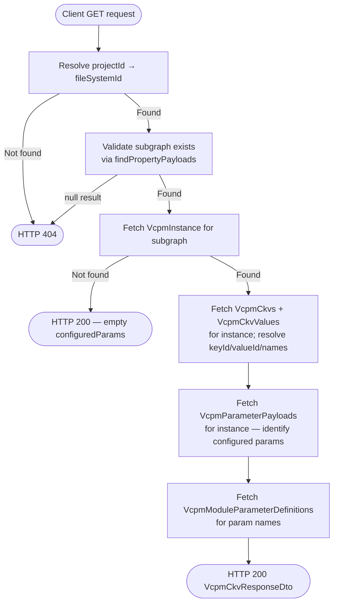
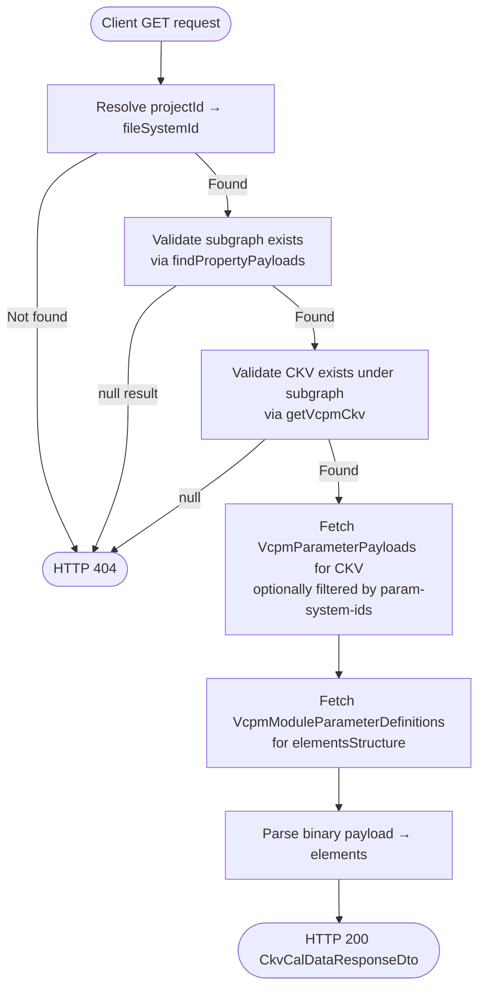

<!--
  Copyright (c) Qualcomm Technologies, Inc. and/or its subsidiaries.
  SPDX-License-Identifier: BSD-3-Clause
-->

# Get VCPM CKV Data — Low-Level Design

## Table of Contents

- [Requirements](#requirements)
- [Section 1: Architecture & Call Flow](#section-1-architecture--call-flow)
  - [1.1 High-Level Workflow Diagrams](#11-high-level-workflow-diagrams)
  - [1.2 File and Folder Organization](#12-file-and-folder-organization)
  - [1.3 Layer Responsibilities](#13-layer-responsibilities)
- [Section 2: Presentation Layer](#section-2-presentation-layer)
- [Section 3: Core Layer](#section-3-core-layer)
  - [3.1 VcpmCkvDtoSchema update](#31-vcpmckvdtoschema-update)
  - [3.2 VcpmQueryService Port](#32-vcpmqueryservice-port)
  - [3.3 QueryServices interface update](#33-queryservices-interface-update)
  - [3.4 GetVcpmCkvHandler](#34-getvcpmckvhandler)
  - [3.5 GetVcpmCalDataHandler](#35-getvcpmcaldatahandler)
- [Section 4: Infrastructure Layer](#section-4-infrastructure-layer)
  - [4.1 VcpmOverlayFetcher](#41-vcpmoverlayfetcher)
  - [4.2 DbVcpmQueryService](#42-dbvcpmqueryservice)
  - [4.3 DbQueryServices wiring](#43-dbqueryservices-wiring)
  - [4.4 Schema Reference](#44-schema-reference)
- [Section 5: Testing Strategy](#section-5-testing-strategy)

---

## Requirements

Requirements source: [../vcpm-ckv-get-requirements.md](../vcpm-ckv-get-requirements.md)

| ID | Requirement |
|---|---|
| FR-VG1-01 | `GET /subgraphs/:id/vcpm-ckv` endpoint |
| FR-VG1-02 | Subgraph not found → 404 |
| FR-VG1-03 | Returns `VcpmCkvResponseDto` — configured params with associated CKVs; each CKV uses `KeyValueInfoDto` shape |
| FR-VG2-01 | `GET /subgraphs/:id/vcpm-ckv/:ckvSystemId/cal-data` endpoint with optional `?param-system-ids` filter |
| FR-VG2-02 | Subgraph not found → 404 |
| FR-VG2-03 | CKV not found → 404 |
| FR-VG2-04 | Returns `CkvCalDataResponseDto` — same shape as SPF module cal data GET |
| FR-CCR-01 | Session overlay applied — staged creates/deletes reflected in both responses |

---

## Section 1: Architecture & Call Flow

Both endpoints are read-only queries. They follow the hexagonal + CQRS structure used throughout the project. Both query handlers exist as stubs — this LLD implements the logic.

### 1.1 High-Level Workflow Diagrams

**GET /vcpm-ckv:**



**GET /vcpm-ckv/:ckvSystemId/cal-data:**



### 1.2 File and Folder Organization

Files annotated **(existing)** already exist; **(modified)** means an existing file is changed; **(new)** means a new file.

#### Core Layer
```
packages/core/src/application/
├── ports/persistence/query-services/
│   ├── query-services.ts                                                  (modified — add vcpmQueryService)
│   └── vcpm/
│       └── vcpm-query-service.ts                                          (new)
├── usecase-designer/subgraph/
│   ├── dto/
│   │   └── subgraph-write-result-types.ts                                 (modified — update VcpmCkvDtoSchema ckv field)
│   ├── get-vcpm-ckv/
│   │   ├── get-vcpm-ckv.query.ts                                          (existing — no changes)
│   │   └── get-vcpm-ckv.handler.ts                                        (modified — implement logic)
│   └── get-vcpm-cal-data/
│       ├── get-vcpm-cal-data.query.ts                                     (existing — no changes)
│       └── get-vcpm-cal-data.handler.ts                                   (modified — implement logic)
└── orchestration/cqrs/registries/
    └── query-handler-registry.ts                                          (existing — handlers already registered)
```

#### Infrastructure Layer
```
packages/infrastructure/persistence/src/persistence-typeorm-sqllite/
├── entity-schema/usecase-data/subgraph/
│   └── subgraph-vcpm-data.ts                                              (modified — add VcpmInstanceBase, VcpmCkvBase, VcpmParameterPayloadBase; Row types extend them)
├── fetchers/
│   └── vcpm-overlay-fetcher.ts                                            (new — imports Base types from schema file)
└── queries/
    ├── vcpm/
    │   └── db-vcpm-query-service.ts                                       (new)
    └── typeorm-query-services.ts                                          (modified — wire DbVcpmQueryService)
```

#### Presentation Layer
```
packages/api/src/presentation/rest/modules/subgraph/
└── subgraph.controller.ts                                                 (existing — no changes; both endpoints fully wired)
```

### 1.3 Layer Responsibilities

```
Presentation (API)
  Already wired — controller builds GetVcpmCkvQuery / GetVcpmCalDataQuery and calls queryBus.execute.
  No changes needed.

Core (Application)
  GetVcpmCkvHandler:
    1. Resolve projectId → fileSystemId via projectQueryService
    2. Validate subgraph via subgraphQueryService.findPropertyPayloads → 404 if null
    3. Fetch VcpmInstance via vcpmQueryService.getVcpmInstanceBySubgraph
    4. No instance → return { configuredParams: [] }
    5. Fetch all CKVs (with resolved key/value names) via vcpmQueryService.getVcpmCkvsByInstance
    6. Fetch all parameter payloads for instance via vcpmQueryService.getVcpmParameterPayloadsByInstance
    7. Fetch parameter definitions for param names via vcpmQueryService.getVcpmParameterDefinitions
    8. Build and return VcpmCkvDto

  GetVcpmCalDataHandler:
    1. Resolve projectId → fileSystemId via projectQueryService
    2. Validate subgraph via subgraphQueryService.findPropertyPayloads → 404 if null
    3. Validate CKV exists via vcpmQueryService.getVcpmCkv → 404 if null
    4. Fetch parameter payloads via vcpmQueryService.getVcpmParameterPayloads
       (filtered by paramSystemIds if provided)
    5. Fetch parameter definitions via vcpmQueryService.getVcpmParameterDefinitions
    6. Parse binary payload → elements for each parameter
    7. Build and return CkvCalDataDto

Infrastructure (Persistence)
  VcpmOverlayFetcher:
    → Takes EntityManager and EditActionsQueryService — no session resolution (caller's responsibility)
    → All fetch methods accept sessionId: number | null — null returns baseline rows only
    → All fetch methods take subgraphSystemId — it is the aggregate ID for getByAggregateId calls
    → fetchInstanceBySubgraph, fetchCkvsByInstance, fetchCkv, fetchParameterPayloads,
      fetchParameterPayloadsByInstance, fetchParameterDefinitions (no overlay — read-only reference data)
    → Returns raw DB rows — vcpm_ckv_values rows carry valueDefSystemId only (not resolved key/value)

  DbVcpmQueryService:
    → Owns session resolution — takes ISessionRepository, resolves sessionId once per method via resolveSessionId()
    → Delegates Layers 1+2 to VcpmOverlayFetcher
    → Resolves valueDefSystemId → { key, value } with full names via keyValueDefQueryService
      (same pattern as DbCkvCalibrationQueryService)
    → Layer 3: maps raw rows to VcpmQueryService read models
    → getVcpmParameterDefinitions: direct query on vcpm_module_parameter_definitions (no overlay — read-only)
```

---

## Section 2: Presentation Layer

No changes required. The controller already has both endpoints fully wired:

- `getVcpmCkv` builds `GetVcpmCkvQuery` and returns `VcpmCkvResponseDto`
- `getVcpmCalData` builds `GetVcpmCalDataQuery` and returns `CkvCalDataResponseDto`

Both call `toApiResult(result)` without a mapper — so the handler must return a `Result` whose `.data` matches the DTO schema directly.

---

## Section 3: Core Layer

### 3.1 VcpmCkvDtoSchema update

**File:** `packages/core/src/application/usecase-designer/subgraph/dto/subgraph-write-result-types.ts` (modified)

Update `VcpmCkvDtoSchema` to use `KeyValueInfoDtoSchema` for the `ckv` field (reviewer requirement: match module API shape):

```typescript
// Before
ckv: z.array(z.object({
  keyId: z.number().int(),
  valueId: z.number().int(),
})),

// After — import KeyValueInfoDtoSchema from spf-module-dto
ckv: z.array(KeyValueInfoDtoSchema),
```

`KeyValueInfoDtoSchema` is already exported from `packages/core/src/application/usecase-designer/spf-module/query/spf-module-dto.ts` and re-exported via `packages/core/src/index.ts`.

### 3.2 VcpmQueryService Port

**File:** `packages/core/src/application/ports/persistence/query-services/vcpm/vcpm-query-service.ts` (new)

```typescript
import type {KeyValueInfoDto} from '../../../../../../application/usecase-designer/spf-module/query/spf-module-dto.js';

export interface VcpmInstanceReadModel {
  systemId: number;
  subgraphSystemId: number;
}

export interface VcpmCkvReadModel {
  systemId: number;
  // Fully resolved key-value pairs — names and systemIds included
  values: KeyValueInfoDto[];
}

export interface VcpmParameterPayloadReadModel {
  systemId: number;
  vcpmParameterSystemId: number;
  vcpmCkvSystemId: number;
  payload: Uint8Array | null;
}

export interface VcpmParameterDefinitionReadModel {
  systemId: number;
  paramId: number;
  name: string;
  isReadOnly: boolean;
  elementsStructure: string;
}

export interface VcpmQueryService {
  getVcpmInstanceBySubgraph(
    subgraphSystemId: number,
    fileSystemId: number,
  ): Promise<VcpmInstanceReadModel | null>;

  getVcpmCkvsByInstance(
    vcpmInstanceSystemId: number,
    subgraphSystemId: number,
    fileSystemId: number,
  ): Promise<VcpmCkvReadModel[]>;

  // Returns null if CKV is not found or is deleted under the given subgraph
  getVcpmCkv(
    ckvSystemId: number,
    subgraphSystemId: number,
    fileSystemId: number,
  ): Promise<VcpmCkvReadModel | null>;

  // paramSystemIds: when provided, filters to those IDs only
  getVcpmParameterPayloads(
    ckvSystemId: number,
    subgraphSystemId: number,
    fileSystemId: number,
    paramSystemIds?: number[],
  ): Promise<VcpmParameterPayloadReadModel[]>;

  getVcpmParameterPayloadsByInstance(
    vcpmInstanceSystemId: number,
    subgraphSystemId: number,
    fileSystemId: number,
  ): Promise<VcpmParameterPayloadReadModel[]>;

  getVcpmParameterDefinitions(
    paramSystemIds: number[],
  ): Promise<VcpmParameterDefinitionReadModel[]>;
}
```

### 3.3 QueryServices interface update

**File:** `packages/core/src/application/ports/persistence/query-services/query-services.ts` (modified)

Add:
```typescript
import type {VcpmQueryService} from './vcpm/vcpm-query-service.js';

export interface QueryServices {
  // ... existing fields ...
  readonly vcpmQueryService: VcpmQueryService;
}
```

### 3.4 GetVcpmCkvHandler

**File:** `packages/core/src/application/usecase-designer/subgraph/get-vcpm-ckv/get-vcpm-ckv.handler.ts` (modified)

```typescript
export class GetVcpmCkvHandler implements QueryHandler<
  GetVcpmCkvQuery,
  Promise<Result<VcpmCkvDto>>
> {
  constructor(private readonly queryServices: QueryServices) {}

  async handle(query: GetVcpmCkvQuery): Promise<Result<VcpmCkvDto>> {
    // Step 1: resolve fileSystemId
    const fileSystemId = await this.queryServices.projectQueryService
      .getFileIdByProjectId(query.projectId);

    // Step 2: validate subgraph exists — findPropertyPayloads returns ok(null) when not found
    const subgraphResult = await this.queryServices.subgraphQueryService
      .findPropertyPayloads(query.subgraphSystemId, fileSystemId);
    if (subgraphResult.kind === RESULT_KIND.Fail || subgraphResult.data === null) {
      throw new ResourceNotFoundException(
        `Subgraph ${query.subgraphSystemId} not found`,
      );
    }

    // Step 3: fetch VcpmInstance — no instance means no CKVs configured
    const instance = await this.queryServices.vcpmQueryService
      .getVcpmInstanceBySubgraph(query.subgraphSystemId, fileSystemId);
    if (!instance) {
      return Result.ok({configuredParams: []});
    }

    // Step 4: fetch CKVs with resolved key/value names
    const ckvs = await this.queryServices.vcpmQueryService
      .getVcpmCkvsByInstance(instance.systemId, query.subgraphSystemId, fileSystemId);

    // Step 5: fetch all parameter payloads for the instance to identify configured params
    const allPayloads = await this.queryServices.vcpmQueryService
      .getVcpmParameterPayloadsByInstance(instance.systemId, query.subgraphSystemId, fileSystemId);

    // Step 6: fetch parameter definitions for param names
    const uniqueParamIds = [...new Set(allPayloads.map(p => p.vcpmParameterSystemId))];
    const paramDefs = await this.queryServices.vcpmQueryService
      .getVcpmParameterDefinitions(uniqueParamIds);
    const defMap = new Map(paramDefs.map(d => [d.systemId, d]));

    // Step 7: build VcpmCkvDto
    const configuredParams = uniqueParamIds.map(paramId => {
      const def = defMap.get(paramId);
      return {
        paramSystemId: String(paramId),
        paramName: def?.name ?? '',
        associatedCkvs: ckvs
          .filter(ckv =>
            allPayloads.some(
              p => p.vcpmParameterSystemId === paramId && p.vcpmCkvSystemId === ckv.systemId,
            ),
          )
          .map(ckv => ({
            ckvSystemId: String(ckv.systemId),
            ckv: ckv.values,
          })),
      };
    });

    return Result.ok({configuredParams});
  }
}
```

### 3.5 GetVcpmCalDataHandler

**File:** `packages/core/src/application/usecase-designer/subgraph/get-vcpm-cal-data/get-vcpm-cal-data.handler.ts` (modified)

```typescript
export class GetVcpmCalDataHandler implements QueryHandler<
  GetVcpmCalDataQuery,
  Promise<Result<CkvCalDataDto>>
> {
  constructor(private readonly queryServices: QueryServices) {}

  async handle(query: GetVcpmCalDataQuery): Promise<Result<CkvCalDataDto>> {
    // Step 1: resolve fileSystemId
    const fileSystemId = await this.queryServices.projectQueryService
      .getFileIdByProjectId(query.projectId);

    // Step 2: validate subgraph exists
    const subgraphResult = await this.queryServices.subgraphQueryService
      .findPropertyPayloads(query.subgraphSystemId, fileSystemId);
    if (subgraphResult.kind === RESULT_KIND.Fail || subgraphResult.data === null) {
      throw new ResourceNotFoundException(
        `Subgraph ${query.subgraphSystemId} not found`,
      );
    }

    // Step 3: validate CKV exists under subgraph
    const ckv = await this.queryServices.vcpmQueryService
      .getVcpmCkv(query.ckvSystemId, query.subgraphSystemId, fileSystemId);
    if (!ckv) {
      throw new ResourceNotFoundException(
        `CKV ${query.ckvSystemId} not found`,
      );
    }

    // Step 4: fetch parameter payloads — filtered if paramSystemIds provided
    const payloads = await this.queryServices.vcpmQueryService
      .getVcpmParameterPayloads(
        query.ckvSystemId,
        query.subgraphSystemId,
        fileSystemId,
        query.paramSystemIds.length > 0 ? query.paramSystemIds : undefined,
      );

    // Step 5: fetch parameter definitions for elementsStructure
    const paramSystemIds = payloads.map(p => p.vcpmParameterSystemId);
    const paramDefs = await this.queryServices.vcpmQueryService
      .getVcpmParameterDefinitions(paramSystemIds);
    const defMap = new Map(paramDefs.map(d => [d.systemId, d]));

    // Step 6: parse binary payload → elements for each parameter
    const parameters = payloads.map(p => {
      const def = defMap.get(p.vcpmParameterSystemId);
      const elements =
        def && p.payload
          ? parseParameterData(p.payload as Uint8Array, def.elementsStructure)
          : [];
      return {
        systemId: String(p.systemId),
        parameterId: String(def?.paramId ?? 0),
        name: def?.name ?? '',
        isReadOnly: def?.isReadOnly ?? false,
        elements,
      };
    });

    // Step 7: build CkvCalDataDto — same shape as SPF module cal data response
    return Result.ok({
      systemId: String(ckv.systemId),
      Ckv: ckv.values,
      parameters,
    });
  }
}
```

Note: `parseParameterData` is imported from the shared parameter parsing utility (same import as used in `GetCkvCalibrationDataHandler`).

---

## Section 4: Infrastructure Layer

### 4.1 VcpmOverlayFetcher

**File:** `packages/infrastructure/persistence/src/persistence-typeorm-sqllite/fetchers/vcpm-overlay-fetcher.ts` (new)

Handles Layers 1+2 — DB query + session overlay — for all VCPM entities. Follows the `SubgraphOverlayFetcher` / `UsecaseOverlayFetcher` pattern: takes `EntityManager` and `EditActionsQueryService`; accepts `sessionId: number | null` on every method (caller resolves session, not the fetcher).

`VcpmCkvBase.values` holds raw join-table rows (`valueDefSystemId` only). Resolution to full `KeyValueInfoDto` shape is the responsibility of `DbVcpmQueryService` — same split as `DbCkvCalibrationQueryService`.

#### Schema file additions (`subgraph-vcpm-data.ts` — modified)

Following the `ContainerPropertyDataBase` / `ContainerPropertyDataRow` pattern: `Base` interfaces hold scalar columns only (no relations), defined in the schema file, imported by the fetcher. Each `Row` type is updated to extend both `EntityBaseRow` and its `Base`.

```typescript
// Scalar-only interfaces — used by VcpmOverlayFetcher
export interface VcpmInstanceBase {
  systemId: number;
  subgraphSystemId: number;
  vcpmDefinitionId: number;
}

export interface VcpmCkvBase {
  systemId: number;
  vcpmInstanceSystemId: number;
  // Raw join-table rows — always populated by fetcher; caller resolves to KeyValueInfoDto
  values: { valueDefSystemId: number }[];
}

export interface VcpmParameterPayloadBase {
  systemId: number;
  vcpmParameterSystemId: number;
  vcpmCkvSystemId: number;
  payload: Uint8Array | null;
}

export interface VcpmParameterDefinitionBase {
  systemId: number;
  paramId: number;
  name: string;
  isReadOnly: boolean;
  elementsStructure: string;
}

// Row types updated to extend their Base
export interface VcpmInstanceRow extends EntityBaseRow, VcpmInstanceBase {
  subgraph: SubgraphRow;
  vcpmDefinition: VcpmModuleDefinitionRow;
  vcpmCkvs?: VcpmCkvRow[];
}

export interface VcpmCkvRow extends EntityBaseRow, VcpmCkvBase {
  vcpmInstance: VcpmInstanceRow;
  vcpmParameterPayloads?: VcpmParameterPayloadRow[];
  values: VcpmCkvValuesRow[];  // non-optional to match VcpmCkvBase
}

export interface VcpmParameterPayloadRow extends EntityBaseRow, VcpmParameterPayloadBase {
  vcpmParameter: VcpmModuleParameterDefinitionRow;
  vcpmCkv: VcpmCkvRow;
}
```

#### VcpmOverlayFetcher class

Imports `VcpmInstanceBase`, `VcpmCkvBase`, `VcpmParameterPayloadBase` from `subgraph-vcpm-data.ts` — does not define its own interface types. Aggregate root is the **subgraph** — edit actions are keyed by `subgraphSystemId`.

```typescript
import type {
  VcpmInstanceBase,
  VcpmCkvBase,
  VcpmParameterPayloadBase,
  VcpmParameterDefinitionBase,
} from '../entity-schema/usecase-data/subgraph/subgraph-vcpm-data.js';

export class VcpmOverlayFetcher {
  private readonly overlay = new OverlayMergeImpl();

  constructor(
    private readonly manager: EntityManager,
    private readonly editActionsSvc: EditActionsQueryService,
  ) {}

  async fetchInstanceBySubgraph(
    subgraphSystemId: number,
    sessionId: number | null,
  ): Promise<VcpmInstanceBase | null> {
    const baseRow = await this.manager
      .getRepository(ENTITY_NAMES.VcpmInstance)
      .createQueryBuilder('vi')
      .where('vi.subgraphSystemId = :subgraphSystemId', {subgraphSystemId})
      .getOne() as unknown as VcpmInstanceBase | null;

    if (sessionId === null) return baseRow;

    const actions = await this.editActionsSvc.getByAggregateId(sessionId, subgraphSystemId);
    const instanceActions = actions.filter(a => a.targetTable === ENTITY_NAMES.VcpmInstance);

    if (baseRow === null) {
      const createAction = instanceActions.find(a => a.operation === CHANGE_OPERATION.Create);
      if (!createAction) return null;
      // Check CREATE-then-DELETE tombstone
      const isDeleted = instanceActions.some(
        a => a.operation === CHANGE_OPERATION.Delete && a.targetSystemId === createAction.targetSystemId,
      );
      if (isDeleted) return null;
      const payload = createAction.newValue as Partial<VcpmInstanceBase>;
      return {
        systemId: createAction.targetSystemId,
        subgraphSystemId: payload.subgraphSystemId ?? subgraphSystemId,
        vcpmDefinitionId: payload.vcpmDefinitionId ?? 0,
      };
    }

    return applyTableOverlay(
      baseRow as unknown as {systemId: number},
      instanceActions,
      ENTITY_NAMES.VcpmInstance,
    ) as VcpmInstanceBase | null;
  }

  async fetchCkvsByInstance(
    vcpmInstanceSystemId: number,
    subgraphSystemId: number,
    sessionId: number | null,
  ): Promise<VcpmCkvBase[]> {
    const baseRows = await this.manager
      .getRepository(ENTITY_NAMES.VcpmCkv)
      .createQueryBuilder('ckv')
      .leftJoinAndSelect('ckv.values', 'values')
      .where('ckv.vcpmInstanceSystemId = :vcpmInstanceSystemId', {vcpmInstanceSystemId})
      .getMany() as unknown as VcpmCkvBase[];

    if (sessionId === null) return baseRows;

    const actions = await this.editActionsSvc.getByAggregateId(sessionId, subgraphSystemId);
    const ckvActions = actions.filter(a => a.targetTable === ENTITY_NAMES.VcpmCkv);

    const overlaid = this.overlay.applyToCollection(
      baseRows as unknown as Array<{systemId: number}>,
      ckvActions,
    ).map(r => r.effective as unknown as VcpmCkvBase);

    // Staged-created CKVs not yet in DB — guard against CREATE-then-DELETE tombstones
    const baseIds = new Set(baseRows.map(r => r.systemId));
    const deletedIds = new Set(
      ckvActions
        .filter(a => a.operation === CHANGE_OPERATION.Delete)
        .map(a => a.targetSystemId),
    );
    const created = ckvActions
      .filter(
        a =>
          a.operation === CHANGE_OPERATION.Create &&
          !baseIds.has(a.targetSystemId) &&
          !deletedIds.has(a.targetSystemId),
      )
      .map(a => {
        const payload = a.newValue as Partial<VcpmCkvBase>;
        return {
          systemId: a.targetSystemId,
          vcpmInstanceSystemId: payload.vcpmInstanceSystemId ?? vcpmInstanceSystemId,
          values: (payload.values ?? []) as {valueDefSystemId: number}[],
        };
      });

    return [...overlaid, ...created];
  }

  async fetchCkv(
    ckvSystemId: number,
    subgraphSystemId: number,
    sessionId: number | null,
  ): Promise<VcpmCkvBase | null> {
    // Join through vcpm_instances to validate the CKV belongs to this subgraph
    const baseRow = await this.manager
      .getRepository(ENTITY_NAMES.VcpmCkv)
      .createQueryBuilder('ckv')
      .leftJoinAndSelect('ckv.values', 'values')
      .innerJoin('ckv.vcpmInstance', 'vi', 'vi.subgraphSystemId = :subgraphSystemId', {subgraphSystemId})
      .where('ckv.systemId = :ckvSystemId', {ckvSystemId})
      .getOne() as unknown as VcpmCkvBase | null;

    if (sessionId === null) return baseRow;

    const actions = await this.editActionsSvc.getByAggregateId(sessionId, subgraphSystemId);
    const ckvActions = actions.filter(
      a => a.targetTable === ENTITY_NAMES.VcpmCkv && a.targetSystemId === ckvSystemId,
    );

    if (baseRow === null) {
      const createAction = ckvActions.find(a => a.operation === CHANGE_OPERATION.Create);
      if (!createAction) return null;
      // Check CREATE-then-DELETE tombstone
      const isDeleted = ckvActions.some(a => a.operation === CHANGE_OPERATION.Delete);
      if (isDeleted) return null;
      const payload = createAction.newValue as Partial<VcpmCkvBase>;
      return {
        systemId: createAction.targetSystemId,
        vcpmInstanceSystemId: payload.vcpmInstanceSystemId ?? 0,
        values: (payload.values ?? []) as {valueDefSystemId: number}[],
      };
    }

    return applyTableOverlay(
      baseRow as unknown as {systemId: number},
      ckvActions,
      ENTITY_NAMES.VcpmCkv,
    ) as VcpmCkvBase | null;
  }

  async fetchParameterPayloads(
    ckvSystemId: number,
    subgraphSystemId: number,
    sessionId: number | null,
    paramSystemIds?: number[],
  ): Promise<VcpmParameterPayloadBase[]> {
    const qb = this.manager
      .getRepository(ENTITY_NAMES.VcpmParameterPayload)
      .createQueryBuilder('pp')
      .where('pp.vcpmCkvSystemId = :ckvSystemId', {ckvSystemId});
    if (paramSystemIds && paramSystemIds.length > 0) {
      qb.andWhere('pp.vcpmParameterSystemId IN (:...paramSystemIds)', {paramSystemIds});
    }
    const baseRows = await qb.getMany() as unknown as VcpmParameterPayloadBase[];

    if (sessionId === null) return baseRows;

    const actions = await this.editActionsSvc.getByAggregateId(sessionId, subgraphSystemId);
    const payloadActions = actions.filter(a => a.targetTable === ENTITY_NAMES.VcpmParameterPayload);

    const overlaid = this.overlay.applyToCollection(
      baseRows as unknown as Array<{systemId: number}>,
      payloadActions,
    ).map(r => r.effective as unknown as VcpmParameterPayloadBase);

    // Guard against CREATE-then-DELETE tombstones
    const baseIds = new Set(baseRows.map(r => r.systemId));
    const deletedIds = new Set(
      payloadActions
        .filter(a => a.operation === CHANGE_OPERATION.Delete)
        .map(a => a.targetSystemId),
    );
    const created = payloadActions
      .filter(
        a =>
          a.operation === CHANGE_OPERATION.Create &&
          !baseIds.has(a.targetSystemId) &&
          !deletedIds.has(a.targetSystemId),
      )
      .map(a => {
        const payload = a.newValue as Partial<VcpmParameterPayloadBase>;
        return {
          systemId: a.targetSystemId,
          vcpmParameterSystemId: payload.vcpmParameterSystemId ?? 0,
          vcpmCkvSystemId: payload.vcpmCkvSystemId ?? ckvSystemId,
          payload: payload.payload ?? null,
        };
      })
      .filter(r => !paramSystemIds || paramSystemIds.includes(r.vcpmParameterSystemId));

    return [...overlaid, ...created];
  }

  async fetchParameterPayloadsByInstance(
    vcpmInstanceSystemId: number,
    subgraphSystemId: number,
    sessionId: number | null,
  ): Promise<VcpmParameterPayloadBase[]> {
    // Join through vcpm_ckv to scope payloads to the instance
    const baseRows = await this.manager
      .getRepository(ENTITY_NAMES.VcpmParameterPayload)
      .createQueryBuilder('pp')
      .innerJoin('pp.vcpmCkv', 'ckv', 'ckv.vcpmInstanceSystemId = :vcpmInstanceSystemId', {vcpmInstanceSystemId})
      .getMany() as unknown as VcpmParameterPayloadBase[];

    if (sessionId === null) return baseRows;

    const actions = await this.editActionsSvc.getByAggregateId(sessionId, subgraphSystemId);
    const payloadActions = actions.filter(a => a.targetTable === ENTITY_NAMES.VcpmParameterPayload);

    const overlaid = this.overlay.applyToCollection(
      baseRows as unknown as Array<{systemId: number}>,
      payloadActions,
    ).map(r => r.effective as unknown as VcpmParameterPayloadBase);

    // Guard against CREATE-then-DELETE tombstones
    const baseIds = new Set(baseRows.map(r => r.systemId));
    const deletedIds = new Set(
      payloadActions
        .filter(a => a.operation === CHANGE_OPERATION.Delete)
        .map(a => a.targetSystemId),
    );
    const created = payloadActions
      .filter(
        a =>
          a.operation === CHANGE_OPERATION.Create &&
          !baseIds.has(a.targetSystemId) &&
          !deletedIds.has(a.targetSystemId),
      )
      .map(a => {
        const payload = a.newValue as Partial<VcpmParameterPayloadBase>;
        return {
          systemId: a.targetSystemId,
          vcpmParameterSystemId: payload.vcpmParameterSystemId ?? 0,
          vcpmCkvSystemId: payload.vcpmCkvSystemId ?? 0,
          payload: payload.payload ?? null,
        };
      });

    return [...overlaid, ...created];
  }

  // No overlay — parameter definitions are read-only reference data
  async fetchParameterDefinitions(
    paramSystemIds: number[],
  ): Promise<VcpmParameterDefinitionBase[]> {
    if (paramSystemIds.length === 0) return [];
    return this.manager
      .getRepository(ENTITY_NAMES.VcpmModuleParameterDefinition)
      .createQueryBuilder('pd')
      .where('pd.systemId IN (:...paramSystemIds)', {paramSystemIds})
      .getMany() as unknown as VcpmParameterDefinitionBase[];
  }
}
```

### 4.2 DbVcpmQueryService

**File:** `packages/infrastructure/persistence/src/persistence-typeorm-sqllite/queries/vcpm/db-vcpm-query-service.ts` (new)

Owns session resolution — takes `ISessionRepository`, resolves `sessionId` once per public method via a private helper, then passes it to `VcpmOverlayFetcher`. Resolves `valueDefSystemId` → full `KeyValueInfoDto` via `keyValueDefQueryService.getKeyValueSummaryForGivenValues` — same pattern as `DbCkvCalibrationQueryService`.

```typescript
export class DbVcpmQueryService implements VcpmQueryService {
  constructor(
    private readonly vcpmOverlayFetcher: VcpmOverlayFetcher,
    private readonly keyValueDefQueryService: KeyValueDefQueryService,
    private readonly sessionRepo: ISessionRepository,
  ) {}

  private async resolveSessionId(fileSystemId: number): Promise<number | null> {
    const session = await this.sessionRepo.findActiveSessionByFileSystemId(fileSystemId);
    return session?.sessionId ?? null;
  }

  async getVcpmInstanceBySubgraph(
    subgraphSystemId: number,
    fileSystemId: number,
  ): Promise<VcpmInstanceReadModel | null> {
    const sessionId = await this.resolveSessionId(fileSystemId);
    const row = await this.vcpmOverlayFetcher.fetchInstanceBySubgraph(
      subgraphSystemId, sessionId,
    );
    if (!row) return null;
    return {systemId: row.systemId, subgraphSystemId: row.subgraphSystemId};
  }

  async getVcpmCkvsByInstance(
    vcpmInstanceSystemId: number,
    subgraphSystemId: number,
    fileSystemId: number,
  ): Promise<VcpmCkvReadModel[]> {
    const sessionId = await this.resolveSessionId(fileSystemId);
    const rows = await this.vcpmOverlayFetcher.fetchCkvsByInstance(
      vcpmInstanceSystemId, subgraphSystemId, sessionId,
    );
    return Promise.all(rows.map(r => this.toCkvReadModel(r, fileSystemId)));
  }

  async getVcpmCkv(
    ckvSystemId: number,
    subgraphSystemId: number,
    fileSystemId: number,
  ): Promise<VcpmCkvReadModel | null> {
    const sessionId = await this.resolveSessionId(fileSystemId);
    const row = await this.vcpmOverlayFetcher.fetchCkv(
      ckvSystemId, subgraphSystemId, sessionId,
    );
    if (!row) return null;
    return this.toCkvReadModel(row, fileSystemId);
  }

  async getVcpmParameterPayloads(
    ckvSystemId: number,
    subgraphSystemId: number,
    fileSystemId: number,
    paramSystemIds?: number[],
  ): Promise<VcpmParameterPayloadReadModel[]> {
    const sessionId = await this.resolveSessionId(fileSystemId);
    const rows = await this.vcpmOverlayFetcher.fetchParameterPayloads(
      ckvSystemId, subgraphSystemId, sessionId, paramSystemIds,
    );
    return rows.map(r => this.toPayloadReadModel(r));
  }

  async getVcpmParameterPayloadsByInstance(
    vcpmInstanceSystemId: number,
    subgraphSystemId: number,
    fileSystemId: number,
  ): Promise<VcpmParameterPayloadReadModel[]> {
    const sessionId = await this.resolveSessionId(fileSystemId);
    const rows = await this.vcpmOverlayFetcher.fetchParameterPayloadsByInstance(
      vcpmInstanceSystemId, subgraphSystemId, sessionId,
    );
    return rows.map(r => this.toPayloadReadModel(r));
  }

  async getVcpmParameterDefinitions(
    paramSystemIds: number[],
  ): Promise<VcpmParameterDefinitionReadModel[]> {
    const rows = await this.vcpmOverlayFetcher.fetchParameterDefinitions(paramSystemIds);
    return rows.map(r => ({
      systemId: r.systemId,
      paramId: r.paramId,
      name: r.name ?? '',
      isReadOnly: r.isReadOnly,
      elementsStructure: r.elementsStructure ?? '',
    }));
  }

  // Resolves raw valueDefSystemId values → full KeyValueInfoDto via keyValueDefQueryService
  private async toCkvReadModel(
    row: VcpmCkvBase,
    fileSystemId: number,
  ): Promise<VcpmCkvReadModel> {
    const valueDefIds = row.values.map(v => v.valueDefSystemId);
    const pairsResult = await this.keyValueDefQueryService
      .getKeyValueSummaryForGivenValues(valueDefIds, fileSystemId);
    if (pairsResult.kind === RESULT_KIND.Fail) {
      throw new Error(
        `Failed to resolve key-value pairs: ${pairsResult.issues.map(e => e.message).join(', ')}`,
      );
    }
    return {
      systemId: row.systemId,
      values: pairsResult.data.map(kv => ({
        key: {keyId: kv.key.keyId, name: kv.key.name, systemId: String(kv.key.systemId)},
        value: {valueId: kv.value.valueId, name: kv.value.name, systemId: String(kv.value.systemId)},
      })),
    };
  }

  private toPayloadReadModel(row: VcpmParameterPayloadBase): VcpmParameterPayloadReadModel {
    return {
      systemId: row.systemId,
      vcpmParameterSystemId: row.vcpmParameterSystemId,
      vcpmCkvSystemId: row.vcpmCkvSystemId,
      payload: row.payload ? new Uint8Array(row.payload) : null,
    };
  }
}
```

### 4.3 DbQueryServices wiring

**File:** `packages/infrastructure/persistence/src/persistence-typeorm-sqllite/queries/typeorm-query-services.ts` (modified)

```typescript
// Add to imports
import {VcpmOverlayFetcher} from '../fetchers/vcpm-overlay-fetcher.js';
import {DbVcpmQueryService} from './vcpm/db-vcpm-query-service.js';

// Add to DbQueryServices class
readonly vcpmQueryService: VcpmQueryService;

// Add to constructor body (after keyValueDefQueryService is instantiated)
const vcpmOverlayFetcher = new VcpmOverlayFetcher(
  manager,
  editActionsQueryService,
);
this.vcpmQueryService = new DbVcpmQueryService(
  vcpmOverlayFetcher,
  this.keyValueDefQueryService,
  sessionRepo,
);
```

### 4.4 Schema Reference

| Table | TypeORM entity name | Key columns |
|---|---|---|
| `vcpm_instances` | `VcpmInstance` | `subgraph_system_id`, `vcpm_definition_id` |
| `vcpm_ckv` | `VcpmCkv` | `vcpm_instance_system_id` |
| `vcpm_ckv_values` | `VcpmCkvValues` | composite PK: `vcpm_ckv_system_id`, `value_def_system_id` |
| `vcpm_parameter_payload` | `VcpmParameterPayload` | `vcpm_parameter_system_id`, `vcpm_ckv_system_id`, `payload` |
| `vcpm_module_parameter_definitions` | `VcpmModuleParameterDefinition` | `param_id`, `elements_structure`, `is_read_only` |
| `arc_values` | `ValueDefinition` | `value_id`, `keys_system_id` |
| `arc_keys` | `KeyDefinition` | `key_id` |

`vcpm_ckv_values` stores only `value_def_system_id` (FK into `arc_values`). Key and value names are resolved by joining through `arc_values → arc_keys` via `keyValueDefQueryService.getKeyValueSummaryForGivenValues`.

---

## Section 5: Testing Strategy

### Unit Tests

**`GetVcpmCkvHandler`** — `packages/core/tests/unit/usecase-designer/subgraph/get-vcpm-ckv.handler.spec.ts`

| Scenario | Expected outcome |
|---|---|
| Subgraph not found (findPropertyPayloads returns ok(null)) | throws `ResourceNotFoundException` → 404 |
| No VcpmInstance for subgraph | returns `{ configuredParams: [] }` |
| Instance exists, no parameter payloads | returns `{ configuredParams: [] }` |
| Instance with CKVs and params | returns correct `VcpmCkvDto` shape with `KeyValueInfoDto` ckv entries |
| Param has payloads for only a subset of CKVs | `associatedCkvs` contains only the CKVs that have a payload for that param |

**`GetVcpmCalDataHandler`** — `packages/core/tests/unit/usecase-designer/subgraph/get-vcpm-cal-data.handler.spec.ts`

| Scenario | Expected outcome |
|---|---|
| Subgraph not found | throws `ResourceNotFoundException` → 404 |
| CKV not found | throws `ResourceNotFoundException` → 404 |
| No `param-system-ids` filter | returns all parameters |
| With `param-system-ids` filter | returns only filtered parameters |
| Payload null | `elements` is `[]` |
| No matching definition | `name = ''`, `elements = []` |
| CkvCalDataDto shape | `systemId`, `Ckv` (from ckv.values), `parameters` all present |

### Integration Tests

**`DbVcpmQueryService`** — `packages/infrastructure/persistence/tests/integration/vcpm/db-vcpm-query-service.spec.ts`

| Scenario | Expected outcome |
|---|---|
| `getVcpmInstanceBySubgraph` — instance exists | returns `VcpmInstanceReadModel` |
| `getVcpmInstanceBySubgraph` — no instance | returns null |
| `getVcpmCkvsByInstance` — CKVs with values | returns `VcpmCkvReadModel[]` with resolved `KeyValueInfoDto` values |
| `getVcpmCkv` — exists under subgraph | returns `VcpmCkvReadModel` |
| `getVcpmCkv` — not found | returns null |
| `getVcpmParameterPayloads` — no filter | returns all payloads for CKV |
| `getVcpmParameterPayloads` — with filter | returns only matching param payloads |
| `getVcpmParameterDefinitions` — valid IDs | returns correct definitions |
| `getVcpmParameterDefinitions` — empty IDs | returns `[]` without querying DB |
| Session overlay — staged create visible | newly created CKV appears in response |
| Session overlay — staged delete hidden | deleted CKV absent from response |

### End-to-End Tests

**`get-vcpm-ckv.e2e-spec.ts`** — `packages/api/tests/e2e/`

| Scenario | HTTP status |
|---|---|
| Subgraph not found | 404 |
| No VCPM instance for subgraph | 200 — `configuredParams: []` |
| Happy path — instance with CKVs | 200 — populated `VcpmCkvResponseDto` with `KeyValueInfoDto` ckv entries |

**`get-vcpm-cal-data.e2e-spec.ts`** — `packages/api/tests/e2e/`

| Scenario | HTTP status |
|---|---|
| Subgraph not found | 404 |
| CKV not found | 404 |
| No `?param-system-ids` filter — all params returned | 200 |
| With `?param-system-ids` filter | 200 — filtered params only |
