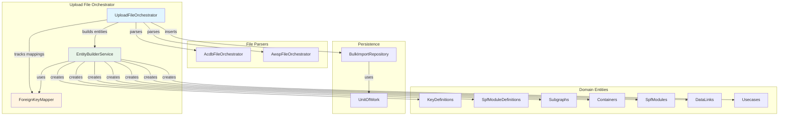
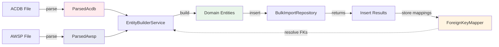
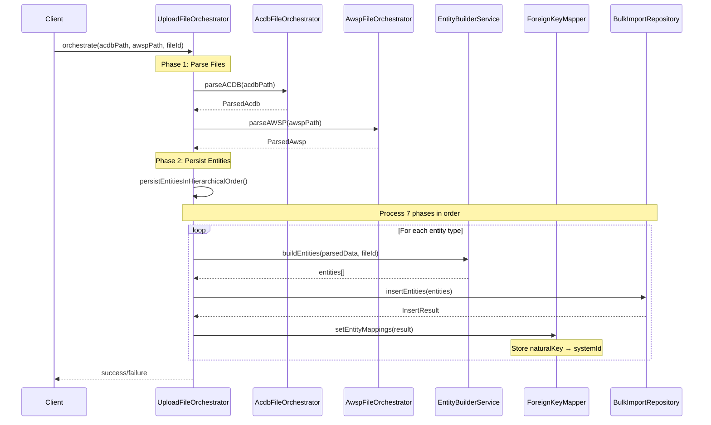
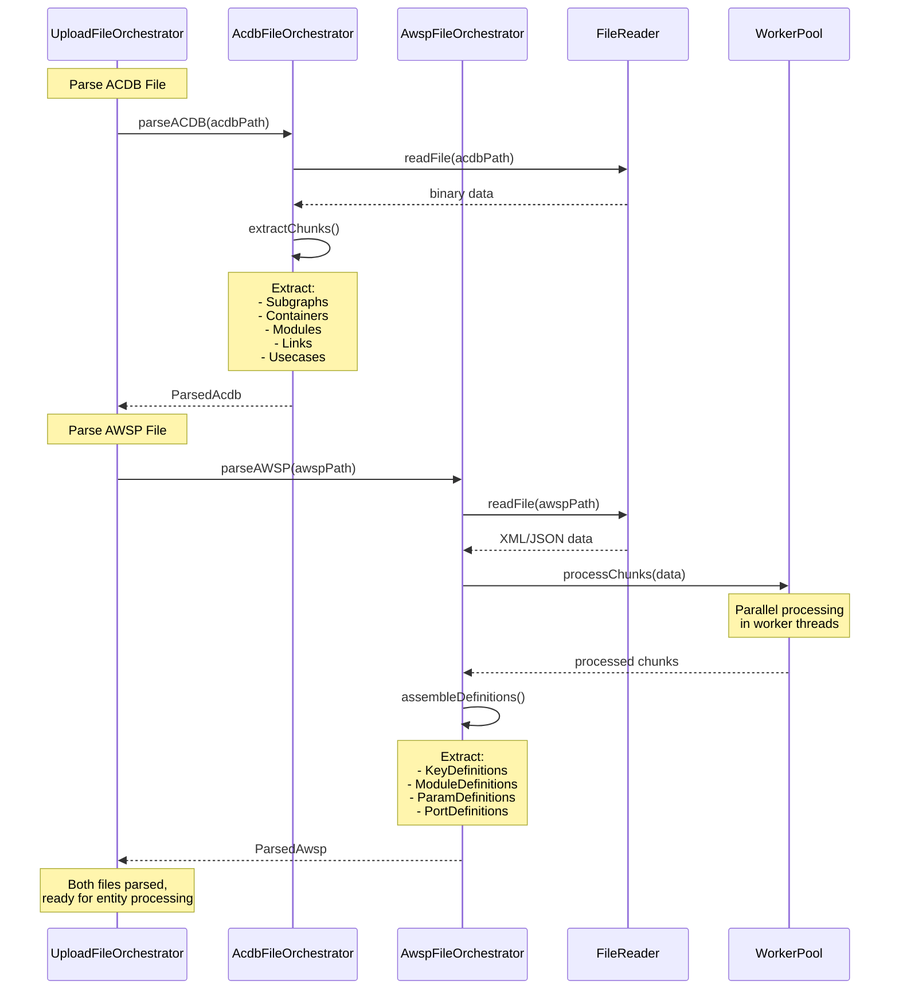
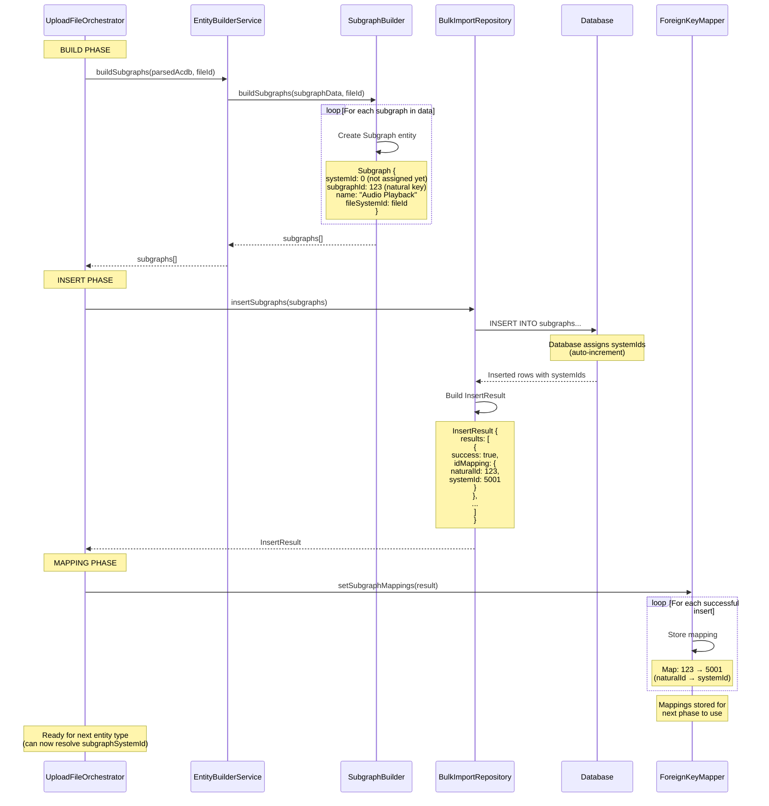
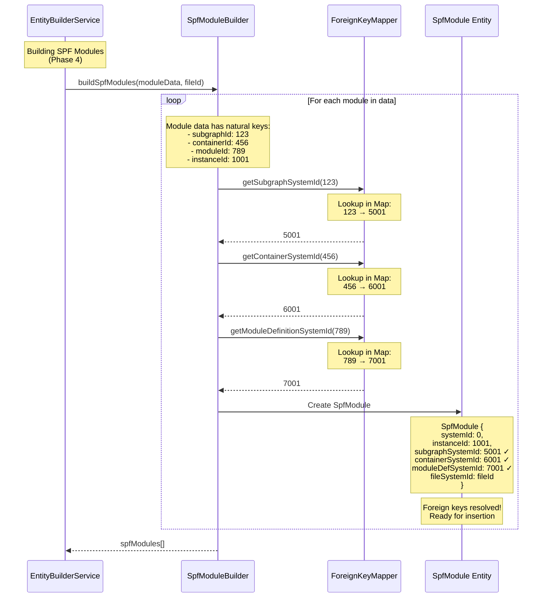
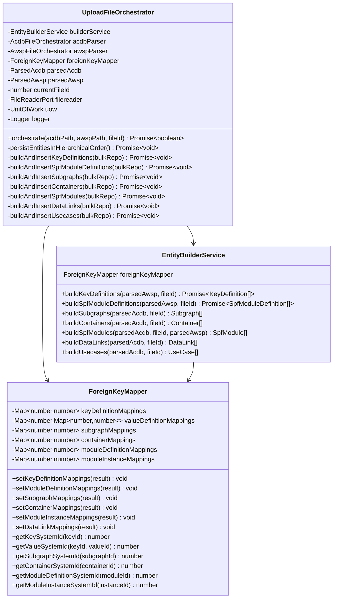
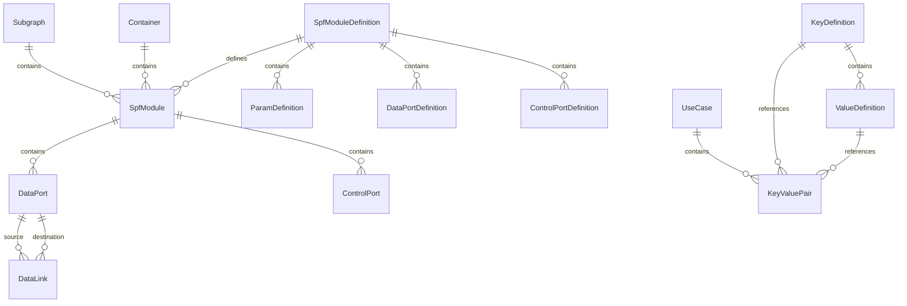
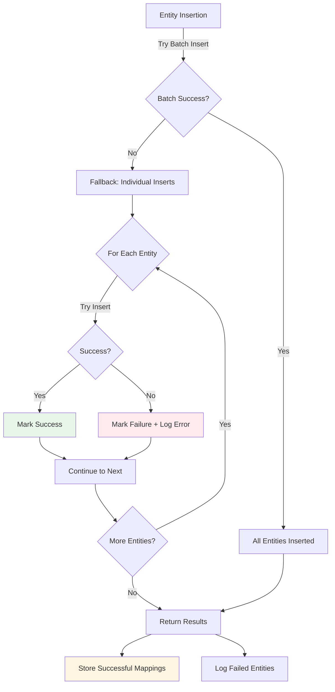

<!--
Copyright (c) Qualcomm Technologies, Inc. and/or its subsidiaries.
SPDX-License-Identifier: BSD-3-Clause
-->

# File Upload Workflow Design

## Document Information
- **Version**: 2.0
- **Date**: March 2026
- **Last Updated**: March 12, 2026

---

## Table of Contents
1. [Overview](#1-overview)
2. [High-Level Architecture](#2-high-level-architecture)
3. [Workflow Steps](#3-workflow-steps)
4. [Sequence Diagrams](#4-sequence-diagrams)
5. [Key Components](#5-key-components)
6. [Entity Processing Order](#6-entity-processing-order)
7. [Foreign Key Resolution](#7-foreign-key-resolution)
8. [Data Models](#8-data-models)
9. [Error Handling](#9-error-handling)
10. [Performance Optimizations](#10-performance-optimizations)
11. [Integration Points](#11-integration-points)
12. [Code Examples](#12-code-examples)
13. [Summary](#13-summary)

---

## 1) Overview

### 1.1 Purpose

The file upload workflow processes AudioReach database files and loads them into the system's SQLite database. It handles two file types:

- **ACDB files** (`.acdb`) - AudioReach Calibration Database containing subgraph data, module data, usecase data, and link information
- **AWSP files** (`.awsp`) - AudioReach Workspace files containing all definitions (key-value definitions, module definitions, parameter definitions, port definitions) and metadata

### 1.2 Two-Phase Approach

The upload process is divided into two distinct phases:

**Phase 1: Project Creation** (Transactional)
- Creates a project record in the database
- Creates a file system record linking the uploaded files
- **Atomic**: Either succeeds completely or rolls back

**Phase 2: Bulk Upload** (Non-Transactional)
- Parses file contents
- Builds domain entities
- Inserts entities in hierarchical order
- **Continue-on-error**: Partial success is allowed

### 1.3 Key Characteristics

- **Hierarchical Processing**: Entities are processed in dependency order (definitions → structure → modules → links)
- **Build-Insert-Build Pattern**: Build entities → Insert → Use systemIds to build dependent entities → Insert
- **Performance Optimized**: Worker pools for parsing, batch insertion, profiling
- **Fault Tolerant**: Continue-on-error semantics in Phase 2

---

## 2) High-Level Architecture

### 2.1 Component Interaction

```
┌─────────────────────────────────────────────────────────────┐
│                    HTTP Request                              │
│  POST /arc-api/v1/projects/offline/upload-files             │
│  Files: acdb_cal.acdb, workspaceFileXml.awsp                │
└─────────────────────────┬───────────────────────────────────┘
                          │
                          ▼
┌─────────────────────────────────────────────────────────────┐
│              ProjectController (NestJS)                      │
│  • Validates file extensions                                 │
│  • Writes files to temp directory                            │
│  • Dispatches OpenFileCommand                                │
└─────────────────────────┬───────────────────────────────────┘
                          │
                          ▼
┌─────────────────────────────────────────────────────────────┐
│              OpenFileHandler (CQRS)                          │
│                                                              │
│  PHASE 1: Project Creation (TRANSACTIONAL)                  │
│  ├─> Start transaction                                       │
│  ├─> Create Project entity                                   │
│  ├─> Create FileSystem record                                │
│  ├─> Commit transaction                                      │
│  └─> Return projectId                                        │
│                                                              │
│  PHASE 2: Bulk Upload (NON-TRANSACTIONAL)                   │
│  └─> Delegate to UploadFileOrchestrator                     │
└─────────────────────────┬───────────────────────────────────┘
                          │
                          ▼
┌─────────────────────────────────────────────────────────────┐
│           UploadFileOrchestrator                             │
│                                                              │
│  Step 1: Parse Files                                         │
│  ├─> AcdbFileOrchestrator.parseACDB()                       │
│  │    (Extracts: subgraphs, containers, modules, links)     │
│  └─> AwspFileOrchestrator.parseAWSP()                       │
│       (Extracts: all definitions)                            │
│                                                              │
│  Step 2: Build and Insert in Hierarchical Order             │
│  ├─> Build KeyDefinitions → Insert → Store systemIds        │
│  ├─> Build SpfModuleDefinitions → Insert → Store systemIds  │
│  ├─> Build Subgraphs → Insert → Store systemIds             │
│  ├─> Build Containers → Insert → Store systemIds            │
│  ├─> Build SpfModules → Insert → Store systemIds            │
│  ├─> Build DataLinks → Insert → Store systemIds             │
│  └─> Build Usecases → Insert                                │
└─────────────────────────┬───────────────────────────────────┘
                          │
                          ▼
┌─────────────────────────────────────────────────────────────┐
│              Database (SQLite)                               │
│  • Projects, Usecases, Modules, Links, Definitions          │
└─────────────────────────────────────────────────────────────┘
```

### 2.2 Component Diagram



### 2.3 Data Flow



---

## 3) Workflow Steps

### 3.1 Phase 1: Project Creation (Transactional)

**Purpose**: Create a project record to associate all uploaded data.

**Steps**:

1. **Validate Inputs**
   - Check file extensions (.acdb, .awsp)
   - Verify files are readable

2. **Extract Metadata**
   - Extract project name from file names
   - Generate project description

3. **Create Project (Transaction)**
   ```typescript
   await uow.startTransaction();
   try {
     // Create project entity
     const project = new Project(0, projectName, projectDescription, PROJECT_TYPE.OFFLINE);

     // Create file system record
     const result = await projectRepo.createOfflineProject(project, fileMetadata);

     await uow.commit();
   } catch (error) {
     await uow.rollback();
     throw error;
   }
   ```

4. **Return Project Info**
   - projectId, projectName, projectDescription

**Error Handling**: If any step fails, the entire transaction is rolled back. No partial project creation.

---

### 3.2 Phase 2: Bulk Upload (Non-Transactional)

**Purpose**: Parse files and load all entities into the database.

#### Step 1: Parse Files

**ACDB Parsing**:
- Read binary file
- Extract chunks containing:
  - Subgraph data
  - Container data
  - Module data (instances)
  - Link data (data links, control links)
  - Usecase data
- Store in `ParsedAcdb` object

**AWSP Parsing**:
- Read .json file (using worker pool for parallel processing)
- Extract all definitions:
  - Key-value definitions
  - Module definitions (SPF, VCPM)
  - Parameter definitions
  - Port definitions (data ports, control ports)
- Store in `ParsedAwsp` object

#### Step 2: Build and Insert Entities in Hierarchical Order

The orchestrator processes entities in a specific order to respect foreign key dependencies:

```
1. KeyDefinitions (from AWSP - no dependencies)
   ↓
2. SpfModuleDefinitions (from AWSP - no dependencies)
   ↓
3. Subgraphs (from ACDB - no dependencies)
   ↓
4. Containers (from ACDB - no dependencies)
   ↓
5. SpfModules (from ACDB - depend on: definitions, subgraphs, containers)
   ↓
6. DataLinks (from ACDB - depend on: modules)
   ↓
7. Usecases (from ACDB - depend on: all value definitions)
```

**For Each Entity Type**:

1. **Build Phase**
   ```typescript
   const entities = await entityBuilder.buildEntities(parsedData, fileId);
   ```
   - Constructs domain entities from parsed data
   - Uses natural keys (keyId, moduleId, etc.)
   - No systemIds yet (assigned by database)

2. **Insert Phase**
   ```typescript
   const result = await bulkRepo.insertEntities(entities);
   ```
   - Batch insert to database
   - Database assigns systemIds (auto-increment)
   - Returns success/failure for each entity

3. **Mapping Phase**
   ```typescript
   foreignKeyMapper.setEntityMappings(result);
   ```
   - Stores mapping: naturalKey → systemId
   - Used to resolve foreign keys in subsequent phases

**Example: SpfModule Processing**

```typescript
// Build Phase: Create SpfModule entities
const spfModules = await builderService.buildSpfModules(
  parsedAcdb,
  fileId,
  parsedAwsp
);

// Insert Phase: Save to database
const result = await bulkRepo.insertSpfModules(
  spfModules.map(m => ({ ...m, systemId: undefined }))
);

// Mapping Phase: Store systemId mappings
foreignKeyMapper.setSpfModuleMappings(result);
// Now we can use these systemIds when building DataLinks
```

---

## 4) Sequence Diagrams

### 4.1 Overall Orchestration Flow



### 4.2 File Parsing Phase



### 4.3 Build-Insert-Build Pattern (Detailed View)

This diagram shows the pattern for a single entity type (Subgraphs as example):



### 4.4 Foreign Key Resolution Flow



---

## 5) Key Components

### 5.1 OpenFileHandler

**Location**: `packages/core/src/application/file-operations/upload-file/upload-file.handler.ts`

**Responsibilities**:
- Entry point for file upload command
- Validates file inputs
- Executes Phase 1 (project creation) with transaction
- Delegates Phase 2 to UploadFileOrchestrator
- Returns project information to client

**Key Methods**:
- `handle(command: OpenFileCommand): Promise<OpenFileResult>`
- `validateInputs(acdb, awsp): void`
- `extractProjectName(acdb, awsp): string`

---

### 5.2 UploadFileOrchestrator

**Location**: `packages/core/src/application/file-operations/upload-file/services/upload-file-orchestrator.ts`

**Responsibilities**:
- Coordinates the entire bulk upload workflow
- Parses ACDB and AWSP files
- Orchestrates build-insert-build pattern
- Manages entity processing order
- Tracks performance metrics

**Class Diagram**:



**Key Methods**:
- `orchestrate(acdbPath, awspPath, fileId): Promise<boolean>` - Main entry point
- `persistEntitiesInHierarchicalOrder(): Promise<void>` - Coordinates all 7 phases
- Private methods for each entity type (e.g., `buildAndInsertKeyDefinitions()`)

**Dependencies**:
- `EntityBuilderService` - Builds domain entities
- `ForeignKeyMapper` - Tracks systemId mappings
- `AcdbFileOrchestrator` - Parses ACDB files
- `AwspFileOrchestrator` - Parses AWSP files
- `BulkImportRepository` - Handles database insertion

**Design Patterns**:

#### Build-Insert-Build Pattern

The orchestrator implements a **build-insert-build** pattern to handle foreign key dependencies:

```
1. Build entities with natural keys (no systemIds)
2. Insert entities into database
3. Database assigns systemIds (auto-increment)
4. Store mappings: naturalKey → systemId
5. Build dependent entities using mapped systemIds
6. Repeat for next entity type
```

**Why This Pattern?**
- Entities need database-assigned systemIds for foreign keys
- Child entities depend on parent systemIds
- Can't build all entities upfront without systemIds
- Must process in dependency order

---

### 5.3 File Parsers

#### AcdbFileOrchestrator

**Location**: `packages/core/src/application/file-operations/upload-file/services/acdb-file-orchestrator.ts`

**Responsibilities**:
- Reads binary ACDB file
- Extracts chunks containing:
  - Subgraph data
  - Container data
  - Module instance data
  - Link data (data links, control links)
  - Usecase data
- Returns `ParsedAcdb` object

**Interface**:
```typescript
class AcdbFileOrchestrator {
  async parseACDB(acdbPath: PathRef): Promise<ParsedAcdb>
}
```

#### AwspFileOrchestrator

**Location**: `packages/core/src/application/file-operations/upload-file/services/awsp-file-orchestrator.ts`

**Responsibilities**:
- Reads XML AWSP file
- Uses worker pool for parallel processing
- Extracts all definitions:
  - Key-value definitions
  - Module definitions (SPF, VCPM)
  - Parameter definitions
  - Port definitions
- Returns `ParsedAwsp` object

**Interface**:
```typescript
class AwspFileOrchestrator {
  async parseAWSP(awspPath: PathRef): Promise<ParsedAwsp>
}
```

---

### 5.4 EntityBuilderService

**Location**: `packages/core/src/application/file-operations/upload-file/services/entity-builder-service.ts`

**Responsibilities**:
- Builds domain entities from parsed file data
- Resolves foreign key references using ForeignKeyMapper
- Constructs entities with natural keys (no systemIds)

**Key Methods**:
- `buildKeyDefinitions(parsedAwsp, fileId): Promise<KeyDefinition[]>`
- `buildSpfModuleDefinitions(parsedAwsp, fileId): Promise<SpfModuleDefinition[]>`
- `buildSubgraphs(parsedAcdb, fileId): Subgraph[]`
- `buildContainers(parsedAcdb, fileId): Container[]`
- `buildSpfModules(parsedAcdb, fileId, parsedAwsp): SpfModule[]`
- `buildDataLinks(parsedAcdb, fileId): DataLink[]`
- `buildUsecases(parsedAcdb, fileId): UseCase[]`

---

### 5.5 ForeignKeyMapper

**Location**: `packages/core/src/application/file-operations/upload-file/services/foreign-key-mapper.ts`

**Responsibilities**:
- Tracks mappings between natural keys and database systemIds
- Provides O(1) lookup for foreign key resolution
- Stores mappings for: keys, values, definitions, subgraphs, containers, modules, links

**Key Methods**:
- `setKeyDefinitionMappings(result): void`
- `setModuleDefinitionMappings(result): void`
- `setSubgraphMappings(result): void`
- `setContainerMappings(result): void`
- `setSpfModuleMappings(result): void`
- `setDataLinkMappings(result): void`
- `getSubgraphSystemId(naturalId): number | undefined`
- `getContainerSystemId(naturalId): number | undefined`
- etc.

**Example Usage**:
```typescript
// After inserting subgraphs
foreignKeyMapper.setSubgraphMappings(subgraphResult);

// Later, when building modules
const subgraphSystemId = foreignKeyMapper.getSubgraphSystemId(module.subgraphId);
```

---

### 5.6 BulkImportRepository

**Location**: `packages/infrastructure/persistence/src/persistence-typeorm-sqllite/repositories/bulk-import/`

**Responsibilities**:
- Handles batch insertion to database
- Implements continue-on-error semantics
- Returns success/failure results for each entity
- Provides inserters for each entity type

**Structure**:
```
bulk-import/
├── typeorm-bulk-import.repository.ts  # Main repository
├── batch-inserter.ts                  # Batch insertion utility
├── base.inserter.ts                   # Base inserter class
├── key-definition/                    # Key definition inserter
├── module-definition/                 # Module definition inserter
├── subgraph/                          # Subgraph inserter
├── container/                         # Container inserter
├── spf-module/                        # SPF module inserter
├── data-link/                         # Data link inserter
└── usecase/                           # Usecase inserter
```

**Key Methods**:
- `insertKeyDefinitions(entities): Promise<InsertResult>`
- `insertSpfModuleDefinitions(entities): Promise<InsertResult>`
- `insertSubgraphs(entities): Promise<InsertResult>`
- `insertContainers(entities): Promise<InsertResult>`
- `insertSpfModules(entities): Promise<InsertResult>`
- `insertDataLinks(entities): Promise<InsertResult>`
- `insertUseCases(entities): Promise<InsertResult>`

**Batch Insertion Strategy**:
1. Try batch insert (fast path)
2. If batch fails, fallback to individual row insertion
3. Continue on error (don't stop on first failure)
4. Return detailed results (success/failure per entity)

---

## 6) Entity Processing Order

### 6.1 Dependency Hierarchy

Entities must be processed in a specific order to respect foreign key dependencies:

```
Level 1: Definitions (No Dependencies) - From AWSP
├─> KeyDefinitions
│   └─> ValueDefinitions (child entities)
└─> SpfModuleDefinitions
    ├─> ParamDefinitions (child entities)
    ├─> DataPorts (child entities)
    └─> ControlPorts (child entities)

Level 2: Structure (No Dependencies) - From ACDB
├─> Subgraphs
└─> Containers

Level 3: Modules (Depend on Level 1 & 2) - From ACDB
└─> SpfModules
    ├─> References: SpfModuleDefinition (Level 1)
    ├─> References: Subgraph (Level 2)
    ├─> References: Container (Level 2)
    ├─> DataPorts (child entities)
    └─> ControlPorts (child entities)

Level 4: Links (Depend on Level 3) - From ACDB
├─> DataLinks
│   ├─> References: Source Module (Level 3)
│   ├─> References: Source Port (Level 3)
│   ├─> References: Destination Module (Level 3)
│   └─> References: Destination Port (Level 3)
└─> ControlLinks (currently disabled)

Level 5: Usecases (Depend on Level 1) - From ACDB
└─> Usecases
    └─> References: ValueDefinitions (Level 1)
```

### 6.2 Why This Order Matters

**Foreign Key Constraints**:
- Database enforces referential integrity
- Child entities must reference existing parent entities
- Inserting in wrong order causes foreign key violations

**Example**:
```typescript
// ❌ WRONG: SpfModule references non-existent Subgraph
await insertSpfModules(modules);  // Fails: subgraphSystemId doesn't exist
await insertSubgraphs(subgraphs);

// ✅ CORRECT: Subgraph exists before SpfModule references it
await insertSubgraphs(subgraphs);
foreignKeyMapper.setSubgraphMappings(result);
await insertSpfModules(modules);  // Success: subgraphSystemId exists
```

### 6.3 Build-Insert-Build Pattern

**Why Not Build Everything First?**

We can't build all entities upfront because:
1. Entities need systemIds from database (auto-increment)
2. Child entities need parent systemIds for foreign keys
3. systemIds are only known after insertion

**Solution: Build-Insert-Build**

```typescript
// Phase 1: Build and insert parents
const subgraphs = buildSubgraphs(parsedData);
const result = await insertSubgraphs(subgraphs);
foreignKeyMapper.setSubgraphMappings(result);

// Phase 2: Build children using parent systemIds
const modules = buildSpfModules(parsedData);
// modules now have correct subgraphSystemId from foreignKeyMapper

// Phase 3: Insert children
await insertSpfModules(modules);
```

---

## 7) Foreign Key Resolution

### 7.1 ForeignKeyMapper Design

The `ForeignKeyMapper` is a critical component that maintains mappings between natural keys (from files) and database-assigned systemIds.

**Key Characteristics:**
- **O(1) Lookup Performance** - Uses Map data structures
- **Hierarchical Storage** - Values nested under keys, ports nested under modules
- **Type-Safe** - Separate maps for each entity type
- **Memory Efficient** - Only stores successful insertions

### 7.2 Mapping Storage Structure

```typescript
class ForeignKeyMapper {
  // Simple mappings: naturalId → systemId
  private keyDefinitionMappings = new Map<number, number>();
  private subgraphMappings = new Map<number, number>();
  private containerMappings = new Map<number, number>();
  private moduleDefinitionMappings = new Map<number, number>();
  private moduleInstanceMappings = new Map<number, number>();

  // Hierarchical mappings: parentSystemId → Map<childNaturalId, childSystemId>
  private valueDefinitionMappings = new Map<number, Map<number, number>>();
  private moduleInputPortMappings = new Map<number, Map<number, number>>();
  private moduleOutputPortMappings = new Map<number, Map<number, number>>();

  // String-based mappings for composite keys
  private dataLinkMappings = new Map<string, number>();
}
```

### 7.3 Example: Module Port Resolution

**Scenario:** Building a DataLink that connects two module ports.

**Step 1: Store Module Mappings (Phase 4)**
```typescript
// After inserting SpfModules
const result = {
  results: [
    {
      success: true,
      moduleIdMapping: {
        naturalId: 1001,  // instanceId from ACDB
        systemId: 8001    // assigned by database
      },
      portMappings: {
        dataPorts: [
          { naturalId: 1, systemId: 9001, portIoType: 'Input' },
          { naturalId: 2, systemId: 9002, portIoType: 'Output' }
        ]
      }
    }
  ]
};

foreignKeyMapper.setModuleInstanceMappings(result);

// Internal storage:
// moduleInstanceMappings: 1001 → 8001
// moduleInputPortMappings: 8001 → { 1 → 9001 }
// moduleOutputPortMappings: 8001 → { 2 → 9002 }
```

**Step 2: Resolve Port SystemIds (Phase 5)**
```typescript
// Building DataLink
const linkData = {
  srcInstanceId: 1001,
  srcPortId: 2,      // Output port
  dstInstanceId: 1002,
  dstPortId: 1       // Input port
};

// Resolve source module and port
const srcModuleSystemId = foreignKeyMapper.getModuleInstanceSystemId(1001);
// Returns: 8001

const srcPortSystemId = foreignKeyMapper.getOutputPortSystemId(8001, 2);
// Returns: 9002

// Resolve destination module and port
const dstModuleSystemId = foreignKeyMapper.getModuleInstanceSystemId(1002);
const dstPortSystemId = foreignKeyMapper.getInputPortSystemId(dstModuleSystemId, 1);

// Create DataLink with resolved foreign keys
const dataLink = new DataLink(
  0,                    // systemId (assigned by DB)
  srcModuleSystemId,    // 8001
  srcPortSystemId,      // 9002
  dstModuleSystemId,    // resolved
  dstPortSystemId,      // resolved
  fileSystemId
);
```

### 7.4 Hierarchical Value Resolution

**Scenario:** Building a Usecase with key-value pairs.

**Challenge:** Values are dependent on their parent keys.

**Solution:** Two-level lookup.

```typescript
// Storage structure
valueDefinitionMappings: Map<keySystemId, Map<valueId, valueSystemId>>

// Example data
keyDefinitionMappings: 100 → 5001
valueDefinitionMappings: 5001 → { 200 → 6001, 201 → 6002 }

// Resolution
const keySystemId = foreignKeyMapper.getKeySystemId(100);
// Returns: 5001

const valueSystemId = foreignKeyMapper.getValueSystemId(100, 200);
// Step 1: Get keySystemId (100 → 5001)
// Step 2: Get valueSystemId from nested map (5001 → { 200 → 6001 })
// Returns: 6001
```

---

## 8) Data Models

### 8.1 ParsedAcdb Structure

```typescript
class ParsedAcdb {
  private chunks = new Map<string, unknown>();

  // Store parsed chunks
  addChunk(type: string, chunk: unknown): void

  // Retrieve specific chunk
  getChunk<T>(type: string): T | undefined

  // Available chunks:
  // - SUBGRAPH_DATA: SubgraphDataChunk
  // - SUBGRAPH_CONNECTION_LUT: SubgraphPairDataChunk
  // - GKV_TABLE: UsecaseDataChunk
}
```

### 8.2 ParsedAwsp Structure

```typescript
class ParsedAwsp {
  private keyDefinitions: AwspKeyDefinition[];
  private spfModuleDefinitions: AwspSpfModuleDefinition[];

  getKeyDefinitions(): AwspKeyDefinition[]
  getSpfModuleDefinitions(): AwspSpfModuleDefinition[]
}
```

### 8.3 Entity Relationships



---

## 9) Error Handling

### 9.1 Phase 1: Project Creation (Transactional)

**Strategy**: All-or-nothing

```typescript
await uow.startTransaction();
try {
  await createProject();
  await createFileRecord();
  await uow.commit();  // Success: Both operations committed
} catch (error) {
  await uow.rollback();  // Failure: Both operations rolled back
  throw error;
}
```

**Behavior**:
- ✅ If all operations succeed → Project created
- ❌ If any operation fails → No project created (rollback)
- No partial state

---

### 9.2 Phase 2: Bulk Upload (Non-Transactional)

**Strategy**: Continue-on-error

```typescript
// No transaction wrapper
const keyResult = await insertKeyDefinitions(keys);
// Some keys may fail, but we continue

const moduleResult = await insertSpfModuleDefinitions(modules);
// Some modules may fail, but we continue

// Process continues even if some entities fail
```

**Behavior**:
- ✅ Successful entities are inserted
- ❌ Failed entities are logged but don't stop the process
- Partial success is allowed

**Why Continue-on-Error?**

The system allows users to correct errors after opening the file. When users save their changes, the system ensures zero errors are present before committing. This approach:

1. **Enables Error Correction**: Users can see what failed and fix it in the UI
2. **Provides Detailed Feedback**: Failed entities are logged with specific error messages
3. **Maximizes Data Recovery**: Load as much valid data as possible
4. **Supports Iterative Workflow**: Users can work with partial data while fixing errors

**Error Information**:

Each insert operation returns detailed results:

```typescript
interface InsertResult {
  results: Array<{
    success: boolean;
    idMapping?: { naturalId: any; systemId: number };
    error?: {
      entity: string;
      naturalId: string;
      code: string;
      message: string;
    };
  }>;
}
```

**Example**:
```typescript
const result = await insertKeyDefinitions(keys);

// Successful inserts
const successful = result.results.filter(r => r.success);
console.log(`Inserted ${successful.length} keys`);

// Failed inserts - user can correct these
const failed = result.results.filter(r => !r.success);
failed.forEach(f => {
  console.error(`Failed to insert key ${f.error.naturalId}: ${f.error.message}`);
});
```

### 9.3 Error Propagation



---

## 10) Performance Optimizations

### 10.1 Worker Pool for File Parsing

**Purpose**: Parallelize CPU-intensive file parsing operations.

**Implementation**:
- AWSP files are parsed using Node.js worker threads
- Multiple chunks processed in parallel
- Reduces parsing time for large files

**Configuration**:
```typescript
const workerPool = new NodeWorkerPoolAdapter({
  maxWorkers: 4,  // Number of parallel workers
  taskTimeout: 30000  // 30 second timeout per task
});
```

**Usage**:
```typescript
// AwspFileOrchestrator uses worker pool
const parsedAwsp = await awspParser.parseAWSP(awspPath);
// Parsing happens in parallel worker threads
```

---

### 10.2 Profiler for Performance Monitoring

**Purpose**: Track performance metrics for each operation.

**Metrics Tracked**:
- Operation duration (milliseconds)
- Memory usage (heap before/after)
- Entity counts and throughput
- Success rates

**Operations Profiled**:
- File parsing (ACDB, AWSP)
- Entity building (per entity type)
- Entity insertion (per entity type)
- Overall orchestration

**Example Output**:
```
Performance: ACDB_PARSING completed in 1250.45ms (memory delta: 15.23MB)
Performance: SUBGRAPH_BUILDING completed in 450.12ms (entities: 25, throughput: 55.5/sec, memory delta: 2.45MB)
Performance: SUBGRAPH_INSERT completed in 125.67ms (entities: 25, success: 25/25 (100%), throughput: 198.9/sec, memory delta: 0.12MB)
```

**Memory Snapshots**:

The profiler captures memory state at key points during the workflow:

- Before parsing
- After parsing
- After entity building (per entity type)
- Before persistence
- After persistence
- After insertion (per entity type)
- After cleanup

---

### 10.3 Batch Processing with Fallback

**Purpose**: Maximize insertion throughput while handling errors gracefully.

**Strategy**:

1. **Fast Path**: Batch insert (100 entities at a time)
   ```typescript
   try {
     await manager.insert(EntityRow, batch);
     // Success: All 100 entities inserted
   } catch (error) {
     // Batch failed, fallback to individual inserts
   }
   ```

2. **Fallback Path**: Individual row insertion
   ```typescript
   for (const row of batch) {
     try {
       await manager.insert(EntityRow, row);
       succeeded.push(row);
     } catch (error) {
       failed.push({ row, error: error.message });
     }
   }
   ```

**Benefits**:
- **Fast**: Batch inserts are much faster than individual inserts
- **Resilient**: Individual fallback ensures partial success
- **Detailed**: Know exactly which entities failed and why

**Performance Impact**:
- Batch insert: ~1000-5000 entities/second
- Individual insert: ~100-500 entities/second
- Fallback only triggered when batch fails (rare)

---

### 10.4 O(1) Foreign Key Lookups

**Purpose**: Fast foreign key resolution using Map-based lookups.

**Implementation**:
```typescript
class ForeignKeyMapper {
  private subgraphMap = new Map<number, number>();  // naturalId → systemId

  setSubgraphMappings(result: InsertResult): void {
    result.results
      .filter(r => r.success)
      .forEach(r => {
        this.subgraphMap.set(r.idMapping.naturalId, r.idMapping.systemId);
      });
  }

  getSubgraphSystemId(naturalId: number): number | undefined {
    return this.subgraphMap.get(naturalId);  // O(1) lookup
  }
}
```

**Benefits**:
- **Fast**: O(1) lookup vs O(n) array search
- **Scalable**: Performance doesn't degrade with dataset size
- **Memory Efficient**: Only stores successful mappings

**Example**:
```typescript
// Building 10,000 modules
for (const moduleData of parsedData.modules) {
  // O(1) lookup instead of O(n) .find()
  const subgraphSystemId = foreignKeyMapper.getSubgraphSystemId(moduleData.subgraphId);
  const containerSystemId = foreignKeyMapper.getContainerSystemId(moduleData.containerId);

  const module = new SpfModule(
    0,  // systemId assigned by database
    moduleData.instanceId,
    subgraphSystemId,  // Foreign key resolved in O(1)
    containerSystemId,  // Foreign key resolved in O(1)
    // ...
  );
}
```

---

## 11) Integration Points

### 11.1 AcdbFileOrchestrator

**Purpose:** Parse binary ACDB files into structured chunks.

**Interface:**
```typescript
class AcdbFileOrchestrator {
  async parseACDB(acdbPath: PathRef): Promise<ParsedAcdb>
}
```

**Responsibilities:**
- Read binary ACDB file
- Extract and parse chunks
- Return structured `ParsedAcdb` object

**Usage in Orchestrator:**
```typescript
this.parsedAcdb = await this.acdbParser.parseACDB(acdbPath);
```

---

### 11.2 AwspFileOrchestrator

**Purpose:** Parse XML/JSON AWSP files into structured definitions.

**Interface:**
```typescript
class AwspFileOrchestrator {
  async parseAWSP(awspPath: PathRef): Promise<ParsedAwsp>
}
```

**Responsibilities:**
- Read XML/JSON AWSP file
- Use worker pool for parallel processing
- Extract and parse definitions
- Return structured `ParsedAwsp` object

**Usage in Orchestrator:**
```typescript
this.parsedAwsp = await this.awspParser.parseAWSP(awspPath);
```

---

### 11.3 EntityBuilderService

**Purpose:** Build domain entities from parsed file data.

**Interface:**
```typescript
class EntityBuilderService {
  async buildKeyDefinitions(parsedAwsp, fileId): Promise<KeyDefinition[]>
  async buildSpfModuleDefinitions(parsedAwsp, fileId): Promise<SpfModuleDefinition[]>
  buildSubgraphs(parsedAcdb, fileId): Subgraph[]
  buildContainers(parsedAcdb, fileId): Container[]
  buildSpfModules(parsedAcdb, fileId, parsedAwsp): SpfModule[]
  buildDataLinks(parsedAcdb, fileId): DataLink[]
  buildUsecases(parsedAcdb, fileId): UseCase[]
}
```

**Responsibilities:**
- Transform parsed data into domain entities
- Resolve foreign keys using ForeignKeyMapper
- Handle missing data gracefully
- Return arrays of domain entities

**Usage in Orchestrator:**
```typescript
const subgraphs = this.builderService.buildSubgraphs(
  this.parsedAcdb,
  this.currentFileId,
);
```

---

### 11.4 ForeignKeyMapper

**Purpose:** Track mappings between natural keys and database systemIds.

**Interface:**
```typescript
class ForeignKeyMapper {
  // Store mappings
  setKeyDefinitionMappings(result): void
  setModuleDefinitionMappings(result): void
  setSubgraphMappings(result): void
  setContainerMappings(result): void
  setModuleInstanceMappings(result): void
  setDataLinkMappings(result): void

  // Retrieve mappings
  getKeySystemId(keyId): number | undefined
  getValueSystemId(keyId, valueId): number | undefined
  getSubgraphSystemId(subgraphId): number | undefined
  getContainerSystemId(containerId): number | undefined
  getModuleDefinitionSystemId(moduleId): number | undefined
  getModuleInstanceSystemId(instanceId): number | undefined
  getInputPortSystemId(moduleSystemId, portId): number | undefined
  getOutputPortSystemId(moduleSystemId, portId): number | undefined
}
```

**Responsibilities:**
- Store successful insertion mappings
- Provide O(1) lookup for foreign key resolution
- Handle hierarchical relationships

**Usage in Orchestrator:**
```typescript
// After insertion
this.foreignKeyMapper.setSubgraphMappings(subgraphResult);

// Later, in EntityBuilderService
const systemId = this.foreignKeyMapper.getSubgraphSystemId(naturalId);
```

---

### 11.5 BulkImportRepository

**Purpose:** Handle batch insertion of entities into database.

**Interface:**
```typescript
class BulkImportRepository {
  insertKeyDefinitions(entities): Promise<InsertResult>
  insertSpfModuleDefinitions(entities): Promise<InsertResult>
  insertSubgraphs(entities): Promise<InsertResult>
  insertContainers(entities): Promise<InsertResult>
  insertSpfModules(entities): Promise<InsertResult>
  insertDataLinks(entities): Promise<InsertResult>
  insertUseCases(entities): Promise<InsertResult>
}
```

**Responsibilities:**
- Batch insert entities (fast path)
- Fallback to individual inserts on batch failure
- Return detailed success/failure results
- Provide natural key to systemId mappings

**Usage in Orchestrator:**
```typescript
const result = await bulkRepo.insertSubgraphs(
  subgraphs as readonly Omit<Subgraph, 'systemId'>[],
);
```

---

### 11.6 UnitOfWork

**Purpose:** Provide access to repositories.

**Interface:**
```typescript
interface UnitOfWork {
  getBulkImportRepository(): BulkImportRepository
  // Other repository getters...
}
```

**Usage in Orchestrator:**
```typescript
const bulkRepo = this.uow.getBulkImportRepository();
```

---

## 12) Code Examples

### 12.1 Basic Usage

```typescript
// Create orchestrator
const orchestrator = new UploadFileOrchestrator(
  fileReader,
  unitOfWork,
  workerPool,
  logger,
  profiler
);

// Execute orchestration
try {
  const success = await orchestrator.orchestrate(
    acdbPath,
    awspPath,
    fileSystemId
  );

  if (success) {
    console.log('File upload completed successfully');
  }
} catch (error) {
  console.error('File upload failed:', error);
}
```

### 12.2 Extending with New Entity Type

**Scenario:** Add a new entity type "AudioProfile" that depends on Subgraphs.

**Step 1: Add to EntityBuilderService**
```typescript
class EntityBuilderService {
  buildAudioProfiles(parsedAcdb: ParsedAcdb, fileId: number): AudioProfile[] {
    const profileData = parsedAcdb.getChunk('AUDIO_PROFILES');

    return profileData.map(data => {
      // Resolve foreign key
      const subgraphSystemId = this.foreignKeyMapper.getSubgraphSystemId(
        data.subgraphId
      );

      return new AudioProfile(
        0,                  // systemId
        data.profileId,     // natural key
        data.profileName,
        subgraphSystemId,   // resolved FK
        fileId
      );
    });
  }
}
```

**Step 2: Add to BulkImportRepository**
```typescript
class BulkImportRepository {
  async insertAudioProfiles(
    entities: readonly Omit<AudioProfile, 'systemId'>[]
  ): Promise<InsertResult> {
    // Implementation similar to other inserters
  }
}
```

**Step 3: Add to UploadFileOrchestrator**
```typescript
class UploadFileOrchestrator {
  private async buildAndInsertAudioProfiles(
    bulkRepo: BulkImportRepository
  ): Promise<void> {
    // 1. Build
    const profiles = this.builderService.buildAudioProfiles(
      this.parsedAcdb,
      this.currentFileId
    );

    // 2. Insert
    const result = await bulkRepo.insertAudioProfiles(profiles);

    // 3. Map (if needed by other entities)
    this.foreignKeyMapper.setAudioProfileMappings(result);
  }

  private async persistEntitiesInHierarchicalOrder(): Promise<void> {
    const bulkRepo = this.uow.getBulkImportRepository();

    // ... existing phases ...

    // New phase: Insert after Subgraphs (Phase 2)
    await this.buildAndInsertAudioProfiles(bulkRepo);

    // ... remaining phases ...
  }
}
```

---

## 13) Summary

### 13.1 Key Takeaways

1. **Two-Phase Approach**:
   - Phase 1: Transactional project creation (all-or-nothing)
   - Phase 2: Non-transactional bulk upload (continue-on-error)

2. **File Responsibilities**:
   - AWSP files contain all definitions (keys, modules, parameters, ports)
   - ACDB files contain instance data (subgraphs, containers, modules, links, usecases)

3. **Build-Insert-Build Pattern**:
   - Build entities → Insert → Get systemIds → Build dependent entities → Insert
   - Respects foreign key dependencies

4. **Hierarchical Processing**:
   - Entities processed in dependency order
   - Definitions (AWSP) → Structure (ACDB) → Modules (ACDB) → Links (ACDB) → Usecases (ACDB)

5. **Performance Optimized**:
   - Worker pools for parallel parsing
   - Batch insertion with fallback
   - O(1) foreign key lookups
   - Profiling for monitoring

6. **Fault Tolerant**:
   - Continue-on-error in Phase 2
   - Detailed error reporting for user correction
   - Partial success allowed during upload
   - Save operation ensures zero errors

### 13.2 Workflow Summary

```
1. HTTP Request → ProjectController
2. Validate files and write to temp directory
3. Dispatch OpenFileCommand → OpenFileHandler
4. PHASE 1: Create project (transactional)
5. PHASE 2: Bulk upload (non-transactional)
   a. Parse ACDB (subgraphs, containers, modules, links, usecases)
   b. Parse AWSP (all definitions)
   c. Build and insert KeyDefinitions (from AWSP)
   d. Build and insert SpfModuleDefinitions (from AWSP)
   e. Build and insert Subgraphs (from ACDB)
   f. Build and insert Containers (from ACDB)
   g. Build and insert SpfModules (from ACDB)
   h. Build and insert DataLinks (from ACDB)
   i. Build and insert Usecases (from ACDB)
6. Return project information to client
```

---

## Document Revision History

| Version | Date | Author | Changes |
|---------|------|--------|---------|
| 1.0 | 2026-02-02 | Architecture Team | Initial upload-file design document |
| 2.0 | 2026-03-12 | Architecture Team | Merged with orchestrator LLD, added sequence diagrams, class diagrams, detailed technical sections, and code examples |

---

**End of Document**
