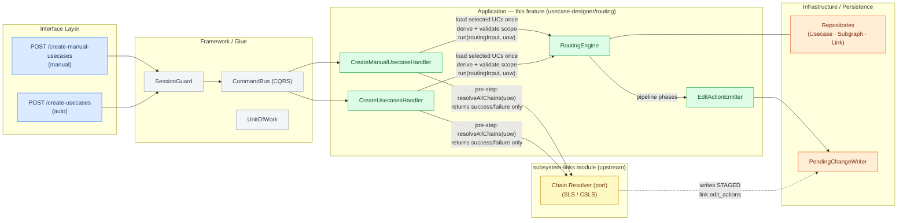
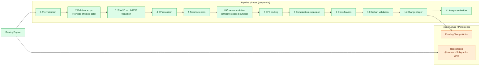

# Diagram 01: Feature Context & Module Boundaries

Renders in VS Code with the "Markdown Preview Mermaid Support" extension, or on GitHub.

## High-level flow

## Inside RoutingEngine

## Legend
- Solid arrow: synchronous call / dependency direction
- Dashed arrow: side-effect write (no data returned to caller)
- `---` line: structural read dependency (no data returned on diagram)
- Color bands: Interface (blue) · Framework/Glue (gray) · Upstream subsystem-links (yellow) · This feature (green) · Infrastructure (orange)

## Notes
Both HTTP entry points funnel through `SessionGuard` and `CommandBus` into their respective handlers. Each handler calls `IChainResolver.resolveAllChains(uow)` (owned by the `subsystem-links` module) as a mandatory pre-step. The chain resolver writes STAGED `data_link`/`control_link` `edit_actions` directly into the session and returns only success/failure. Each handler then loads graph edits and selected UCs, enforces FR-API-07 addition-side closure, and enforces FR-API-03 before manual discovery or engine execution. The handler passes request policy, effective selections, and session edits to one `RoutingGraphSnapshotBuilder`. The builder owns overlay graph reads, committed UC reads, MDF classification, and exclusion application; only immutable `graphSnapshot` collections cross the engine boundary. Phase 2 aggregates topology decisions, excludes pure MDF substitutions from FR-DEL-02, and enforces deletion-side closure after the ordinary affected-UC gate. Manual Phase 2 runs the same gates and direct MDF maintenance but skips ordinary automatic reconstruction. For raw-mode projects the chain resolver is a fast no-op; the routing engine has no concept of chain resolution.

After the pre-step, each handler calls `RoutingEngine.run(routingInput, uow)` — this is the only public API of the routing subfolder. `RoutingEngine` stores the concrete phase services and drives them through an ordered list of zero-argument closures. Pure phases receive only `RoutingContext`; Phases 2 and 4 receive the narrow subgraph repository, Phase 11 receives the request `UnitOfWork`, and Phase 12 receives only `groupId`. Phase 2 performs a conditional legacy-EC SGKV baseline read; Phase 4 performs its SGKV baseline and batched file-scoped Value Definition-to-Key reads. `UnitOfWork` wraps those operations in one edit session.
